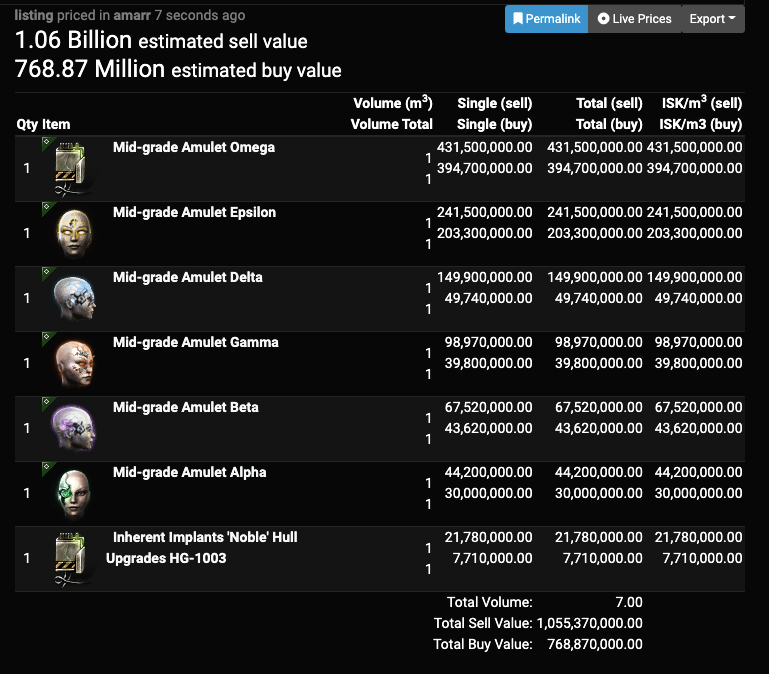

+++
categories = ["gaming", "project"]
date = "2022-02-20"
description = "Evepraisal - An Eve Online price estimation tool"
featured = "thumbnail.png"
featuredalt = ""
featuredpath = "date"
linktitle = ""
title = "evepraisal.com: A price estimation tool for Eve Online"
slug = "evepraisal.com"
type = "posts"
+++

# Basic Details

Evepraisal is a web-based bulk price estimation tool for the game Eve Online. It has gained wide use and has a fairly high amount of traffic for such a simple utility. Almost anyone who plays the game has used it.

[Go version on GitHub](https://github.com/evepraisal/go-evepraisal) | [Python version on Github](https://github.com/evepraisal/python-evepraisal)

------------

# How it was created

This is a story about how I came to create [evepraisal.com](https://evepraisal.com), a popular tool for Eve Online that is commonly used to price check cargo scans, contracts, EFT fittings, assets, and more. If none of that means anything to you that's totally fine! I barely know, too.

Eve Online has always been an interesting game to me. For the uninitiated, Eve Online is a space-themed single-sharded MMO game that boasts an incredibly realistic economy and allows players to take high stakes risks. This is the game that has had several extremely large fights over player-controlled territories involving thousands of people. It’s a game where politics, espionage and propaganda are effective weapons against your enemy.

## Burn Jita

2 years ago, during a large player-made event called “Burn Jita”, an in-game alliance named Goonswarm and various other null-sec entities sought to blockade the biggest market hub in the game in hopes that the established trading center of Eve Online would be significantly impacted. I happened to be in an alliance comprising of the “various other null-sec entities” so I participated in the event. How could I not? Here’s how the scheme worked:

1. Designated people would cargo scan ships passing through nearby systems headed toward Jita. The information would be relayed through in-game and out-of-game channels.
2. A fleet of ships would be waiting to strike juicy targets foolish enough to enter or leave the trade hub with valuable cargo. The ships they were flying were cheap and could deal a lot of instant damage.
3. Once a transport ship with a significant amount of goods entered the system the fleet would strike. Jita is located in high sec which means every attacking ship would pretty quickly be destroyed by the computer-controlled police force, but the damage output of the entire fleet assured that the transport ship would turn into a pile of wreckage and loot.
4. Rinse; repeat.

Now take a second to appreciate the fact that several of these fleets were operating at any given time and the ships used to do these attacks were provided, free of charge, by each participating alliance.

My role in the process above was being one of the people who did step 1. I did a fair amount of ganking with the fleet but what I really enjoyed was pointing to a person and then waiting 10 minutes to see that his ship turned into mangled wreck and his goods (or what’s left of them) were stolen to aid the further destruction of people like him. It was my (and my counter-part’s) actions that started the chain of events leading to the death of an enterprising player who paid no attention to player events. The act of firing space-bullets was a detail.

## Necessity is the mother of invention

After a few hours of scanning the cargo of every ship in sight I realized that many freighters were stuffing their cargo hold with lots of useless junk in order to hide the true value of the cargo that they were carrying. This was a problem. Deciding who to attack was a time-sensitive task and not having a reliable cost estimate of what the ship contained made things harder than they had to be.

That’s where something clicked in my mind and over the next 3 hours I made a web-based tool that completely solved the ambiguity of this entire process and changed ganking into a legitimate economically-driven career that boasts cost/benefit analysis similar to (yet more exciting than) most of the other more reputable careers in Eve Online. That’s a big claim, but I don’t think I am far off.

## How it works

When you cargo scan a potential target’s cargo hold, you get a list of all its contents. Up until recently, all you could do was look at the list and that was basically it. However, CCP recently added the ability to copy/paste from many different places in the Eve Online UI including the cargo scan result window. Cool, I thought. I could have users to give me a list of all the items in the potential target’s hanger. Now I just needed a way to calculate the prices. Eve Online has an amazing developer community. There were (and are) existing websites that had daily database dumps of aggregate pricing data for every market item in the game. I downloaded one of the database dumps and used that data as my price reference. After that it was a matter of making a small website where people could give it cargo scan results and it would give back a reasonably accurate guess of the cargo’s value in less than a second. These estimates could be much better than what a human could do manually in the same time.

I randomly linked the website that I had just created in one of the fleet channels and it was a short time later that someone in Goonswarm broadcasted the link to the Goonswarm jabber server. I instantly got a flood of interested people trying out the tool and, to my surprise, the site held up fine. Later, I added the ability to share results so that the many scanners wouldn’t have to communicate the estimate they’re seeing from my website which further streamlined the process. In hindsight, what seemed like a small feature that was fairly easy to implement turned out to be the biggest selling point. The immediate feedback I got from people was invaluable and shaped my thoughts on the problem. To this day I’ve never had a bad experience asking people (even those who really didn’t like the tool) what could be better.

The Burn Jita event continued for a couple more days and instead of cargo scanning ships, I was working on improving the tool that others used to find targets to gank more efficiently. The rest is history.

The website slowly evolved into what is now known as Evepraisal. I added support for many different formats and switched from using price data from a static database dump to using more frequently updated sources like Eve-Central, Eve-marketdata.com and eventually the official ESI API had support for everything IU needed. I’ve heard from several people who are career gankers in Eve who leverage Evepraisal to be profitable.

I am still waiting for the day that CCP makes a suitable replacement to my tool, but until then I’ll still be slowly improving on the tool that’s become a ganker’s best friend and a scammer’s worst nightmare.

