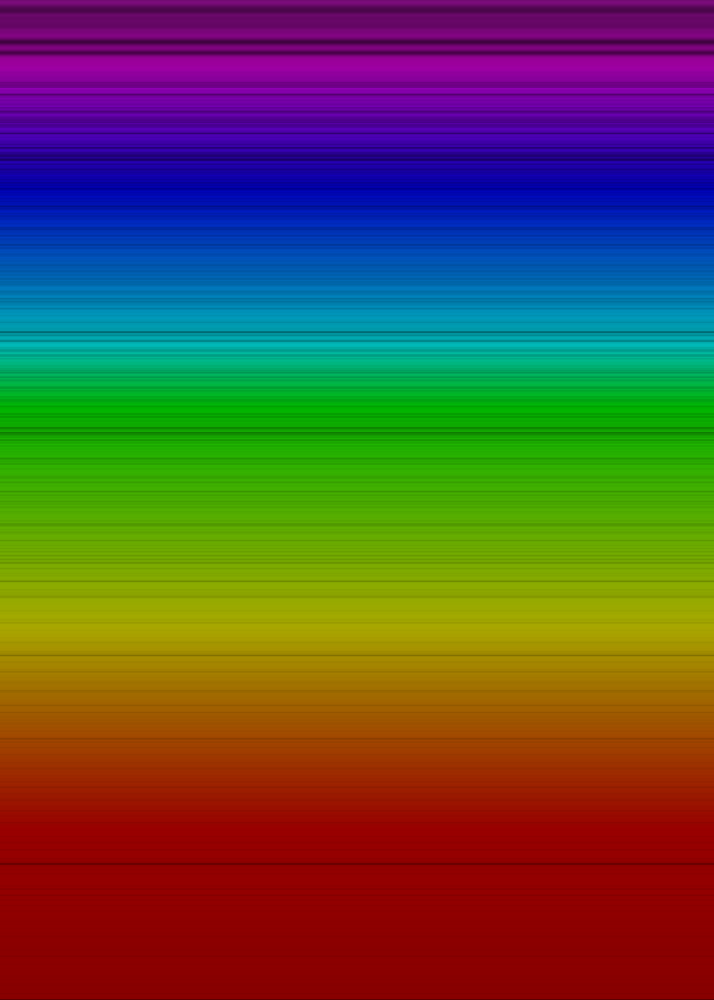
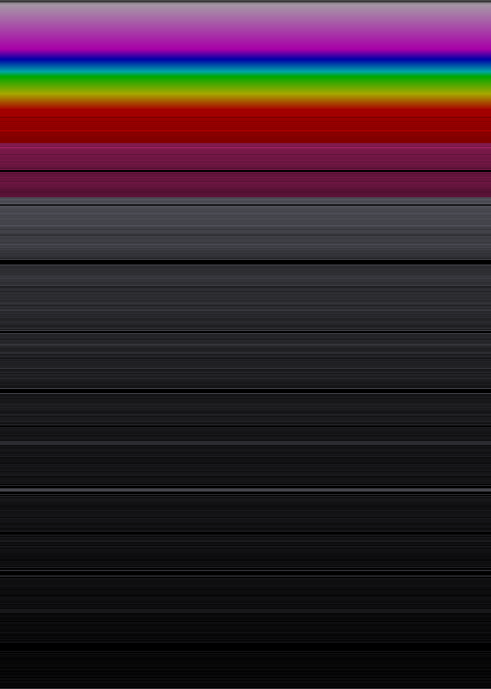
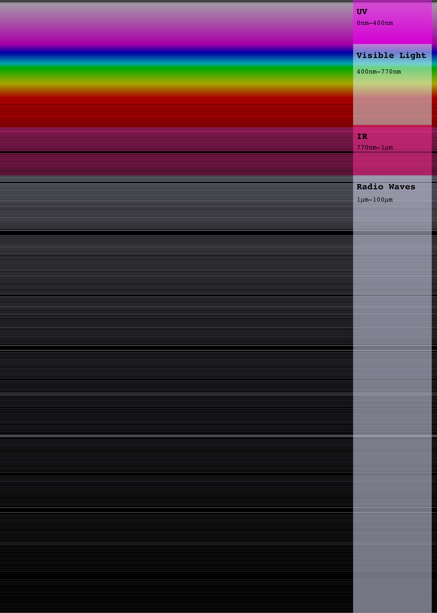

+++
categories = ["project"]
tags = ["dataviz", "spectrum", "sun", "light", "python", "svg", "data", "science", "displate"]
date = "2022-09-12"
description = "Revisiting visualizing the light that comes from the sun. Spectrum analysis, wavelengths of light, data visualization"
images = ["/posts/sun-spectra-image-v2.svg/thumbnail.png"]
featured = "thumbnail.png"
featuredalt = ""
featuredpath = "date"
linktitle = ""
title = "Visualizing the spectrum of the sun (Part 2)"
slug = "sun-spectra-image-v2.svg"
type = "posts"
aliases = [
    "portfolio/sun-spectra-v2/",
]
+++

## Basic Details
You may know about my [previous sun spectra project](/posts/sun-spectra-image.svg/) where I created a visualization of the sun's observed electromagnetic spectrum. Well, this is the same thing but I made some different decisions on how to visualize it this time and I think it turned out beautifully. I thought it looked so great that you can get it on [Displate](https://displate.com/displate/5622874)!

[Github](https://github.com/sudorandom/sun-fingerprint) | [All output images](https://github.com/sudorandom/sun-fingerprint/tree/main/output) | [Displate](https://displate.com/displate/5622874)

-------

## The sun's spectra (visible light)
This represents the visible light that the sun puts out. Notice the holes. These holes and dim spots tell us what the sun is made of, how it works and even the temperature of different parts of the sun.

Notice that you can zoom in an incredible amount. This is possible because these images are SVG files that use vectors to represent the image instead of a pixel map. This allows the images to essentially be infinitely zoomable.

[Click here to see the full resolution](visible.svg)

## The sun's spectra (full spectrum)
Here's the entire spectrum. As you may know, there is light that we cannot see because it either has too high or too low of a frequency. This visualization shows you the intensity levels for frequencies even outside of the visual spectrum. The pinkish color at the top is Ultraviolet light. The magenta-colored section under read is infrared light. Everything below that can be classified as radio waves. Scroll down a bit more to see an image with these sections annotated.

[Click here to see the full resolution](non-visible.svg)

## The sun's spectra (annotated)
Here is a version of the image that has text which describes what you're seeing.

[Click here to see the full resolution](annotated.svg)

[Spectroscopy](https://en.wikipedia.org/wiki/Spectroscopy) is a very interesting science and the basis for it is rooted in our understanding of quantum physics. We know a lot about how the sun and other stars work using this science. However, we don't fully understand EVERY observation in these spectral lines. There's always more to learn and understand. Physics in particular has several massive mysteries just waiting to be solved.

A better explanation can be found in [this video](https://www.youtube.com/watch?v=gVZwdYZqCUI)](https://www.youtube.com/watch?v=gVZwdYZqCUI) from the youtube channel [Be smart](https://www.youtube.com/@besmart).
