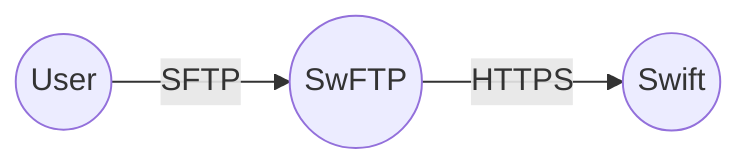

+++
categories = ["python", "golang"]
date = "2023-07-30"
description = "Describing an old project of mine from 2014; an SFTP/FTP interface over an object storage API."
cover = "/posts/swftp/cover.jpg"
featured = ""
featuredalt = ""
featuredpath = "date"
linktitle = ""
title = "SwFTP - SFTP/FTP Server For Openstack Swift"
slug = "swftp"
type = "posts"
+++

I used to work for a public cloud company called [SoftLayer](https://en.wikipedia.org/wiki/IBM_Cloud#SoftLayer). Before [S3’s API](https://docs.aws.amazon.com/AmazonS3/latest/API/) was the de-facto API standard that object storage services used there were several object storage APIs that seemed like they could claim that crown. The company I worked for, SoftLayer, had recently come out with an Object Storage service based off of the [OpenStack Swift](https://wiki.openstack.org/wiki/Swift) project. It came with its own API, which is great. However, at the time, it was hard to get buy-in from customers to use under supported APIs. They’d have to use unfamiliar tooling or even develop tooling themselves just to transfer files around... And if they currently had a product that didn’t support OpenStack Swift they may just be stuck. So I was charged with coming up with a solution for these customers.

After testing out a few different ideas I ended up deciding on the SFTP protocol. Object Storage doesn’t translate 1:1 with a “normal” filesystem but it was close enough. This might seem a strange decision in modern days where everyone has S3 integration but this was done as a way to integrate with older products and give customers a much more familiar feel with interacting with their data. I decided to call the project [SwFTP](https://github.com/softlayer/swftp).

I was all set. I needed to just... implement an SFTP server. Oof. That’s actually very challenging. You see, the [SFTP protocol](https://www.ietf.org/rfc/rfc0913.txt) has lived for over a decade at that point so it has gone through several RFC drafts and it supports various extensions... AND it’s built on top of SSH, which is also fairly complex to implement. So I needed to use something more proven. I needed a library that I could plug in OpenStack Swift integration into without needing to implement the wire protocol itself. Again, at the time this kind of ability was fairly rare. I was very experienced with Python and a bit with Go (now-a-days I would totally write this project in Go, using this [SFTP library](https://pkg.go.dev/github.com/pkg/sftp) and implementing the fs.Walker interface). That would have made my life so much simpler. But no, I was essentially stuck with Python’s [Twisted](https://twisted.org/). Twisted has a library called ["Conche"](https://docs.twisted.org/en/stable/api/twisted.conch.html) which implements the SSH protocol and it allows you to hook into the SFTP subsystem, which is exactly what I needed. Twisted seemed to be the best option at the time, but it was (and still is) very hard to work with. The failure modes can be very complex. Plus, the SFTP protocol is actually fairly complex and SFTP clients will behave in vastly different ways. For instance some clients, in order to maximize throughput, will concurrently send several batches of data at once when uploading a file without waiting for the acknowledgement to be received. We can’t behave similarly with an object storage API call so I needed to force the concurrent write requests to queue up properly until it was their turn to be sent down the wire to Swift. This, alone, is complex but I was also using an unfamiliar framework which has completely different sync primitives than I’ve used in the past... So I found this work to be very challenging... but in the end it was very rewarding.

SwFTP was never the only project I was working on. However after a year of sporadically working on this project it was finally good enough to deploy. Testing took a long time because, as I said, many clients behave very differently. I am happy about where I got the functional test framework since I was able to fairly easily write code that would reproduce errors that we saw when testing, including some super complicated cases of race conditions. I've learned some very important lessons about functional and manual testing.

All-in-all, SwFTP ended up being a success and a lot of data was transferred using this service. And thanks to my manager and support from others in the company I was able to perform all of this iteration and development as an open source project. There was no SoftLayer-specific implementation details so others could (and did) deploy the project for their own OpenStack Swift clusters.

> By the way, if you’re having issues pronouncing “SwFTP” in your head then you aren’t alone. I used to call it something like “Swefteepee”.

References:
- SwFTP Github - https://github.com/softlayer/swftp
- Conch (SSH library) - https://docs.twisted.org/en/stable/api/twisted.conch.html
- Writing a client using Conch - https://docs.twisted.org/en/twisted-18.9.0/conch/howto/conch_client.html
