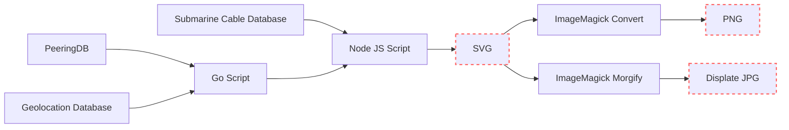

+++
categories = ["project", "data-visualization", "internet", "networking"]
date = "2023-08-01"
description = "Adding a new layer to world map of the Internet"
cover = ""
featured = ""
featuredalt = ""
featuredpath = "date"
linktitle = ""
title = "Visualizing the Internet (part 2)"
slug = "internet-map-v2"
type = "posts"
+++




I recently expanded on my [Internet map visualization](/posts/submarine-cable-map.svg/) that showed all of the undersea internet cables that run along the bottom of the oceans and seas. This time, I also added dots that represent the locations of all of the advertised internet exchanges in the world. The more red (and bigger) the dot, the more bandwidth the internet exchange supports.

**[Click here for full resolution image (warning, it's big)](geo-mercator.svg)**

## What's an internet exchange?
**Internet Exchange:**

An internet exchange, often referred to as an Internet Exchange Point (IXP), is a physical infrastructure or facility where Internet Service Providers (ISPs) and other network operators connect their networks together to exchange Internet traffic. The primary purpose of an internet exchange is to improve the efficiency of data exchange between different networks by allowing direct peering between them. Instead of sending data through multiple third-party networks, which can lead to increased latency and costs, ISPs can directly exchange traffic at an internet exchange, resulting in faster and more cost-effective data transmission.

Internet exchanges play a crucial role in the functioning of the global internet. By facilitating direct peering, they help reduce the reliance on expensive long-distance links and enhance the overall performance and resilience of the internet. They also promote competition among ISPs and encourage the growth of internet infrastructure in specific regions.

**Traceroute Command:**

The `traceroute` command is a network diagnostic tool used to trace the route that data packets take from one computer to another across a network, typically the Internet. It helps identify the network path taken by the data, showing the sequence of intermediate devices (routers) that the packets pass through before reaching the destination.

```bash
$ sudo mtr apple.com
                            My traceroute  [v0.95]
kevins-mbp-m1.local (192.168.88.31) -> apple.com (17.22023-08-02T13:19:54+0200
Keys:  Help   Display mode   Restart statistics   Order of fields   quit
                                      Packets               Pings
 Host                               Loss%   Snt   Last   Avg  Best  Wrst StDev
 1. router.lan                       0.0%     5    5.2   4.8   4.3   5.2   0.4
 2. 10.24.0.1                        0.0%     4    4.7   4.6   4.3   5.0   0.3
 3. soeborg2.net.gigabit.dk          0.0%     4    5.6   6.6   5.5   9.7   2.1
 4. apple-1.equinix-am1.nl-ix.net    0.0%     4   15.6  15.5  14.1  16.6   1.0
 5. apple.com.sg                     0.0%     4   15.2  15.0  14.5  15.6   0.5
```

In the provided example output:
- `kevins-mbp-m1.local` is the name of the source host or the computer from which the `traceroute` is initiated. That's my laptop, so I know that it is located in Copenhagen, Denmark.
- `apple.com` is the destination host or the target server to which the `traceroute` is being performed.

The columns in the output represent the following information:
- `Host`: The intermediate routers or nodes in the network path.
- `Loss%`: The percentage of packet loss experienced while reaching each router.
- `Snt`: The number of packets sent to each router.
- `Last`: The last round-trip time taken to reach the router.
- `Avg`: The average round-trip time to reach the router.
- `Best`: The best (minimum) round-trip time to reach the router.
- `Wrst`: The worst (maximum) round-trip time to reach the router.
- `StDev`: The standard deviation of round-trip times to the router.

**Identifying Exchange Location using Reverse IP Lookup:**

In the `traceroute` output, you can sometimes infer the location of an internet exchange based on the names of the intermediate routers. Many internet exchanges are named explicitly to indicate their location. For example, in the provided `traceroute`, the router with the name `apple-1.equinix-am1.nl-ix.net` suggests that it is associated with Equinix Amsterdam (AM1), which is a prominent internet exchange in Amsterdam, Netherlands.

However, it's important to note that not all routers or nodes in a traceroute will have such descriptive names. Some routers might be labeled with IP addresses or generic names that do not reveal their location. In such cases, it becomes more challenging to pinpoint the exact location of an internet exchange solely based on the traceroute output. Additionally, the reverse IP lookup method depends on the accuracy and up-to-date information in the IP address registries, and some routers might not be accurately represented.

Because of all of this, we can see the path that is taken when connecting to a server, which I think is really cool. With my example I can know that it takes around 15.5 milliseconds for my network traffic to reach the Netherlands and I can tell that Apple is peering directly in this facility. You can verify this fact by looking at [PeeringDB](https://www.peeringdb.com/ix/2031). Essentially, if you want `apple.com` to load faster for your users who are near(ish) to Amsterdam, you may want to run some fiber optic cable to this internet exchange.

## How it's made
First, this is where I got the data from:

- [PeeringDB](https://peeringdb.com) - PeeringDB is a user-driven database that offers information about network interconnection facilities and peering arrangements, supporting network administrators in optimizing Internet connectivity.
- [Simple Maps](https://simplemaps.com/data/world-cities) - I used this dataset to geolocate all internet exchanges in PeeringDB using the city and country fields.
- [Submarine Cable Map](submarinecablemap.com/) - TeleGeography maintains a database of all major submarine fiber optic cables and their status.

Next, these are the different tools/languages that I used:

- [Javascript (nodejs)](https://nodejs.org)
  - [D3](https://d3js.org/) - D3.js is a powerful JavaScript library for data visualization that allows developers to create interactive and dynamic charts, graphs, and other visual representations on the web using HTML, SVG, and CSS.
    - [d3-node](https://www.npmjs.com/package/d3-node) - library that helps with running d3 inside of a nodejs environment
    - [d3-geo](https://www.npmjs.com/package/d3-geo) - library that handles translating coordinates for different map projections. I know it's controversial now, but the earth isn't flat. So to make a flat image you have to pick how you are going to translate the globe coordinates onto a map. Despite its flaws, I used the [mercator projection](https://en.wikipedia.org/wiki/Mercator_projection) because it is by far the most popular map projection.
- [The Go Programming Language](https://golang.org) - This is my current working language, so it's what I used to integrate with the PeeringDB API and do some data processing/validation.
  - [PeeringDB](https://github.com/gmazoyer/peeringdb) - A library for talking to the PeeringDB API.

The pipeline looks like this:


### Mapping of Cities to lat/long GPS coordinates
I had so many data validation issues when doing this project. I should have expected this more since PeeringDB is user-managed and there's no validation of the City field.

I had a lot of random issues mapping internet exchanges with their GPS coordinates. First, the geolocation database I was using is not complete. It only has around 43 thousand cities but there are many, many more towns and cities. The way I handled that was to manually map to the closest city that I do have geo coordinates for. Additionally, the city field would be misspelled, formatted in a way differently than my database or the name of the city may have changed. This happens a lot because there's usually multiple ways to convert many languages into a latin character. And sometimes cities just change their names. All-in-all I have 95 internet exchanges that I have had to manually map. I can't guarantee that they are all correct... but it is definitely good enough. You can see all of the places that I manually mapped [on github](https://github.com/sudorandom/submarine-cable-map/blob/main/cmd/load-peering-data/cities.go).

Here are my favorites:
 - There was an Internet Exchange named "BGP.Exchange - Los Angles". Either they were talking about Los Angeles or they just really like angles. - [entry on PeeringDB](https://www.peeringdb.com/ix/3818) *(note: I believe they fixed the city entry but haven't yet fixed the name of the IX)*
 - There is an exchange named "Example IX" which is obviously just used as an example: [entry on PeeringDB](https://www.peeringdb.com/ix/4095)
 - The accepted western name for the capital city of Ukraine changed from Kiev to Kyiv due to the efforts of a campaign called [KyivNotKiev](https://en.wikipedia.org/wiki/KyivNotKiev). There are several internet exchanges still using the old spelling in its address.

## Observations from the map
Now here's the pretty part. Here are close-ups of different parts of the map with some general observations.











{{< figure src="svalbard.png" title="Svalbard" alt="Svalbard" caption="Svalbard is a set of islands owned by Norway that is waaay far north. It's one of those places that gets 6 months of day followed by 6 months of night. And it's always super cold. It's interesting to see two undersea cables to a place like this. Svalbard is where [the global seed vault](https://www.croptrust.org/work/svalbard-global-seed-vault/) lives, with seeds from all over the world. If you want to use these two cables you can check out [some webcams that are set up in Svalbard](https://www.spitsbergen-svalbard.com/photos-panoramas-videos-and-webcams/spitsbergen-webcams.html)." >}}



## Thanks for reading
So far I'm pretty happy with the results of this little project. If I were to work more on this I would want there to be an actual heatmap instead of just drawing dots. I have attempted to do this but it was taking too long to figure out how to properly do it specifically with the node-d3 library. There's probably a lot of data validation that I could do... but I do feel like it's not my job to fix this database so I'm probably not going to do that for the sake of a small side project.

- Github: https://github.com/sudorandom/submarine-cable-map
- PeeringDB: https://www.peeringdb.com/
- Simple Maps (Geolocation Database): https://simplemaps.com/data/world-cities
 