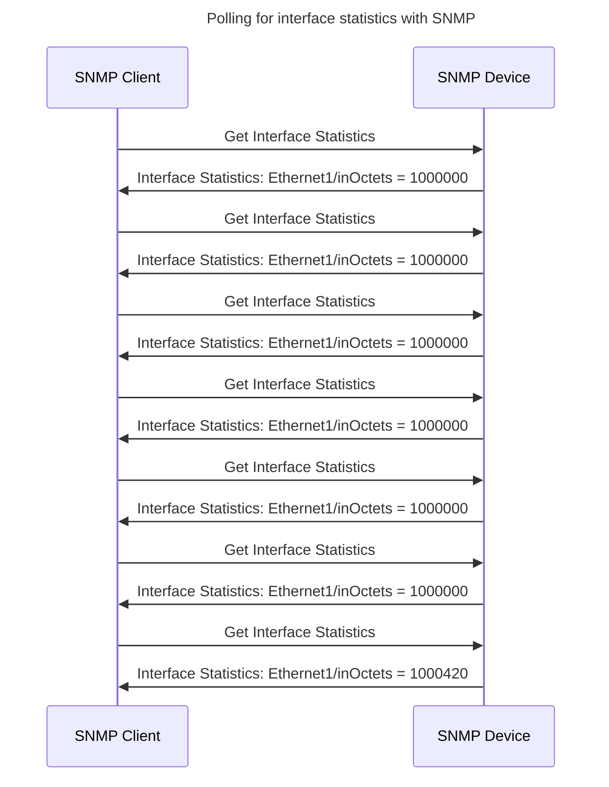
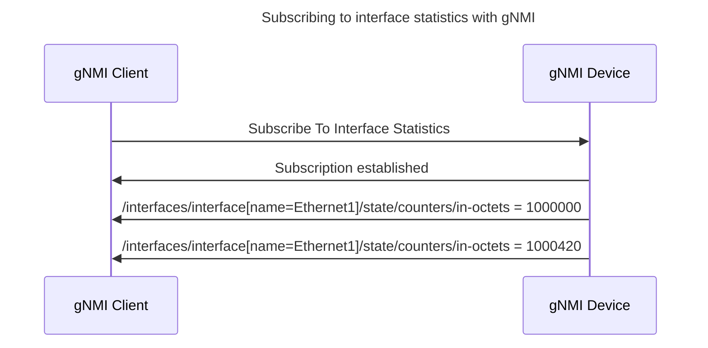

+++
categories = ["article"]
tags = ["grpc", "golang"]
date = "2024-01-01"
description = "grpc-go"
cover = "cover.jpg"
images = ["/posts/grpc-go/cover.jpg"]
featured = ""
featuredalt = ""
featuredpath = "date"
linktitle = ""
title = "grpc-go"
slug = "grpc-go"
type = "posts"
draft = true
+++

Network engineers have some unique challenges in monitoring and managing their own network devices. So it may come as a surprise to some people that, by far, the most used protocol for monitoring network devices was created over 30 years ago. However, there is an industry-accepted replacement and it's time to upgrade.

[SNMP](https://en.wikipedia.org/wiki/Simple_Network_Management_Protocol) has been the go-to protocol for network management for decades, but it has some limitations. It is complex, inefficient, and doesn't scale well to modern networks.

[gNMI](https://github.com/openconfig/reference/blob/master/rpc/gnmi/gnmi-specification.md) is a newer protocol that is designed to address these limitations. It is simpler, more efficient, and more scalable than SNMP. It is also more flexible, giving network administrators more control over what data they collect and how they collect it.

gNMI has the following operations:
- **Get** is used to retrieve data from network devices.
- **Set** is used to modify data on network devices.
- **Subscribe** is used to receive updates from network devices when the data changes.

### Why is gNMI better than SNMP?

Here are a few specific reasons:

- **gNMI is model-driven.** This means that it uses [YANG](https://datatracker.ietf.org/doc/html/rfc6020) to define the data that can be collected from network devices. This makes it easier to write and maintain scripts and applications that collect and manage network data.
- **gNMI is bidirectional.** This means that it can be used to both collect data from network devices and send data to them. This makes it possible to use gNMI for a wider range of network management tasks, such as configuring devices and troubleshooting problems.
- **gNMI is efficient.** gNMI uses a streaming protocol to collect data from network devices. This means that it can collect data more efficiently than SNMP, which uses a polling-based approach.
- **gNMI is scalable.** gNMI is designed to scale to large networks with many devices. It can handle a high volume of traffic without sacrificing performance.

#### Subscriptions
Let me elaborate on the "streaming protocol" comment. gNMI allows for a sustained streaming connection where the server can send updates to the client. This is possible because [gNMI uses gRPC](https://grpc.io/docs/what-is-grpc/core-concepts/#server-streaming-rpc). SNMP has no such streaming ability and most SNMP communication happens with a simple request/response pattern. Let's look at what a typical SNMP-based monitoring setup looks like:

Notice that the "Get Interface Statistics" request is repeated over and over again. The SNMP client has to keep asking over and over again for updates and will get back the same data it just got a minute ago. Also, I'm masking some serious ugliness of SNMP for your sake. With SNMP, you have to look at a table to map an index number to the interface name... And if an interface is "too fast" then you may need to poll the [ifHCInOctets](https://datatracker.ietf.org/doc/html/rfc2233#section-3.1.6) value instead. Neither of these issues exists in gNMI.

Now let's see how gNMI handles this situation using so-called subscriptions:

In this example, we set up the subscription once and from then on we get updates to these counters. Note that we ONLY get updates. This is a strength that's possible in gNMI. We can choose to not get updates if nothing has changed with a piece of data, so if an interface counter has not changed then we just won't get an update for that interface. This shows how gNMI subscriptions reduce the need for a large number of polling requests which has the benefit of reducing the load on network devices. Said differently, instead of polling devices for updates at regular intervals, gNMI subscriptions can allow devices to send updates to clients only when the data changes.

#### More

In addition to the above, here are some other benefits of using gNMI:

- **gNMI is more secure than SNMP.** Since it is based on HTTP/2, it uses TLS to encrypt all traffic, which helps to protect your network from unauthorized access.
- **gNMI is supported by a growing number of network devices and management tools.** This makes it easier to find the solutions that you need to meet your specific needs. Tools like [gNMIc](https://gnmic.openconfig.net/) make it much easier to peer into the state of devices while offering a much better user experience than tools like `snmpget` or `snmpwalk`.
- **gNMI is an open standard.** This means that it is not controlled by any one vendor, which gives you more flexibility and choice. Even when the data models that are used aren't OpenConfig, YANG is still almost always used to describe the vendor-specific data model and makes documentation and automation infinitely easier.

Overall, gNMI is a more modern and efficient approach to network management than SNMP. It is a good choice for organizations of all sizes, from small businesses to large enterprises. I have a hypothesis that gNMI could also be good for smaller-scale (maybe homelab?) setups as well, but more on that in a future post. In the future, I also want to dive into some details of gNMI with: different types of subscriptions: ([STREAM](https://github.com/openconfig/reference/blob/master/rpc/gnmi/gnmi-specification.md#35152-stream-subscriptions), [POLL](https://github.com/openconfig/reference/blob/master/rpc/gnmi/gnmi-specification.md#35153-poll-subscriptions), [ONCE](https://github.com/openconfig/reference/blob/master/rpc/gnmi/gnmi-specification.md#35151-once-subscriptions)), `updates_only`/`sync_response`, coalescing of duplicated updates, dial out with [grpctunnel](https://github.com/openconfig/grpctunnel), and core data types. However, I'm low on time and each of these topics deserves separate posts. Until then, thanks for reading!

----

#### Footnotes
 Yes, I know SNMP traps exist but they're not applicable in this and many other examples and it's also a pain to work with, may silently break and is overall awful to work with.

#### References
- [gNMI on github](https://github.com/openconfig/gnmi) - has a reference client/server in Go.
- [gNMI specification](https://github.com/openconfig/reference/blob/master/rpc/gnmi/gnmi-specification.md) - the specification documentation for gNMI
- [SNMP on Wikipedia](https://en.wikipedia.org/wiki/Simple_Network_Management_Protocol) - SNMP has many different RFCs (because it's old) so Wikipedia is a source for the full list.
- [YANG specification](https://datatracker.ietf.org/doc/html/rfc6020) - Networking is such a complex problem they made an entirely new language to describe the data.
- [OpenConfig YANG models](https://www.openconfig.net/projects/models/) - OpenConfig is the "de facto" models for network devices and is a good example of using YANG itself.
- [gNMIc](https://gnmic.openconfig.net/) - Commandline tool that supports many gNMI features and supports data transformation, path suggestions based on YANG, dial-out telemetry, multiple gNMI targets, and a lot more.
