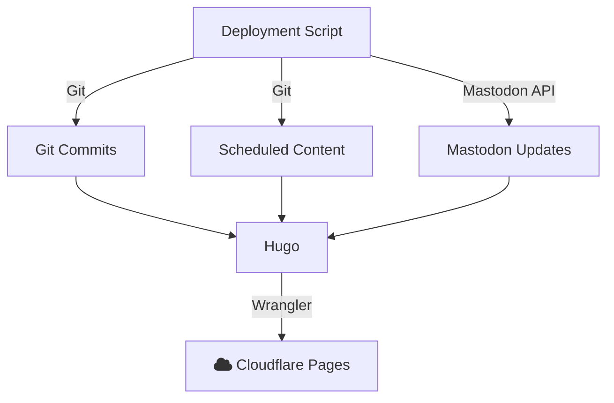

You may have noticed from my [mastodon feed](https://infosec.exchange/@sudorandom) or from a link on the website's navigation that I have added **daily prompts**. Each day is a new question to answer. You can respond to the post on Mastodon and it will appear (after some minutes) on this website. I've been doing it for the entire month of May and I intend to keep doing it to spur my thoughts and maybe others. I feel like having a question to answer each day helps give others context on who I am, what I'm doing and how I see the world. I have also found that it acts as a good way to reflect on things. I've wanted some answers to be different... so I now have some motivation to make them different.

**So go and check out the [prompts page](/prompts/).**

The rest of this article talks about all of the pieces that went into making this happen behind the scenes, besides actually writing the prompts.

### Banner Images
I wanted to show a banner image for the prompts... but using the same one every day seemed boring... So now I have a set of 6 banner images that I rotate through. Here's how I did that with Hugo:

`layouts/partials/prompts/load-cover.html`
```go
{{- $images := (resources.Match "images/prompt_covers/*") -}}
{{- return (index $images (mod .Date.Day (len $images))) -}}
```

This piece of code picks a new cover based on the day of the month, so the first of every month will have the same cover, for example. As I add more covers, the covers might shift over some number of days but I hope to eventually make 31 covers so each day of the month is unique. Notice that I used the `return` statement. This is a [special Hugo-specific statement](https://gohugo.io/functions/go-template/return/) that allows you to return values from partials.

Here's an example how how I use this partial in another template:

`layouts/prompts/single.html`
```go
{{- $cover := (partial "prompts/load-cover.html" .).Fill "1520x400 Center webp q100" -}}
<figure>
    
</figure>
```

### Mastodon "Comments"
I've changed a lot about how this website is deployed lately and hopefully, no one noticed... The biggest change was switching from [GitHub Pages](https://pages.github.com/) to [Cloudflare Pages](https://pages.cloudflare.com/). At first, this was just a temporary change, because Cloudflare was going to make me wait an entire week before allowing me to use `kmcd.dev` with the pages website, so I adjusted the Github Action to publish to Cloudflare Pages instead and everything went pretty great with that. That got me thinking... I was scheduling GitHub Actions to post daily updates and I also had a separate posting schedule for Tuesday to publish a new post. That seemed both wasteful and limiting at the same time. So I came up with a plan.

Instead of using Github Actions or Cloudflare Workers to deploy my static website, I'm just going to do it myself, from my Synology NAS. This allowed me to have a much more frequent update schedule for my website if there were changes. You may ask: what does it mean to "have changes" for a static website? Changes can be one of the following:
- I committed some changes that affected the website output
- A scheduled post becomes live
- A new mastodon post happened on my feed or there are other changes with the post (likes, favorites, boosts, edits etc.)



I have a simple script that checks for new changes in my Github repo periodically and does a rebuild to see if there are any scheduled changes. However, you may be wondering how I add mastodon posts to my "static" website. If you experiment enough, you may see that replies get added to my website within 10 minutes (if posted during the day in the European CEST timezone, otherwise it waits until the morning). I made this happen by writing some code with Go and a library called [go-mastodon](https://github.com/mattn/go-mastodon) that scans through my previous mastodon posts and puts the updated statuses into a Github repo which is updated for each build of my website. If I want to block content from appearing on my website, I can block the user or mute the reply.

The system works out pretty well. I can improve this, however. I could use a webhook to trigger builds more quickly when there are changes to my Github repo or if there are new posts on mastodon. As it stands, I have to wait up to 10 minutes to see the changes reflected... which isn't bad, it could just be better. This doesn't help with scheduled posts, but it would reduce the frequency that I have to check for updates on a timer.

I intend to polish the script that I use to pull down Mastodon updates and publish it as a tool that others can use. I may try to also add support for Blue Sky as well but I make no promises!

### Enjoy
I do hope that others find the prompts useful. If you have a suggestion for a prompt or any questions about my setup, please let me know in the comments for *this* post!
