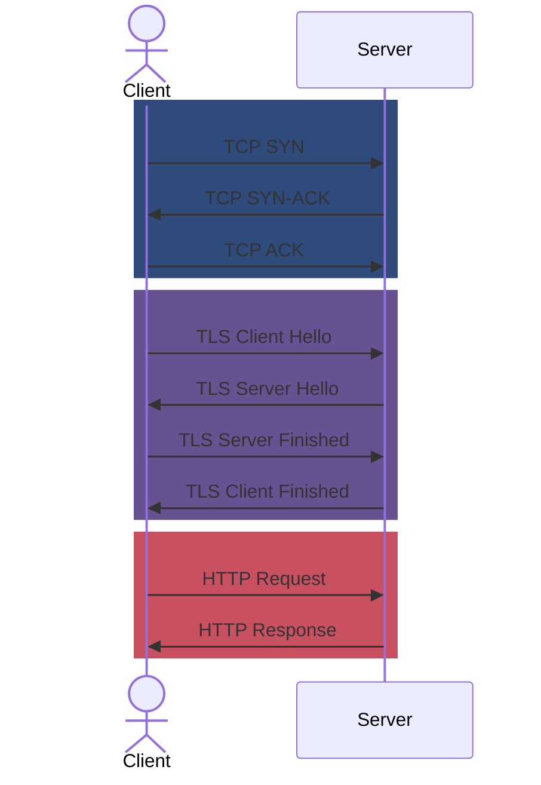
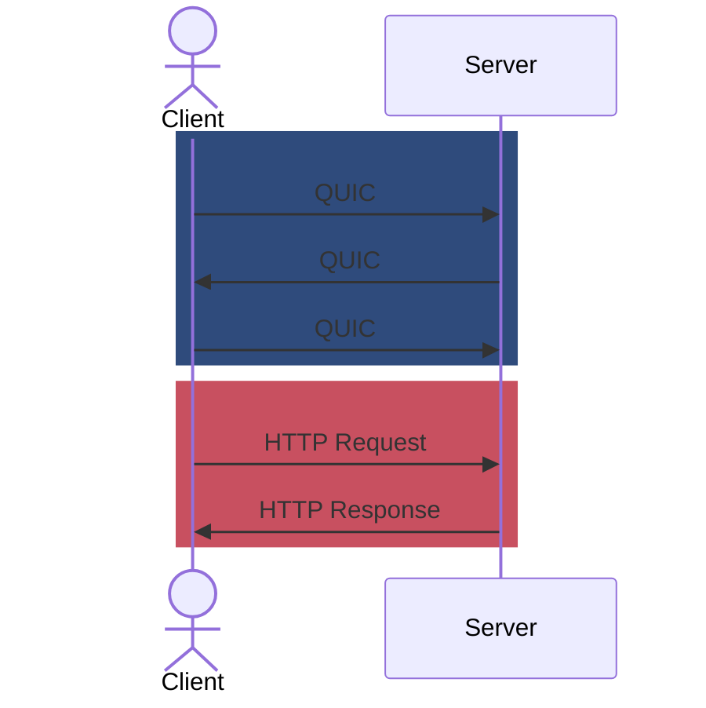
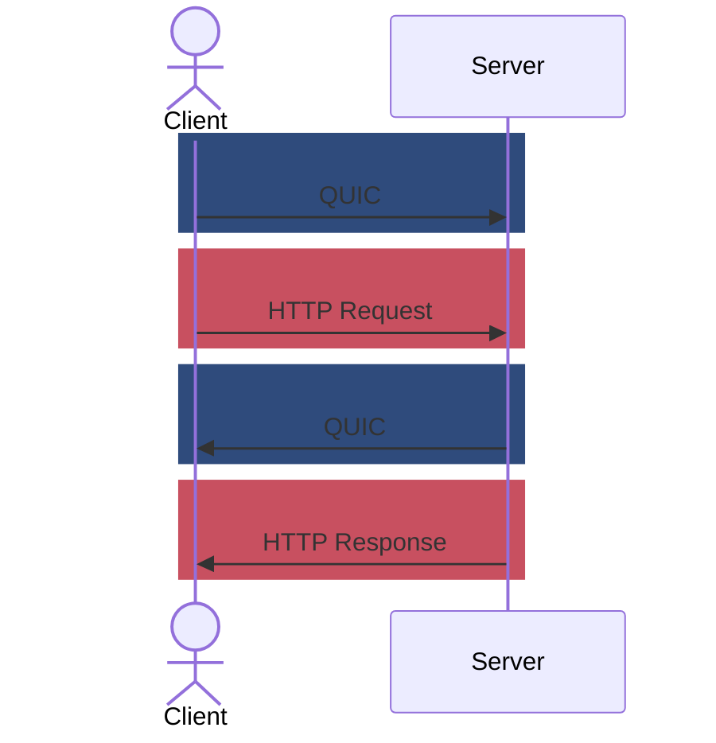

## Introduction
At the time of writing, HTTP/3 is [supported by 30.4% of the top 10 million websites](https://w3techs.com/technologies/details/ce-http3). This market penetration is astounding, but it seems like all of this progress has been possible almost exclusively by work on browsers, load balancers and CDN providers. What about the backend? How's HTTP/3 doing there? The answer, sadly, is not as incredible.

Because of this, I have been very interested in HTTP/3 in the context of gRPC. While gRPC has been instrumental in driving the adoption of HTTP/2, the same isn't true for HTTP/3 even though HTTP/3 promises several benefits that all seem to apply exceptionally well to gRPC services.

In this post, we'll dive into what HTTP/3 is and explore the compelling reasons why it's an ideal fit for gRPC applications. We'll uncover the technical advancements that promise to make HTTP/3 faster, more reliable, and more secure. But we won't stop at theory; we'll get our hands dirty with practical examples in Go, demonstrating how to set up and test gRPC servers and clients over HTTP/3.

By the end of this journey, you'll have a solid understanding of the benefits HTTP/3 brings to gRPC, the tools available to start using it today, and the potential it holds for the future of API development. So, fasten your seatbelts and get ready to experience the next generation of network protocols!

## Why HTTP/3

gRPC has had a lot of success pushing the world into HTTP/2 but there are some advantages to pushing even further and adopting the new major version of HTTP, [HTTP/3](https://http3-explained.haxx.se/en). Let's discuss these advantages before delving into code examples. So why should we use HTTP/3?



### Faster Connection Establishment
HTTP/3 is built on [QUIC](https://blog.cloudflare.com/the-road-to-quic) (Quick UDP Internet Connections). You can think of it as a similar protocol to TCP but as the name suggests, it is built on top of UDP. While TCP has historically been the foundation of web communication, offering sequential packet ordering, congestion control and retransmissions, the needs of web browsers have evolved to require some different features and tradeoffs. All three main features of TCP—sequential packet ordering, congestion control, and retransmissions—can sometimes hinder the performance of modern web applications. Acknowledging these trade-offs led to the development of QUIC and HTTP/3, which both leverage UDP.

As the internet evolved better security practices, we've layered TLS on top of TCP, so a TCP connection gets established first and then an HTTP/gRPC/etc. request can be made. This layering made it much easier to slowly adopt TLS but it has also made it slower to establish connections that need TLS because it added more round trips between the server and client before a connection can be "established". Each round trip introduces latency, delaying the time it takes for a request to reach the server and receive a response. Here's what it looks like with HTTP/1.1 and HTTP/2:



Yes, this process involves **three round trips** before the client even sends a request. Viewed in this way, this seems shockingly slow to me. By combining TLS 1.3, QUIC and HTTP/3, we can do away with several of those round trips. So with HTTP/3 it typically looks like this with only a single round trip before we can issue our request:



But wait, we can actually go further. With a feature called `0-RTT`, the number of round trips for a new connection can actually be **ZERO**. The idea is that the client can presume that a connection will be established and send the request based on that presumption. 0-RTT quite literally removes the need to do a round trip before making the first request. It looks like this:



Note that 0-RTT requires the client to have some cached information about the server so it's not always possible to use. Also, there are still some security concerns, mostly focused on the potential for denial of service attacks.

### Head-of-line Blocking
HTTP/2 has allowed gRPC to be quite good at multiplexing multiple requests and streams onto a single connection. This wasn't possible with HTTP/1.1. However, there is an issue that can arise due to TCP's guarantee of delivering packets **in order** even if they arrive out of order. This is an issue because packets for a request could be waiting for retransmissions from another request that is using the same connection. From gRPC's point of view, these requests are independent things, so there's no need to wait but TCP does not know about these separate streams, so we end up experiencing a so-called [head-of-line blocking](https://en.wikipedia.org/wiki/Head-of-line_blocking) issue.



HTTP/3 solves the head-of-line blocking issue by avoiding TCP altogether. Instead, it is built on top of a protocol called QUIC which is built on top of UDP. QUIC is aware of multiple streams so it knows when it is appropriate to deliver packets without having this head-of-line blocking behavior. This makes HTTP/3 much better when dealing with unreliable networks. With its heavy use of streams, gRPC in particular would greatly benefit from the elimination of the head-of-line blocking issue.

### Encryption is&nbsp;*Required*
When creating HTTP/2 there was a lot of disagreement over if it should require TLS. Many have argued that this requirement would hurt the adoption of HTTP/2. Further, they argue that HTTP/2 offers a lot of benefits that can be attained without the use of TLS. As a result, we now have [h2c](https://datatracker.ietf.org/doc/html/rfc7540#section-3.2), which is a way to use HTTP/2 without encryption.



These arguments might have worked for HTTP/2 but they didn't hold up for HTTP/3. HTTP/3 *requires* encryption and usage of the TLS 1.3 protocol. There are several reasons for this, but the most compelling one is that TLS 1.3 working with QUIC allows for fewer (and sometimes zero) round trips to negotiate a new connection before making a request, which is even faster than HTTP/1.1 without TLS. It's a double win by being both more secure and, theoretically, much faster.

## Experimentation
When researching this topic, I discovered that HTTP/3 with gRPC is a bit of a complicated story. I covered this a bit in my [gRPC: The Good Parts](/posts/grpc-the-good-parts/) post but the gist is that no decision has been made to officially support HTTP/3 throughout the entire gRPC ecosystem. There is an [open issue](https://github.com/grpc/grpc/issues/19126) to discuss this and there is an [official proposal](https://github.com/grpc/proposal/blob/master/G2-http3-protocol.md) also discussing the idea. Some projects are closer to HTTP/3 than others, so here are the implementations that I have found where you can make gRPC over HTTP/3 work:

- **C#**: [dotnet-grpc](https://devblogs.microsoft.com/dotnet/http-3-support-in-dotnet-6/#grpc-with-http-3) is the pioneer here, already containing an implementation of an HTTP/3 transport for gRPC.
- **Rust**: [Tonic with the Hyper transport](https://github.com/hyperium/tonic/issues/339) appears to be able to support this, although I'm not sure if there are good examples of this in the wild yet.
- **Go**: [ConnectRPC](https://github.com/connectrpc/connect-go) for Go uses the standard library http.Handlers, so any http server implementation can be used, including the transport available in [quic-go](https://github.com/quic-go/quic-go).
- **Cronet**: [Cronet](https://developer.android.com/develop/connectivity/cronet), designed primarily for mobile clients (Android and iOS), provides a way to utilize Chrome's network stack, including its QUIC and HTTP/3 support. This can be particularly useful for building gRPC clients with HTTP/3 capabilities in mobile environments.

If you know about other gRPC implementations that can work with HTTP/3 (client or server), let me know. These are only the ones I know about.

When learning something new I always like getting my hands dirty by using it. I feel like this is the best way to learn. Since Go is my current working language, I decided to explore HTTP/3 using ConnectRPC in Go. I'm including the full examples in this article because I've looked and haven't really been able to find good examples for this. I hope it's helpful for others. The full working examples are on [a git repo](https://github.com/sudorandom/example-connect-http3/) that I made for this post. Examples will have things like imports omitted for brevity but the full source is linked under each example.

### Example server in Go
Let's explore how easy it is to set up a gRPC server with HTTP/3 support using Go. The key players here are:

- [quic-go](https://github.com/quic-go/quic-go): This library provides a robust implementation of the QUIC protocol in Go, enabling HTTP/3 communication.
- [ConnectRPC](https://github.com/connectrpc/connect-go): connect-go, the Go implementation of ConnectRPC allows us to define gRPC services using familiar Go HTTP handlers (http.Handler), which greatly simplifies the integration process.

I am using the [Eliza service](https://buf.build/connectrpc/eliza) as the service to implement with ConnectRPC. This is a simple service intended to help demonstrate ConnectRPC. The implementation is un-important, so I omitted it but my implementation just echos back whatever the user sends.


func main() {
	mux := http.NewServeMux()
	// Implementation is only in the full source
	mux.Handle(elizav1connect.NewElizaServiceHandler(&server{}))

	addr := "127.0.0.1:6660"
	log.Printf("Starting connectrpc on %s", addr)
	h3srv := http3.Server{
		Addr:    addr,
		Handler: mux,
	}
	if err := h3srv.ListenAndServeTLS("cert.crt", "cert.key"); err != nil {
		log.Fatalf("error: %s", err)
	}
}



<a href="https://github.com/sudorandom/example-connect-http3/blob/v0.0.1/server-single/main.go" target="_blank">See the full source at GitHub.</a>


That's it! With this minimal setup, we now have a gRPC server that supports HTTP/3! I just used an `http3.Server` instance instead of `http.Server`. `http3.Server` does have different options related to the differences between QUIC and TCP. Note that it is possible to run an `http.Server` alongside `http3.Server` using the same address with the same port. How is this possible? Because HTTP/3 uses UDP and the ports are completely separate from TCP ports. Here's an example:

```go
func main() {
	mux := http.NewServeMux()
	mux.Handle(elizav1connect.NewElizaServiceHandler(&server{}))

	addr := "127.0.0.1:6660"
	log.Printf("Starting connectrpc on %s", addr)
	h3srv := http3.Server{
		Addr:    addr,
		Handler: mux,
	}

	srv := http.Server{
		Addr:    addr,
		Handler: h2c.NewHandler(mux, &http2.Server{}),
	}

	eg, _ := errgroup.WithContext(context.Background())
	eg.Go(func() error {
		return h3srv.ListenAndServeTLS("cert.crt", "cert.key")
	})
	eg.Go(func() error {
		return srv.ListenAndServeTLS("cert.crt", "cert.key")
	})
	if err := eg.Wait(); err != nil {
		log.Fatalf("error: %s", err)
	}
}
```

<a href="https://github.com/sudorandom/example-connect-http3/blob/v0.0.1/server-multi/main.go" target="_blank">See the full source at GitHub.</a>


This code demonstrates running multiple HTTP servers concurrently, providing support for HTTP/1.1, HTTP/2, and HTTP/3 on the same port by leveraging TCP for HTTP/1.1 and HTTP/2 and UDP for HTTP/3.

Oh, and note that this requires a certificate and a key because HTTP/3 **requires** TLS. Here's the command that I used to create a self-signed cert for testing:

```shell
openssl req -new -newkey rsa:4096 -days 365 -nodes -x509 \
    -subj "/C=DK/L=Copenhagen/O=kmcd/CN=local.kmcd.dev" \
    -keyout cert.key  -out cert.crt
```

That's it! With just a few lines of code, we now have a gRPC server that supports HTTP/3!

#### Testing with an example client in Go
Now that we have a server running we need some way to test it, so let's use the standard library `http.Client` with some quic-go magic sprinkled on top:

```go
const (
	url        = "https://127.0.0.1:6660/connectrpc.eliza.v1.ElizaService/Say"
	reqBody = `{"sentence": "Hello World!"}`
)

func main() {
	roundTripper := &http3.RoundTripper{
		TLSClientConfig: &tls.Config{
			// we need this because our certificate is self signed
			InsecureSkipVerify: true,
		},
	}
	defer roundTripper.Close()
	client := &http.Client{
		Transport: roundTripper,
	}

	log.Println("connect: ", url)
	log.Println("send: ", reqBody)
	req, err := http.NewRequest("POST", url, strings.NewReader(reqBody))
	if err != nil {
		log.Fatalf("error: %s", err)
	}
	req.Header.Add("Content-Type", "application/json")

	resp, err := client.Do(req)
	if err != nil {
		log.Fatalf("error: %s", err)
	}

	body, err := io.ReadAll(resp.Body)
	if err != nil {
		log.Fatalf("error: %s", err)
	}
	defer resp.Body.Close()

	log.Println("recv: ", string(body))
}
```

<a href="https://github.com/sudorandom/example-connect-http3/blob/v0.0.1/client-http/main.go" target="_blank">See the full source at GitHub.</a>


In the case of the client, we only need to define a `http3.RoundTripper` instance and pass that into a completely normal `http.Client` instance. That's... quite literally it. Everything else should be the same.

```plaintext
2024/07/06 12:57:24 connect:  https://127.0.0.1:6660/connectrpc.eliza.v1.ElizaService/Say
2024/07/06 12:57:24 send:  {"sentence": "Hello World!"}
2024/07/06 12:57:24 recv:  {"sentence":"Hello World!"}
```

This works as expected! In this next example, I'm calling the service using a client built with ConnectRPC, demonstrating how it can work seamlessly over HTTP/3 as well, just by configuring `http.Client` a little differently.

```go
const url = "https://127.0.0.1:6660"
var reqBody = &elizav1.SayRequest{Sentence: "Hello World!"}

func main() {
	roundTripper := &http3.RoundTripper{
		TLSClientConfig: &tls.Config{
			InsecureSkipVerify: true,
		},
	}
	defer roundTripper.Close()
	client := &http.Client{
		Transport: roundTripper,
	}

	svcClient := elizav1connect.NewElizaServiceClient(client, url, connect.WithGRPC())

	log.Println("connect: ", url)
	log.Println("send: ", reqBody)
	resp, err := svcClient.Say(context.Background(), connect.NewRequest(reqBody))
	if err != nil {
		log.Fatalf("error: %s", err)
	}

	log.Println("recv: ", resp.Msg)
}
```

<a href="https://github.com/sudorandom/example-connect-http3/blob/v0.0.1/client-connect/main.go" target="_blank">See the full source at GitHub.</a>


It works the same, but the output is a bit different since protobuf types print slightly differently from JSON:

```plaintext
2024/07/06 12:57:12 connect:  https://127.0.0.1:6660
2024/07/06 12:57:12 send:  sentence:"Hello World!"
2024/07/06 12:57:14 recv:  sentence:"Hello World!"
```

Now we have a server and a client that talks HTTP/3! Amazing!

#### Testing HTTP/3 servers with curl
I wanted to test this with a "real" HTTP/3 client because maybe there are some weird issues where quic-go servers only work against quic-go clients. To be extra sure, I wanted to validate this further with a well-established HTTP/3 client. So I reached for `curl`, the de-facto tool for calling HTTP APIs from the command line. So I immediately tried to just run `curl --http3`:

```shell
$ curl \
  --json '{"sentence": "Hello World!"}' \
  --http3 -k -v \
  https://127.0.0.1:6660/connectrpc.eliza.v1.ElizaService/Say
curl: option --http3: the installed libcurl version doesn't support this
curl: try 'curl --help' or 'curl --manual' for more information
```



Wait, what? What's happening?? I thought curl supported HTTP/3! What gives? Well, the story [isn't that simple](https://daniel.haxx.se/blog/2024/06/10/http-3-in-curl-mid-2024/). The curl CLI might support HTTP/3 but the libraries that it uses also need to be on the correct version to make it all work. To get around that, I installed curl using [Cloudflare's homebrew formula](https://blog.cloudflare.com/http3-the-past-present-and-future#using-curl) which will install everything needed to get curl to work with HTTP/3. So let's try it out:

```shell
$ curl \
  --json '{"sentence": "Hello World!"}' \
  --http3 -k -v \
  https://127.0.0.1:6660/connectrpc.eliza.v1.ElizaService/Say
*   Trying 127.0.0.1:6660...
* Server certificate:
*  subject: C=DK; L=Copenhagen; O=kmcd; CN=local.kmcd.dev
*  start date: Jul  6 06:14:48 2024 GMT
*  expire date: Jul  6 06:14:48 2025 GMT
*  issuer: C=DK; L=Copenhagen; O=kmcd; CN=local.kmcd.dev
*  SSL certificate verify result: self signed certificate (18), continuing anyway.
* Connected to 127.0.0.1 (127.0.0.1) port 6660
* using HTTP/3
* [HTTP/3] [0] OPENED stream for https://127.0.0.1:6660/connectrpc.eliza.v1.ElizaService/Say
* [HTTP/3] [0] [:method: POST]
* [HTTP/3] [0] [:scheme: https]
* [HTTP/3] [0] [:authority: 127.0.0.1:6660]
* [HTTP/3] [0] [:path: /connectrpc.eliza.v1.ElizaService/Say]
* [HTTP/3] [0] [user-agent: curl/8.9.0-DEV]
* [HTTP/3] [0] [content-type: application/json]
* [HTTP/3] [0] [accept: application/json]
* [HTTP/3] [0] [content-length: 28]
> POST /connectrpc.eliza.v1.ElizaService/Say HTTP/3
> Host: 127.0.0.1:6660
> User-Agent: curl/8.9.0-DEV
> Content-Type: application/json
> Accept: application/json
> Content-Length: 28
>
* upload completely sent off: 28 bytes
< HTTP/3 200
< content-type: application/json
< accept-encoding: gzip
< date: Sat, 06 Jul 2024 13:17:12 GMT
< content-length: 27
<
* Connection #0 to host 127.0.0.1 left intact
{"sentence":"Hello World!"}
```

Success! You can see that HTTP/3 is being used by inspecting the verbose logging. This flexes our server with HTTP/3 but you may be wondering what this has to do with gRPC because I'm only using basic HTTP requests with JSON and you're totally right. The previous examples only leverage one of the three protocols that ConnectRPC provides by default, [the connect protocol](https://connectrpc.com/docs/protocol/). Thus far, I haven't validated if the other two protocols, gRPC or gRPC-Web, really work using this transport. To test that, we'll need more gRPC-centric tooling.

#### Adding HTTP/3 to the Buf CLI
I also wanted to test with gRPC-specific tooling to ensure gRPC and gRPC-Web worked as expected. So I added support for HTTP/3 with the buf CLI because it supports calling services using [Connect](https://connectrpc.com/docs/protocol/), [gRPC](https://github.com/grpc/grpc/blob/master/doc/PROTOCOL-HTTP2.md) and [gRPC-Web](https://github.com/grpc/grpc/blob/master/doc/PROTOCOL-WEB.md). This ended up being pretty easy and looks similar to the ConnectRPC example client above. I have an [open PR here](https://github.com/bufbuild/buf/pull/3127) and if you want a sneak peak you can build the Buf CLI from [my branch](https://github.com/sudorandom/buf/tree/http3). Below, I show how I tested this new feature with ConnectRPC's demo website:

```shell
$ buf curl \
    --http3 \
    --schema=buf.build/connectrpc/eliza \
    -d '{"sentence": "Hello world!"}' \
    https://demo.connectrpc.com/connectrpc.eliza.v1.ElizaService/Say
{
  "sentence": "Hello...I'm glad you could drop by today."
}
```

Success! HTTP/3 works now! When I tested this, I was surprised that [demo.connectrpc.com](https://demo.connectrpc.com) actually supported HTTP/3, but it does! By default, `buf curl` will use the connect protocol, so we didn't test anything new. So let's try gRPC-Web next:

```shell
$buf curl \
    --http3 \
    --protocol=grpcweb \
    --schema=buf.build/connectrpc/eliza \
    -d '{"sentence": "Hello world!"}' \
    https://demo.connectrpc.com/connectrpc.eliza.v1.ElizaService/Say
{
  "sentence": "Hello, how are you feeling today?"
}
```

And now the classic gRPC:

```shell
$ buf curl \
    --http3 \
    --protocol=grpc \
    --schema=buf.build/connectrpc/eliza \
    -d '{"sentence": "Hello world!"}' \
    https://demo.connectrpc.com/connectrpc.eliza.v1.ElizaService/Say
{
   "code": "internal",
   "message": "protocol error: no Grpc-Status trailer: unexpected EOF"
}
```

Wait, ***what***? Why is it complaining about missing HTTP trailers? What gives?



HTTP trailers are a recurring issue for gRPC. HTTP trailers are a special type of HTTP header that is sent at the very end of a message body after all the data has been transmitted. They are useful for sending metadata that cannot be determined until the entire message is known, such as checksums, signatures, or other end-of-message signals. gRPC relies on trailers to return status codes and error details.

To explain why I am not receiving the HTTP trailers, I had to dig into [quic-go's](https://github.com/quic-go/quic-go) HTTP/3 implementation.

#### Adding trailer support to quic-go
When I looked into quic-go, I discovered that it *doesn't support [HTTP trailers](https://developer.mozilla.org/en-US/docs/Web/HTTP/Headers/Trailer) yet*. There is [an issue](https://github.com/quic-go/quic-go/issues/2266) and a [related pull request](https://github.com/quic-go/quic-go/pull/2344). But the issue is four years old, the PR is two years old, and both are still open after all of this time. This seemed quite crazy to me at first, but, on reflection, I realized that gRPC is the most popular thing that currently uses HTTP trailers. However, `grpc-go` directly uses HTTP/2 support from `golang.org/x/net/http2` instead of using `net/http` so it would require a good amount of work to get HTTP/3 support through quic-go. Therefore, this issue probably isn't on the radar of anyone working on `grpc-go`. However, it is trivial (as seen above) to use quic-go with ConnectRPC, so I think this is a unique situation where progress can be made quickly.

So I ended up implementing trailer support for clients and I [submitted my own PR](https://github.com/quic-go/quic-go/issues/2266). I don't think it is quite ready yet but when I use [my branch of quic-go](https://github.com/sudorandom/quic-go/tree/client-trailers) with [my branch of the buf CLI](https://github.com/sudorandom/buf/tree/http3), gRPC actually works with HTTP/3!

```shell
$ buf curl \
    --http3 \
    --protocol=grpc \
    --schema=buf.build/connectrpc/eliza \
    -d '{"sentence": "Hello world!"}' \
    https://demo.connectrpc.com/connectrpc.eliza.v1.ElizaService/Say
{
  "sentence": "Hello there...how are you today?"
}
```

There are a few issues that I have with my PR. I based it off of the earlier PR but many things have changed with the codebase that actually make it harder to implement this feature. However, it's super encouraging that this code seems to work without too much fuss.

### Experiment Results
My experimentation shows that while Go doesn't yet have full, native support for gRPC over HTTP/3, there are practical workarounds available today. Both the gRPC-Web and Connect protocols function seamlessly over HTTP/3, and in fact, ConnectRPC may already be leveraging HTTP/3 in production environments where infrastructure allows. I discovered this firsthand with the [ConnectRPC demo website](https://connectrpc.com/demo/), which will connect using HTTP/3 from the browser to the load balancer (after a few requests so the browser knows HTTP/3 is available).




Note: While the connection between my browser and the demo service is HTTP/3, it is likely that HTTP/2 is being used between the load balancer and the backend service. Even without HTTP/3 through the entire stack, the reduced number of round trips between the load balancer and the end user is likely still an advantage due to the decreased connection latency.


## Conclusion
In this post, we've explored the exciting potential of HTTP/3 to supercharge gRPC performance. We dove into the key advantages of HTTP/3, such as faster connection establishment, elimination of head-of-line blocking, and mandatory encryption. By getting our hands dirty with practical examples in Go, we've seen firsthand how HTTP/3 can be seamlessly integrated into gRPC services using tools like ConnectRPC and Buf.

While the gRPC ecosystem's full adoption of HTTP/3 is in its early stages, the benefits are clear, and the tools are already available in some libraries and tools. As developers, we have the opportunity to push this technology forward and shape the future of high-performance, secure communication.



I encourage you to experiment with HTTP/3 and gRPC in your own projects. Explore different implementations, measure the performance gains, and don't be afraid to dive into the code if you run into issues. Your active engagement with this evolving technology can directly contribute to the ongoing development of gRPC and HTTP/3. Although widespread adoption of HTTP/3 for gRPC on the backend is still in its early stages, if you have the flexibility to control both server and client components, or are working with browser-based clients, you might find compelling use cases for it even today.

I'd love to hear about your experiences with HTTP/3 and gRPC. Have you seen significant performance improvements? Or perhaps you've found that QUIC is slower without the kernel-level optimizations that TCP can take advantage of? What challenges have you encountered while experimenting with this exciting technology? Let's share our experiences and findings because even though HTTP/3 is still finding its footing in this context, there's a lot we can learn from each other.
