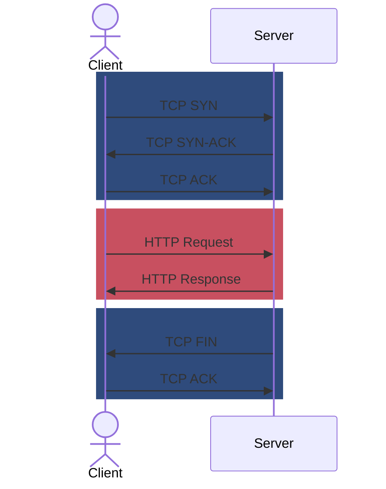

## Introduction
Welcome to the first installment of our "HTTP from Scratch" blog series! In this series, we'll embark on a journey through the evolution of the Hypertext Transfer Protocol (HTTP), the backbone of the World Wide Web. By building simple implementations of each major HTTP version, we'll gain a deep understanding of how this essential protocol has shaped the internet we use every day and how it has evolved to what we have now.

In this post, we'll travel back to the early days of the web and explore [HTTP/0.9][1], HTTP's initial incarnation. HTTP/0.9 was a groundbreaking technology that enabled the first web browsers and servers to communicate, laying the foundation for the World Wide Web that we know today. But HTTP/0.9 had its limitations. We'll discuss these shortcomings, which ultimately paved the way for subsequent versions of HTTP that introduced features like headers, status codes, and support for additional HTTP methods, connection reuse, binary framing and, eventually, abandoning TCP for UDP for better reliability and performance. For a more formal description of the HTTP/0.9 specification, you can reference [http.dev][1] or [w3.org][2].

To get a hands-on understanding of HTTP/0.9, we'll take a practical approach. Since no modern web servers support this early version, we'll create our own HTTP/0.9 server from scratch using Go. This will allow us to experiment with the protocol and gain valuable insights into its inner workings.

By the end of this post, you'll have a solid grasp of HTTP/0.9 and the foundation it laid for the modern web. You will be well-equipped to continue our journey through the evolution of HTTP in the upcoming articles.

## Understanding HTTP/0.9

HTTP/0.9, the inaugural version of the Hypertext Transfer Protocol, laid the groundwork for the web as we know it today. It introduced a simple request-response model that facilitated communication between web clients and servers.

### The Request

In HTTP/0.9, a client sends a single-line request to the server. This request line consists of only two components:

1. **GET Method:**  The only method supported in HTTP/0.9. It instructs the server to retrieve the specified resource.
2. **Resource Path:**  The path to the resource on the server that the client wants to access.

For example, to request the index.html file from the server's root directory, the client would send:

```http
GET /index.html
```

That's... it. It can't get much simpler than that. Note that there are no headers to indicate content size, compression, content type, etc. This isn't a part of HTTP/0.9 as all of that was introduced in HTTP/1.0.

### The Response

Upon receiving a request, the server responds with the contents of the requested resource. This response is a simple stream of bytes, usually representing an HTML document. Notably, there are no headers in an HTTP/0.9 response or a status code that tells us if we're receiving an error page or the resource that we asked for. Since there were no status codes, there was no way to indicate if a requested resource was not found — a concept that would later be introduced with the 404 status code.

### Full example
```http
> GET /index.html
< <html>
< Hello World!
< </html>
```

Again, this is an extremely simple protocol at this point. Request a resource and get the data. There's no place to put metadata when requesting or responding. By the way, lines prefixed with `>` are from the client to the server and `<` are from the server to the client. Remember this, because this is important for understanding verbose `curl` output, which we'll use a good amount in the future.



### Limitations
While revolutionary for its time, HTTP/0.9 had some significant limitations that paved the way for future improvements:

- **No Headers:**  The absence of headers meant that the server could not convey any additional information about the response, such as content type or length.
- **Only GET:** The only supported method was GET, which meant that clients could only request resources and not submit data to the server.
- **No Status Codes:**  There was no mechanism to indicate errors or other status information.

## Implementing an HTTP/0.9 Server
Okay, now let's implement the server.
```go
type Server struct {
	Addr    string
	Handler http.Handler
}


func (s *Server) ServeAndListen() error {
	if s.Handler == nil {
		panic("http server started without a handler")
	}
	l, err := net.Listen("tcp", s.Addr)
	if err != nil {
		return err
	}
	defer l.Close()

	for {
		conn, err := l.Accept()
		if err != nil {
			log.Fatal(err)
		}

		go s.handleConnection(conn)
	}
}
```

You can see here that our ServeAndListen() listens on the configured TCP port and then loops forever, accepting and handling new connections in separate goroutines. Now let's look at `s.handleConnection()`

```go
func (s *Server) handleConnection(conn net.Conn) {
	defer conn.Close()

	reader := bufio.NewReader(conn)
	line, _, err := reader.ReadLine()
	if err != nil {
		return
	}

	fields := strings.Fields(string(line))
	if len(fields) < 2 {
		return
	}
	r := &http.Request{
		Method:     fields[0],
		URL:        &url.URL{Scheme: "http", Path: fields[1]},
		Proto:      "HTTP/0.9",
		ProtoMajor: 0,
		ProtoMinor: 9,
		RemoteAddr: conn.RemoteAddr().String(),
	}

	s.Handler.ServeHTTP(newWriter(conn), r)
}
```

Handling a connection is very simple in HTTP/0.9 because clients can only create a new connection, send a single request and then the connection is closed. This code reads the first line given by the user and then calls `strings.Fields` to split the different parts of the request up. As a reminder, this is what the request looks like in HTTP/0.9:

```http
GET /path/to/resource
```

Okay, now let's look at what `newWriter` does. ServeHTTP expects a `http.ResponseWriter`, which looks like this:
```go
type ResponseWriter interface {
	Header() Header
	Write([]byte) (int, error)
	WriteHeader(statusCode int)
}
```

Here's what our HTTP/0.9 looks like:
```go
type responseBodyWriter struct {
	conn net.Conn
}

func (r *responseBodyWriter) Header() http.Header {
	// unsupported with HTTP/0.9
	return nil
}

func (r *responseBodyWriter) Write(b []byte) (int, error) {
	return r.conn.Write(b)
}

func (r *responseBodyWriter) WriteHeader(statusCode int) {
	// unsupported with HTTP/0.9
}

func newWriter(c net.Conn) http.ResponseWriter {
	return &responseBodyWriter{
		conn: c,
	}
}
```
The important thing to note here is that HTTP/0.9 doesn't support status codes or headers so we don't need to do anything in `Header()` and `WriteHeader(statusCode)`

Now let's put it together in a main function:
```go
func main() {
    addr := "127.0.0.1:9000"
	s := Server{
		Addr: addr,
		Handler: http.HandlerFunc(func(w http.ResponseWriter, r *http.Request) {
			w.Write([]byte("Hello World!"))
		}),
	}
    log.Printf("Listening on %s", addr)
	if err := s.ServeAndListen(); err != nil {
		log.Fatal(err)
	}
}
```
Note that the HTTP handler is a normal-looking `http.Handler` so this server could work with any existing HTTP router or framework.

See the full source at Github: .

### Testing the server
Now we just need to run the server:
```shell
$ go run server/main.go
2024/07/27 21:55:28 Listening on 127.0.0.1:9000
```

Now that we have an HTTP/0.9 server, how do we test it?? Since HTTP/0.9 pretty much isn't used anywhere, how do find a client to test this server? Luckily, `curl` [supports HTTP/0.9][3], so let's try that!
```shell
$ curl --http0.9 http://127.0.0.1:9000/this/is/a/test
Hello World!
```

The --http0.9 flag instructs curl to accept the headerless responses of HTTP/0.9.

You should note that curl is *sending* a request as if it were HTTP/1.1 but appears accept to the headerless responses of HTTP/0.9. Here's what the curl manpage says about the flag:

```shell
--http0.9
       (HTTP) Tells curl to be fine with HTTP version 0.9 response.

       HTTP/0.9 is a completely headerless response and therefore you can also connect with this to non-HTTP servers and still get a response since curl will simply transparently downgrade - if allowed.
```

I verified this behavior a bit more when I mixed `--http1.0` and `--http0.9`. Instead of using `HTTP/1.1` in the first line of the request, curl declares that it is using `HTTP/1.0` while still treating the body correctly (not expecting a status code or headers):

```shell
$ curl --http1.0 --http0.9 http://127.0.0.1:9000/this/is/a/test
Hello World!
```

By the way, if you don't use the `--http0.9` (or if your server returns the status code/headers in a format that doesn't make sense) you will receive an error message, "Received HTTP/0.9 when not allowed":
```shell
$ curl http://127.0.0.1:9000/this/is/a/test
curl: (1) Received HTTP/0.9 when not allowed
```

You can test this server with simpler tools. For example, [netcat][4] (`ncat`), can be used to make this same request. This will be a theme for the text-based protocols where often it's simpler just to write text out directly to netcat than it is to use other kinds of tooling:

```shell
$ echo GET this/is/a/test | ncat 127.0.0.1 9000
Hello World!
```

After writing most of this article, I finally realized that I never even attempted to test my web server using a real web browser. It seems like the only major browser that still supports HTTP/0.9 is Firefox, so let's see it!



**Yes, it works!** Success!

## Implementing an HTTP/0.9 Client

Now that we've made a server and used existing clients, we might as well make a client in Go. Don't worry, this one is super simple:

```go
conn, err := net.Dial("tcp", "127.0.0.1:9000")
if err != nil {
	log.Fatalf("err: %s", err)
}

if _, err := conn.Write([]byte("GET /this/is/a/test\r\n")); err != nil {
	log.Fatalf("err: %s", err)
}

body, err := io.ReadAll(conn)
if err != nil {
	log.Fatalf("err: %s", err)
}

fmt.Println(string(body))
```
See the full source at Github: .

This code does the following:

- Establishes a TCP connection to the server.
- Sends the HTTP/0.9 request.
- Receives the response and displays it to the user.

Simple, right? Almost ***too simple***.

```go
$ go run client/main.go
Hello World!
```

## Conclusion

In this post, we delved into the origins of the web by exploring HTTP/0.9. While simple in its design, HTTP/0.9 was a groundbreaking protocol that enabled the first web browsers and servers to communicate.

We explored the basic request-response model of HTTP/0.9, understanding how clients could request resources and servers could deliver them. We also acknowledged the limitations of this early version, including the lack of headers, status codes, and support for other HTTP methods besides GET.

By building a rudimentary HTTP/0.9 server and client in Go, we gained hands-on experience with the protocol's core concepts. We learned how to handle TCP connections, parse requests, and send responses, laying a solid foundation for understanding more advanced HTTP versions.

In the upcoming parts of this series, we'll delve into how HTTP evolved to overcome the limitations of HTTP/0.9 and address the needs of the evolving World Wide Web. We'll explore the introduction of headers, status codes, and additional methods, which enabled more robust and feature-rich communication between web clients and servers. Stay tuned for the next part of our series, where we'll dive into HTTP/1.0 and its significant enhancements over HTTP/0.9. As a sneak peek, these are the major features added to each version:

- HTTP/0.9: First attempt to transfer generic resources by paths
- HTTP/1.0: Adds status codes, headers, verbs
- HTTP/1.1: Adds connection re-use so connections can be reused
- HTTP/2: Switches from a text-based protocol to binary
- HTTP/3: Built on QUIC instead of TCP

[1]: https://http.dev/0.9
[2]: https://www.w3.org/Protocols/HTTP/AsImplemented.html
[3]: https://ec.haxx.se/http/versions/http09.html
[4]: https://en.wikipedia.org/wiki/Netcat
