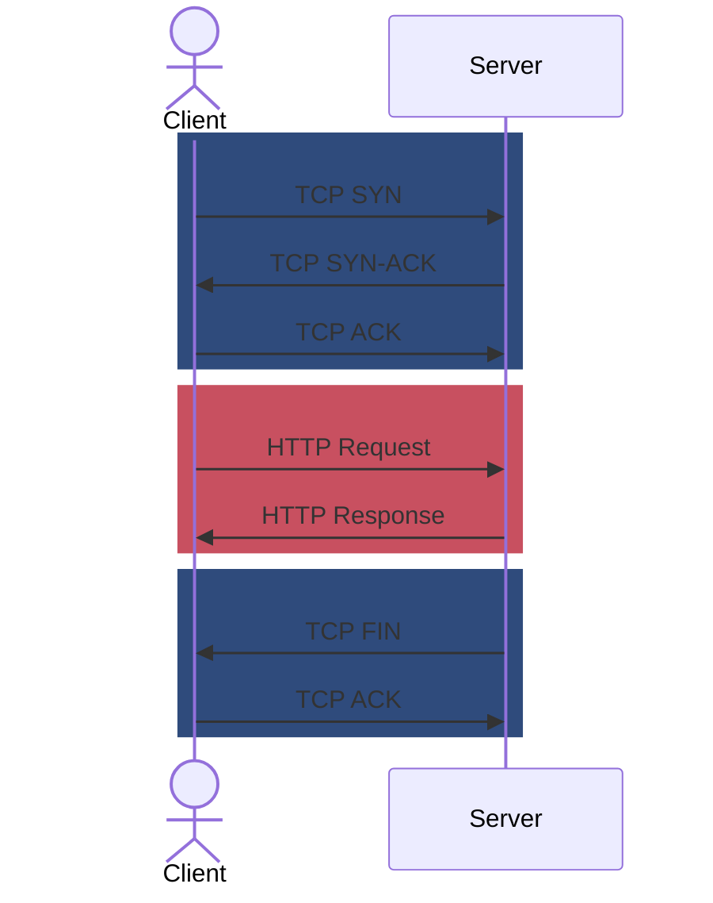

## Introduction
In our previous exploration, we delved into the simplicity of [HTTP/0.9](/posts/http0.9-from-scratch), a protocol that served as the web's initial foundation. However, as the internet evolved, so did its needs. Enter HTTP/1.0, a landmark version released in 1996 that laid the groundwork for the web we know today. HTTP/1.0 was a game-changer, introducing features that revolutionized web communication:

- **Headers:** Metadata that added context and control to requests and responses ([RFC 1945 4.2](https://datatracker.ietf.org/doc/html/rfc1945#section-4.2)).
- **Methods:** A diverse set of actions (POST, HEAD, PUT, DELETE, etc.) beyond just retrieving documents. The web was no longer read-only. ([RFC 1945 8](https://datatracker.ietf.org/doc/html/rfc1945#section-8)).
- **Status Codes:** Clear signals about the outcome of requests, paving the way for better error handling and redirection ([RFC 1945 6.1.1](https://datatracker.ietf.org/doc/html/rfc1945#section-6.1.1)).
- **Content Negotiation:** The ability to request specific formats ([RFC 1945 10.5](https://datatracker.ietf.org/doc/html/rfc1945#section-10.5)), encoding ([RFC 1945 10.3](https://datatracker.ietf.org/doc/html/rfc1945#section-10.3)) or languages ([RFC 1945 D.2.5](https://datatracker.ietf.org/doc/html/rfc1945#appendix-D.2.5)) for content.

In this article, we'll journey through the intricacies of HTTP/1.0 and craft a simple Go server that speaks the protocol.

## Understanding HTTP/1.0

First, let's cover the new features added in HTTP/1.0. I hope at the end of this section you'll understand why this version was truly deserving of the "1.0" labeling.

### Headers
Headers convey vital information about requests and responses. Some common headers include:

- `Content-Type`:  Indicates the format of the data (text/html, image/jpeg, etc.). ([RFC 1945 10.5](https://datatracker.ietf.org/doc/html/rfc1945#section-10.5))
- `Accept`:  Tells the server which content type the client expects. ([RFC 1945 D2.1](https://datatracker.ietf.org/doc/html/rfc1945#appendix-D.2.1))
- `Content-Length`: Specifies the size of the response body. ([RFC 1945 10.4](https://datatracker.ietf.org/doc/html/rfc1945#section-10.4))
- `User-Agent`: Identifies the client software making the request. ([RFC 1945 10.15](https://datatracker.ietf.org/doc/html/rfc1945#section-10.15))

...but many more have since become standard.

### HTTP Methods
HTTP/1.0 introduced a variety of methods:

- **GET:**  Requests a resource.
- **POST:**  Submits data to be processed by the server.
- **HEAD:**  Similar to GET, but only requests the headers, not the body.
- **PUT:** Replaces an existing resource or creates a new one if it doesn't exist.
- **DELETE:**  Removes a specified resource.

### Status Codes
Status codes are essential for communication between the client and server. They fall into categories:
- **1xx:** [Informational.](https://datatracker.ietf.org/doc/html/rfc1945#section-9.1)
- **2xx:** [Success.](https://datatracker.ietf.org/doc/html/rfc1945#section-9.2)
- **3xx:** [Redirection](https://datatracker.ietf.org/doc/html/rfc1945#section-9.3).
- **4xx:** [Client Error (e.g., 404 Not Found).](https://datatracker.ietf.org/doc/html/rfc1945#section-9.4)
- **5xx:** [Server Error (e.g., 500 Internal Server Error).](https://datatracker.ietf.org/doc/html/rfc1945#section-9.5)

### Request Structure
HTTP/1.0 requests follow a structured format:

1. **Request Line:** Specifies the HTTP method (e.g., GET, POST), the requested path, and the protocol version (HTTP/1.0).
2. **Headers:** Key-value pairs that provide additional information (e.g., `User-Agent`, `Content-Type`, `Referer`).
3. **Empty Line:** Signals the end of the headers.
4. **Request Body (Optional):** Data sent with the request (common with POST).

Headers and request bodies are completely new in this version. Now there is an official way to send data to servers using HTTP. Before this, it was possible to encode information into the HTTP path to send data to the servers but now that HTTP servers can accept entire documents from clients, it opens up the possibilities for more dynamic web experiences. And don't sleep on headers. Headers provide a way to annotate more details about web requests that would be very tedious to add in the URL. Now the client can specify the language, content-encoding, character-set, content-type that it will accept as a response and much, much more.

#### Example
```http
GET /index.html HTTP/1.0
User-Agent: Mozilla/5.0
Host: www.example.com

(Optional request body)
```

#### Response Structure
HTTP/1.0 responses mirror this structure:

1. **Status Line:**  Includes the protocol version, a status code (e.g., 200 OK, 404 Not Found), and a reason phrase. ([RFC 1945 6.1](https://datatracker.ietf.org/doc/html/rfc1945#section-6.1))
2. **Headers:** Similar to request headers, providing metadata about the response. ([RFC 1945 6.2](https://datatracker.ietf.org/doc/html/rfc1945#section-6.2))
3. **Empty Line:** Separates headers from the body.
4. **Response Body:** The actual content sent back to the client.

Status codes now enable more robust error handling. Web servers would use the status codes to show appropriate error pages to the user. These error codes have been so important that non-technical people around the world will know of `404 Not Found`.

Now HTTP responses return headers. This adds important information about how to render the document. Finally, we're not just limited to HTML. Headers are critical to many features today, including redirection, caching, authentication, authorization, and many more.

#### Example

```http
HTTP/1.0 200 OK
Content-Type: text/html
Content-Length: 1354

(HTML content here)
```

Nothing has changed with the sequence of events from HTTP/0.9. It still looks like this:



## Implementing an HTTP/1.0 Server in Go
Enough theory! Let's roll up our sleeves and bring HTTP/1.0 to life.

    Programming is learned by writing programs. — Brian Kernighan

We'll build a simple Go server from the ground up, handling requests and responses with the elegance and efficiency that Go is known for. By the end of this section, you'll have a working HTTP/1.0 server that you can interact with using familiar tools like `curl` and your web browser. Note that this server is NOT "production ready" and is only meant for learning. Many aspects of HTTP are not clearly defined in the spec that are critical to get right to avoid security exploits and denial of service attacks.

If you'd rather just dig into the code yourself, Go here: . Some people (like me) learn better by just downloading the entire script and modifying it to see what breaks to get a better understanding.

The heart of our HTTP/1.0 server is this Server struct, which encapsulates the server's address and the handler responsible for processing incoming requests. The `ServeAndListen()` method initiates the server, listens for connections, and handles each one concurrently, in a new goroutine.

```go
type Server struct {
	Addr    string
	Handler http.Handler
}

func (s *Server) ServeAndListen() error {
	handler := s.Handler
	if handler == nil {
		handler = http.DefaultServeMux
	}
	l, err := net.Listen("tcp", s.Addr)
	if err != nil {
		return err
	}
	defer l.Close()

	for {
		conn, err := l.Accept()
		if err != nil {
			return err
		}

		go func() {
			if err := s.handleConnection(conn); err != nil {
				slog.Error(fmt.Sprintf("http error: %s", err))
			}
		}()
	}
}
```
You might notice that it's mostly unchanged from the 0.9 version. But as a recap, this code sets up a TCP listener on the specified address, starts an infinite loop, accepts connections and calls `s.handleConnection` in a new goroutine.

Now we're moving to the heart of the HTTP server. The `handleConnection` method parses the incoming HTTP request, extracting the method, path, headers, and optional body. It then passes the constructed `http.Request` to the server's handler for further processing and response generation.
```go
func (s *Server) handleConnection(conn net.Conn) error {
	defer conn.Close()

	// Limit headers to 1MB
	limitReader := io.LimitReader(conn, 1*1024*1024).(*io.LimitedReader)
	reader := bufio.NewReader(limitReader)
	headerReader := textproto.NewReader(bufio.NewReader(reader))

	// Read the request line: GET /path/to/index.html HTTP/1.0
	reqLine, err := headerReader.ReadLine()
	if err != nil {
		return fmt.Errorf("read request line error: %w", err)
	}

	req := new(http.Request)
	var found bool

	// Parse Method: GET/POST/PUT/DELETE/etc
	req.Method, reqLine, found = strings.Cut(reqLine, " ")
	if !found {
		return errors.New("invalid method")
	}
	if !methodValid(req.Method) {
		return errors.New("invalid method")
	}

	// Parse Request URI
	req.RequestURI, reqLine, found = strings.Cut(reqLine, " ")
	if !found {
		return errors.New("invalid path")
	}
	if req.URL, err = url.ParseRequestURI(req.RequestURI); err != nil {
		return fmt.Errorf("invalid path: %w", err)
	}

	// Parse protocol version "HTTP/1.0"
	req.Proto = reqLine
	req.ProtoMajor, req.ProtoMinor, found = parseProtocol(req.Proto)
	if !found {
		return errors.New("invalid proto")
	}

	// Parse headers
	req.Header = make(http.Header)
	for {
		line, err := headerReader.ReadLineBytes()
		if err != nil && err != io.EOF {
			return err
		} else if err != nil {
			break
		}
		if len(line) == 0 {
			break
		}

		k, v, ok := bytes.Cut(line, []byte{':'})
		if !ok {
			return errors.New("invalid header")
		}
		req.Header.Add(strings.ToLower(string(k)), strings.TrimLeft(string(v), " "))
	}

	// Unbound the limit after we've read the headers since the body can be any size
	limitReader.N = math.MaxInt64

	ctx := context.Background()
	ctx = context.WithValue(ctx, http.LocalAddrContextKey, conn.LocalAddr())
	ctx, cancelCtx := context.WithCancel(ctx)
	defer cancelCtx()
	contentLength, err := parseContentLength(req.Header.Get("Content-Length"))
	if err != nil {
		return err
	}
	req.ContentLength = contentLength
	if req.ContentLength == 0 {
		req.Body = noBody{}
	} else {
		req.Body = &bodyReader{reader: io.LimitReader(reader, req.ContentLength)}
	}

	req.RemoteAddr = conn.RemoteAddr().String()
	req.Close = true // this is always true for HTTP/1.0

	w := &responseBodyWriter{
		// We hard-code this because this is a HTTP/1.0 server. Web servers will make requests with HTTP/1.1
		// but we're saying that we only support HTTP/1.0.
		proto:   "HTTP/1.0",
		conn:    conn,
		headers: make(http.Header),
	}

	// Finally, call our http.Handler!
	s.Handler.ServeHTTP(w, req.WithContext(ctx))
	if !w.sentHeaders {
		w.sendHeaders(http.StatusOK)
	}
	return nil
}
```

 - Creates a fresh `*http.Request` object that we'll pass to the given `http.Handler`
 - Reads and parses the request line (method, path, protocol) `GET /path/to/index.html HTTP/1.0`
 - Parses and stores request headers
 - Handles the request body based on the Content-Length header
 - Creates a `responseBodyWriter` to handle writing the response headers and body
 - Calls the server's Handler to process the request and generate the response
 - Sends the response headers if not already sent.

Now let's dig into the utility functions that we just called. First, here's a simple one. If the client didn't send a HTTP body, we still need to populate `request.Body` with *something*, so this is a mocked-out version that satisfies the required `io.ReadCloser` interface.
```go
type noBody struct{}

func (noBody) Read([]byte) (int, error)         { return 0, io.EOF }
func (noBody) Close() error                     { return nil }
```

Next, we have the type that we use for `request.Body` when there's a request body. It is fairly simple:
```go
type bodyReader struct {
	reader io.Reader
}

func (r *bodyReader) Read(p []byte) (n int, err error) {
	return r.reader.Read(p)
}

func (r *bodyReader) Close() error {
	_, err := io.Copy(io.Discard, r.reader)
	return err
}
```

Here are assorted helper functions that don't have too much to comment on. I had to add HTTP/1.1 to parseProtocol because many browsers and other tools will send requests as HTTP/1.1 because there's no protocol version negotiation before a request to tell HTTP/1.0 and HTTP/1.1 apart.
```go
func parseContentLength(headerval string) (int64, error) {
	if headerval == "" {
		return 0, nil
	}

	return strconv.ParseInt(headerval, 10, 64)
}

func parseProtocol(proto string) (int, int, bool) {
	switch proto {
	case "HTTP/1.0":
		return 1, 0, true
	case "HTTP/1.1":
		return 1, 1, true
	}
	return 0, 0, false
}

func methodValid(method string) bool {
	switch method {
	case http.MethodGet, http.MethodHead, http.MethodPost, http.MethodPut, http.MethodPatch, http.MethodDelete, http.MethodConnect, http.MethodOptions, http.MethodTrace:
		return true
	}
	return false
}
```

And now we have the response body writer. So far, all of the code has been in aid for creating an `http.Request` object, but handlers also need a `http.ResponseWriter` to satisfy the handler interface:
```go
type Handler interface {
	ServeHTTP(ResponseWriter, *Request)
}
```

Here's the implementation:
```go
type responseBodyWriter struct {
	proto       string
	conn        net.Conn
	sentHeaders bool
	headers     http.Header
}

func (r *responseBodyWriter) Header() http.Header {
	return r.headers
}

func (r *responseBodyWriter) Write(b []byte) (int, error) {
	if !r.sentHeaders {
		r.sendHeaders(http.StatusOK)
	}
	return r.conn.Write(b)
}

func (r *responseBodyWriter) WriteHeader(statusCode int) {
	if r.sentHeaders {
		slog.Warn(fmt.Sprintf("WriteHeader called twice, second time with: %d", statusCode))
		return
	}
	r.sendHeaders(statusCode)
}

func (r *responseBodyWriter) sendHeaders(statusCode int) {
	r.sentHeaders = true
	io.WriteString(r.conn, r.proto)
	r.conn.Write([]byte{' '})
	io.WriteString(r.conn, strconv.FormatInt(int64(statusCode), 10))
	r.conn.Write([]byte{' '})
	io.WriteString(r.conn, http.StatusText(statusCode))
	r.conn.Write([]byte{'\r', '\n'})
	for k, vals := range r.headers {
		for _, val := range vals {
			io.WriteString(r.conn, k)
			r.conn.Write([]byte{':', ' '})
			io.WriteString(r.conn, val)
			r.conn.Write([]byte{'\r', '\n'})
		}
	}
	r.conn.Write([]byte{'\r', '\n'})
}
```
- `Header()` allows handlers to add headers to the response.
- `WriteHeader(statusCode int)` writes out the status code line and any headers that the handler has added
- `Write(b []byte)` writes some data and can be called multiple times for streaming the body back to the client. Note that once you start writing the body, the headers will automatically be sent.

And, finally, here's how to start the server, which looks very similar to the last time (and many Go tutorials):
```go
func main() {
	addr := "127.0.0.1:9000"
	mux := http.NewServeMux()
	// TODO: handlers go here
	s := Server{
		Addr:    addr,
		Handler: mux,
	}
	log.Printf("Starting web server: http://%s", addr)
	if err := s.ServeAndListen(); err != nil {
		log.Fatal(err)
	}
}
```

That's it. We're done with our server! See the full source at Github:  to see how it all fits together. Similar to last time, I also wanted to test this implementation to make sure it works well with browsers and other web tools.

## Testing the Implementation
First off, to start the server, you can run this:
```go
go run server/main.go
```

### Handlers
For this time, I've added a few more handlers to test different aspects of our HTTP server. It's more fun that way and there are just generally more things to test with HTTP/1.0, like status codes and headers.

#### /headers

```go
mux.HandleFunc("/headers", func(w http.ResponseWriter, r *http.Request) {
    w.Header().Add("content-type", "application/json")
    json.NewEncoder(w).Encode(r.Header)
})
```

* **Description:** This handler echoes back all the request headers in JSON format. It also sets the `Content-Type` header to `application/json` to inform the client about the response format.
* **Testing Rationale:** Useful for verifying that the server correctly receives and parses request headers. Can be used to test sending various headers with different values and case variations.

```shell
$ curl -H "My-Custom-Header: Hello, world!" http://localhost:9000/headers
{"Accept":["*/*"],"Host":["localhost:9000"],"My-Custom-Header":["Hello, world!"],"User-Agent":["curl/8.7.1"]}
```

You can even use [netcat](https://nc110.sourceforge.io/) to craft the HTTP request manually:
```shell
printf "GET /headers HTTP/1.0\r\nMy-Custom-Header: Hello from nc!\r\n" | nc localhost 9000
```

Netcat is particularly useful at testing text-based protocols because you can write out exactly what the request will look like, which is great for testing unique situations that are hard to set up using existing tools like `curl`.

#### /status/{status}
```go
mux.HandleFunc("/status/{status}", func(w http.ResponseWriter, r *http.Request) {
    status, err := strconv.ParseInt(r.PathValue("status"), 10, 64)
    if err != nil {
        w.WriteHeader(http.StatusBadRequest)
        io.WriteString(w, fmt.Sprintf("error: %s", err))
        return
    }
    w.WriteHeader(int(status))
})
```

* **Description:** This handler allows you to request a specific HTTP status code by providing it in the URL path (e.g., `/status/404`). If the provided status is invalid, it returns a 400 Bad Request error.
* **Testing Rationale:** Essential for testing how clients handle different status codes, especially error codes. Can be used to simulate various scenarios like successful requests, redirects, client errors, and server errors.


```shell
$ curl -I http://localhost:9000/status/404
HTTP/1.0 404 Not Found

```

#### /nothing
```go
mux.HandleFunc("/nothing", func(w http.ResponseWriter, r *http.Request) {})
```

* **Description:** This handler does absolutely nothing. It doesn't write any headers or body.
* **Testing Rationale:** Can be used to test the server's behavior when a handler doesn't explicitly send a response. It should still send a default 200 OK response with no body, as implemented in the `responseBodyWriter`.

```shell
$ curl http://localhost:9000/nothing
```

#### /echo
```go
mux.HandleFunc("/echo", func(w http.ResponseWriter, r *http.Request) {
    defer r.Body.Close()
    io.Copy(w, r.Body)
})
```

* **Description:** This handler echoes back the request body as the response body. 
* **Testing Rationale:** Useful for testing how the server handles request bodies, especially with POST requests. Can be used to verify that the server correctly receives and processes the body data.


```shell
$ curl -X POST -d "This is some data to echo" http://localhost:9000/echo
This is some data to echo
```

#### Serving up my blog
```go
mux.Handle("/", http.FileServer(http.Dir("public")))
```

* **Description:** This handler serves static files from the "public" directory. It's a convenient way to serve HTML, CSS, JavaScript, and other assets.
* **Testing Rationale:** Allows testing of how the server handles GET requests for files. Can be used to verify that it correctly serves different file types with appropriate headers (Content-Type, Content-Length). 



It is quite amazing to see an entire website work just fine with this small amount of code.

## Beyond HTTP/1.0
While HTTP/1.0 was a significant leap forward, the story doesn't end there. HTTP/1.1, HTTP/2, and HTTP/3 brought further enhancements. In my next article, we'll dive into the world of HTTP/1.1, exploring its advancements over HTTP/1.0; reusable connections, chunked encoding, and TLS will finally enter the scene. From here on out, the focus was less on forming the semantics of HTTP and more on improving performance.

## Conclusion
By building this HTTP/1.0 server from the ground up, we've explored the key components that transformed the web into a more dynamic and interactive space. From the introduction of headers and status codes to the expanded set of HTTP methods, HTTP/1.0 laid the crucial foundation for modern web communication.

While this server is a simplified implementation, it captures the essence of HTTP/1.0 and gives you a hands-on understanding of how the protocol works. As you continue to explore HTTP, you’ll see how later versions, like HTTP/1.1 and HTTP/2, built upon this foundation, optimizing performance and enhancing features.

Remember, the journey of mastering web technologies is continuous. Whether you're diving into newer protocols or digging deeper into foundational ones like HTTP/1.0, each step broadens your understanding and sharpens your skills.
