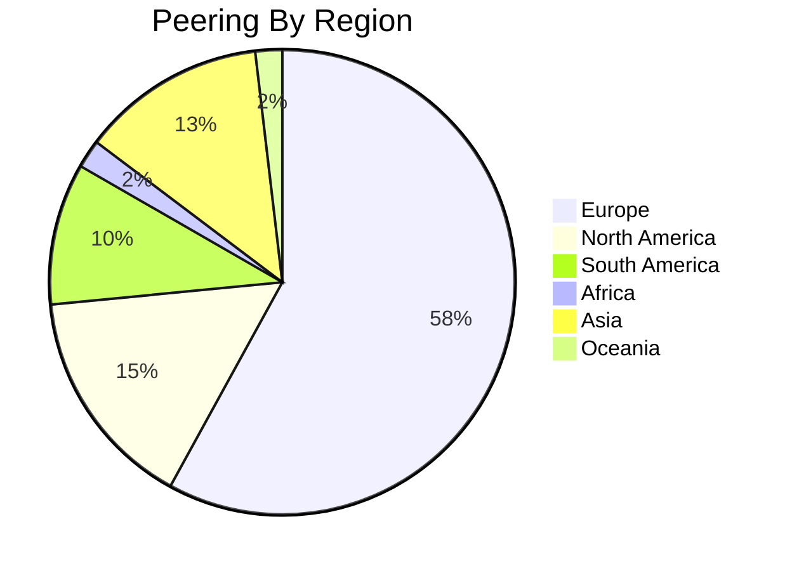
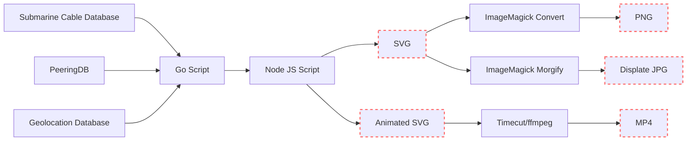

I recently updated my [Map of the Internet visualization](/posts/internet-map-2023/) that shows all of the undersea Internet cables that run along the bottom of the oceans and seas and the Internet exchange points that offer peering. Together these show a pretty good view of the physical aspects of the internet. This time, I generated a video that shows the evolution of our current internet along with some interesting stats from each year. Enjoy:

## Video


[YouTube: Internet Map (2010-2024)](https://www.youtube.com/watch?v=dZDSUY-vBgs)

## Still images
I, of course, also generated new versions of the static maps. Below is an overview of the entire world. Click on the image below to zoom/pan the full-resolution version or click the link under the image to download it:


**[Click here for full resolution image (warning, it's big)](the-internet-map.svg)**

So what are you looking at? The lines are submarine cables and the circles are cities with Internet Exchange Points (IXPs).

## Submarine Cables
The squiggly lines on the map are [submarine communications cables](https://en.wikipedia.org/wiki/Submarine_communications_cable). Submarine cables are truly a technological wonder. They carry vast amounts of data across the world's largest oceans. Yes, they just lie at the bottom of our oceans. Yes, it is crazy. From route selection, cable manufacturing, and [specialized cable-laying ships](https://en.wikipedia.org/wiki/Cable_layer); it's all incredible. Even more normal aspects of fiber optic cables like having [in-line amplifiers](https://hackaday.com/2023/08/08/under-the-sea-optical-repeaters-for-submarine-cables/) become far more difficult when you cannot drive a truck out to fix something. You can't drive a truck to the bottom of the ocean. Well, you can but you won't be much use once you get there and good luck doing it more than once. Anyway... from [amazing robots](https://en.wikipedia.org/wiki/Autonomous_underwater_vehicle) that can locate and assist in bringing cables to the surface to [in-water fiber optic repair habitats](https://www.youtube.com/watch?v=OKS-Hp7q-44) every bit of submarine cable deployment and operations is extreme and fascinating.

Laying and operating submarine cables is a complex and expensive undertaking, but it is vital for our interconnected world. Note how *few* of these cables exist in total. They connect our content digitally and culturally but there are only **549** active submarine cables right now in the world. That truly is an extremely small amount but you should note that many more terrestrial cables connect on land. Too many for us to map or know about. So instead, I used data about internet exchange points to show the scale of the internet on land.

## Internet Exchange Points
The circles in the maps above are all [buildings called "Internet Exchange Points"](https://www.cloudflare.com/learning/cdn/glossary/internet-exchange-point-ixp/). These buildings (*and sometimes closets*) are specialized data centers that have a uniquely large number of fiber connections from surrounding data centers, other internet exchanges and long-haul cables. These buildings are "meeting points" for Internet service providers (ISPs), cloud providers, content delivery networks (CDNs), and large enterprises like IBM and Apple and many could say that it is "where" the Internet lives. This is where networks interconnect or "peer". Many of these Internet exchanges charge a monthly fee to participate in the exchange but who everyone peers with and the financial details around the arrangement is up to each company. Some companies like Apple or Google will peer with anyone because it brings Google devices closer to Google services and reduces latency and cost while improving reliability. Traffic served through peering, for Google, is traffic that they do not have to pay backbone providers for.

These exchanges usually have a "gravity" to them. It's more valuable to be in an exchange where there are already many other networks present. However, we need to remember to avoid putting all of our eggs into a single basket. Exchanges that are too large create a single point of failure, so large internet-connected cities need to have several of these exchanges.

## Looking at each region
Okay, let's look a bit closer at each region. In terms of infrastructure, you can see which areas have more investments.

### Europe


Europe reigns supreme in peering traffic, boasting a staggering 1.39 petabits of advertised peering bandwidth. This dominance can be attributed to several factors:

- European nations tend to have well-developed economies that prioritize high-speed internet infrastructure. This translates to greater investment in network backbones and internet exchange points (IXPs).
- Europe has a dense network of IXPs, particularly in major cities like Frankfurt, Amsterdam, and London. These hubs facilitate efficient peering between numerous networks, reducing reliance on expensive long-haul transit.
- Europe has a regulatory environment that encourages open peering practices. This fosters competition and innovation among internet service providers (ISPs), ultimately benefiting end users with lower costs and improved performance.

### North America


North America follows closely behind Europe with a respectable 371 terabits of peering traffic. Similar to Europe, factors like strong economies, a well-developed internet infrastructure, and the presence of major IXPs contribute to this robust peering ecosystem. However, North America's peering traffic might be slightly lower due to a larger geographical footprint compared to Europe.

I find it interesting that there are two submarine cables planned for 2024 (and two more in 2026) going to Myrtle Beach in South Carolina. It might be a decent time to start an internet exchange around that area since there's a good amount of submarine cable capacity going through that area now. This could improve peering options and potentially lower latency for users in the southeastern United States

### Asia


Asia exhibits a significant peering presence with 308 terabits of traffic. The region's economic growth and increasing internet penetration are driving forces behind this. But it's important to note:

- There's a significant disparity in development levels across Asian countries. While developed nations like Singapore and Japan boast strong peering infrastructure, others might lag behind.
- Government Regulations: Some Asian governments might have stricter regulations on internet traffic, potentially impacting peering arrangements between ISPs.

You may be trying to remember what the island is in the center-right of this picture that many things appear to connect to. That, my friends, is [Guam](https://en.wikipedia.org/wiki/Guam), an unincorporated territory of the United States.

### Africa/South America


South America and Africa have the lowest peering traffic at 236 terabits and 47.3 terabits, respectively. This can be attributed to:

- These regions are still in the development stages when it comes to internet infrastructure. Lower investments in IXPs and network backbones can limit peering opportunities.
- The number of IXPs in these regions might be lower compared to Europe and North America.



For South America there seems to be a geographically dominant peering spot: Buenos Aires in Argentina.

## How it's made
The images are generated the same way I did [in the last version](/posts/internet-map-2023/), so refer to that article for more context. Generating the video, however, required a little bit more technology. I primarily used a tool called [timecut](https://github.com/tungs/timecut) that records the SVG animations for me and encodes it as an mp4 file using `ffmpeg`. I used another `ffmpeg` call to mix in the audio song. By the way, I used some trial and error to figure out that the tempo of the song is `110bpm`. To find out how long to sleep before changing to the next frame I did some simple math... but I also double-checked it with [this nifty website](https://sengpielaudio.com/calculator-bpmtempotime.htm) that shows how long in milliseconds there are between between each beat with different tempos. It may have been easier to do this "manually" with video editing software but I enjoy the fact that I can generate the entire video from the command line. Because the fps is so low the 4k video file that I generate only takes up 18MB.

Here's the updated pipeline:

### Closing Thoughts
This visualization provides a fascinating glimpse into the physical infrastructure that underpins the Internet. As our reliance on the internet continues to grow, so too will the need for robust and resilient network infrastructure. By understanding the physical underpinnings of the internet, we can appreciate its ingenuity and work towards ensuring its continued growth and accessibility for everyone.

References:
- Github: https://github.com/sudorandom/submarine-cable-map
- PeeringDB: https://www.peeringdb.com/
- Simple Maps (Geolocation Database): https://simplemaps.com/data/world-cities
- Submarine Cable Map: https://www.submarinecablemap.com
 