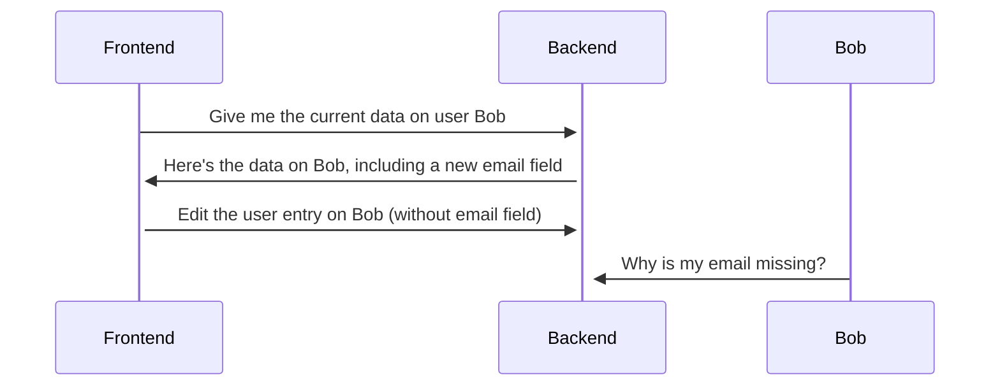
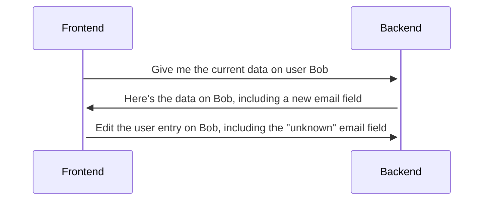

+++
categories = ["article"]
tags = ["protobuf", "grpc", "api"]
date = "2024-03-12"
description = "Let's delve into the cunfusing and neat feature of protobuf; unknown fields"
cover = "cover.jpg"
images = ["/posts/protobuf-unknown-fields/cover.jpg"]
featured = ""
featuredalt = ""
featuredpath = "date"
linktitle = ""
title = "Unknown Fields in Protobuf"
slug = "protobuf-unknown-fields"
type = "posts"
+++

[Protobuf](https://protobuf.dev/programming-guides/proto3/) offers a powerful feature known as [**unknown fields**](https://protobuf.dev/programming-guides/proto3/#unknowns). These fields act as a safety net when messages encounter unforeseen circumstances. Let's delve into what they are, how they work and why they're useful.

**What are Protobuf Unknown Fields?**

Imagine receiving a message encoded in protobuf. You have the corresponding `.proto` file defining the expected structure, which dictates the message's fields and their data types. However, during the parsing process, the message might contain fields you haven't encountered before, meaning they aren't defined in your current `.proto` definition. These unexpected fields are what we call **unknown fields**.

**Forwarding the Unforeseen**

One of the most crucial aspects of unknown fields is their behavior when you manipulate a message. Consider a scenario where you receive a message containing unknown fields, and you need to forward it to another system. Protobuf, by default, **forwards these unknown fields along with the known ones**. This ensures that even though you may not understand them, the receiving system has the complete information contained in the message. If this didn't happen you may end up clearing the values of fields that were set by another part of the system.

This forwarding capability holds true even if you **persist the message** before forwarding it. When you write the message to a storage location, the unknown fields are included in the serialized format. When the message is retrieved later and sent on, the unknown fields remain intact.

Let's run through a scenario where a new field, email, was added to a user object. The backend is updated but the frontend is not. First, we'll see how a "traditional" system would work:



The object may look like this coming from the server:
```json
{
    "user" {
        "id": "0edc0903-9e31-47be-adad-1dfc434ca2d3",
        "name": "Bob",
        "email" "bob@example.com"
    }
}
```

A typical application will unmarshal this object into a struct or object, like:

```typescript
class User {
  id: string;
  name: string;
}
```
But remember that email is missing, so the resulting request to update the user record would look like this:
```json
{
    "user" {
        "id": "0edc0903-9e31-47be-adad-1dfc434ca2d3",
        "name": "Bob",
    }
}
```

Now let's see how a system that communicates with protobuf would work. This is an example where the frontend is using [connect-es](https://github.com/connectrpc/connect-es) with the [`useBinaryFormat` transport option set to `true`](https://connectrpc.com/docs/web/choosing-a-protocol#connect):


Here's what the resulting protobuf message type would look like:
```typescript
export class User extends Message<User> {
    id = "";
    name = "";
    
    static readonly runtime: typeof proto3 = proto3;
    static readonly typeName = "management.v1.User";
    static readonly fields: FieldList = proto3.util.newFieldList(() => [
        { no: 1, name: "id", kind: "scalar", T: 9 /* ScalarType.STRING */ },
        { no: 2, name: "name", kind: "scalar", T: 9 /* ScalarType.STRING */ },
    ]);
}
```

This user class looks very similar to the previous one but some extra fields describe the expected structure of the message and some extra metadata on the fields to know how to decode protobuf. It also has an extra field (not shown) for unknown fields. This is what it looks like when we log our protobuf message that contains an unknown field:

```typescript
{
    id: "0edc0903-9e31-47be-adad-1dfc434ca2d3",
    name: "Bob",
    Symbol(@bufbuild/protobuf/unknown-fields): [{0: {no:3, wire_type:2, data: Uint8Array(14)}}]
}
```
The `@bufbuild/protobuf/unknown-fields` field shows the field number, protobuf wire type (`LEN`, which is what strings are encoded as) and the raw data from the wire stored in the `data` field. And here's what this message looks like when you encode once more, in protoscope format:

```text
1:LEN {"0edc0903-9e31-47be-adad-1dfc434ca2d3"}
2:LEN {"Bob"}
3:LEN {"bob@example.com"}
```
*Our email field is there!* Even though our application isn't updated to know about the email field when we write back the protobuf object (maybe with some changes) the unknown field comes along with it. [This is configurable](https://github.com/bufbuild/protobuf-es/blob/main/docs/runtime_api.md#binary-serialization-options) because this may not be the desired behavior in every case.

This scenario does pre-suppose that you write your frontend in a specific way, where changes are written back to the same protobuf message object that you used when fetching the user data initially and that same message is sent in the subsequent edit user request. However, that's often not a crazy pattern to adopt that may save you from potential data loss when introducing new features that aren't immediately supported everywhere.

**Benefits and Considerations**

Unknown fields offer several advantages:

* **Backward compatibility:** They allow newer versions of your message schema to communicate with older systems that don't recognize the new fields.
* **Flexibility:** You can introduce new fields to your message structure without breaking existing systems.
* **Data preservation:** Unknown fields ensure all information in the message is preserved, even if you don't understand it.

However, it's important to be aware of potential drawbacks:

* **Library Support** Unknown fields aren't universally supported in every protobuf library implementation.
* **Unintended consequences:** If unknown fields are misinterpreted by a receiving system, it can lead to unexpected behavior. If a system is passing along unknown fields it also doesn't know how to validate the data in the unknown fields. Think wisely about which components are responsible for validation.
* **Security Concerns** Malicious users could potentially exploit unknown fields to inject harmful data into messages, especially if proper validation mechanisms are not in place.

It is recommended by the [API Best Practices article](https://protobuf.dev/programming-guides/api/#support-partial-updates) on [protobuf.dev](https://protobuf.dev) to filter out unknown fields for public APIs. Here's the relevant section:

> In general, public APIs should drop unknown fields on server-side to prevent security attack via unknown fields. For example, garbage unknown fields may cause a server to fail when it starts to use them as new fields in the future.

### In conclusion
Protobuf unknown fields are a valuable feature for handling unexpected data in your messages. They offer flexibility and backward compatibility. They give you the power to handle many upgrade scenarios in a far more graceful way than traditional JSON/REST APIs. However, they do require careful consideration to when and where they are used.
