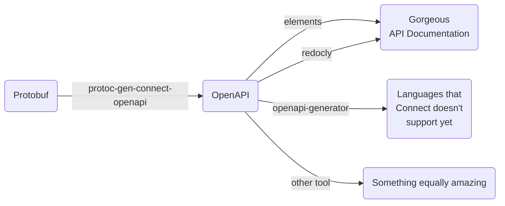

+++
categories = ["project"]
tags = ["protobuf", "grpc", "connectrpc", "openapi", "http"]
date = "2024-02-20"
description = ""
cover = "cover.jpg"
images = ["/posts/protoc-gen-connect-openapi/social.jpg"]
featured = ""
featuredalt = ""
featuredpath = "date"
linktitle = ""
title = "Introducing protoc-gen-connect-openapi"
slug = "protoc-gen-connect-openapi"
type = "posts"

aliases = [
  "/posts/introducing-protoc-gen-connect-openapi",
]
+++

[ConnectRPC](https://connectrpc.com) is a fantastic set of libraries that bridge gRPC into the web. gRPC is no longer relegated to the microservice box. Now it can spread its legs into the browser with gRPC-Web or the Connect protocol. The connect protocol, unlike [gRPC-Web](https://github.com/grpc/grpc-web), allows for many standard web tools to work for non-streaming APIs. For unary RPCs Connect exposes an API that is simply JSON over HTTP like you've seen a million times before so tools like curl, postman, the Javascript Fetch API, etc. all work nicely with Connect. ConnectRPC also provides all three protocols (gRPC, gRPC-Web and Connect) [using a single port on a single server](https://connectrpc.com/docs/multi-protocol). That means that you no longer need proxies to enable gRPC-Web and all standard gRPC tools are also at your disposal as well.

Here's what an HTTP request looks like for a unary RPC with connect:

```http
> POST /connectrpc.greet.v1.GreetService/Greet HTTP/1.1
> Host: demo.connectrpc.com
> Content-Type: application/json
>
> {"name": "Buf"}

< HTTP/1.1 200 OK
< Content-Type: application/json
<
< {"greeting": "Hello, Buf!"}
```

If you mark the endpoint as `idempotency_level=NO_SIDE_EFFECTS` then you can also call `GET` on the endpoint so the request body has to go into the query parameters. Here's what that looks like:

```http
> GET /connectrpc.greet.v1.GreetService/Greet?encoding=json&message=%7B%22name%22%3A%22Buf%22%7D HTTP/1.1
> Host: demo.connectrpc.com

< HTTP/1.1 200 OK
< Content-Type: application/json
<
< {"greeting": "Hello, Buf!"}
```

It's that... simple? Elegant? No? If you're not sold on ConnectRPC now then this may not be the post for you because the rest will talk about my new tool created for ConnectRPC; **[protoc-gen-connect-openapi](https://github.com/sudorandom/protoc-gen-connect-openapi)**.

## Introducing protoc-gen-connect-openapi
[protoc-gen-connect-openapi](https://github.com/sudorandom/protoc-gen-connect-openapi) generates OpenAPI v3.1 files from protobuf files that match the API that the [Connect protocol](https://connectrpc.com/docs/protocol) exposes.

We can document the Connect API as if it's a real JSON/HTTP API... because it is, and the gRPC "flavor" isn't so noticable due to Connect. With [protoc-gen-connect-openapi](https://github.com/sudorandom/protoc-gen-connect-openapi) you can declare your API using protobuf, serve it using gRPC/gRPC-WEb/Connect and fully document it without the API consumers ever knowing what protobuf is or how to read it. To me, this is the best of all worlds.

So, specifically, what good are OpenAPI files generated for Connect? What does that do? Well, first of all, it allows you to generate documentation with tools like [redocly](https://github.com/Redocly/redocly-cli) or [elements](https://github.com/stoplightio/elements).



Additionally, with tools like [OpenAPI-Generator](https://openapi-generator.tech) you can generate API clients for languages that Connect doesn't support yet (for non-streaming methods).



In summary, I hope this tool will extend the contract-based usage of protobuf along with ConnectRPC's RPC-based API into further places with more documentation, more code generation, and additional validation.

For more information, check out the [protoc-gen-connect-openapi repo on Github](https://github.com/sudorandom/protoc-gen-connect-openapi).
