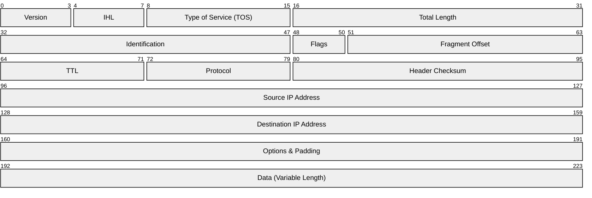
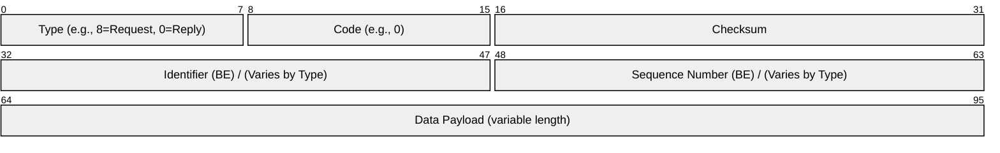

Traceroute is a network diagnostic utility that maps the path that packets take across an IP network. It provides a list of the intermediate routers a packet traverses on its way to a final destination, along with the time taken for each "hop." This information is crucial for diagnosing network latency and identifying points of failure. Personally, I think it is super cool that there's a way to figure out the route that your packets are taking.

In this article, I'll dig into how traceroute works and show you how to build a simple version from scratch using Go.

## ICMP: The Internet's Control Protocol

Before diving into traceroute, we need to understand the protocol that powers it: **ICMP (Internet Control Message Protocol)**. ICMP is a network-layer protocol used by network devices to send error messages and operational information. It's *not* for exchanging data, but for diagnostics, control, and error reporting. In fact, many routers and devices will heavily throttle ICMP traffic to protect their CPU usage, since generating these error messages is computationally expensive compared to simply forwarding packets.

### The Classic Use Case: `ping`

The most common and well-known use of ICMP is the `ping` utility. `ping` is used to test the reachability of a host on an IP network. It works by sending an **`ICMP Echo Request`** to the target host. If the host is reachable, it responds with an **`ICMP Echo Reply`**.

Here is what a typical `ping` to `google.com` looks like:

```shell
$ ping google.com
PING google.com (192.0.0.88): 56 data bytes
64 bytes from 192.0.0.88: icmp_seq=0 ttl=64 time=88.471 ms
64 bytes from 192.0.0.88: icmp_seq=1 ttl=64 time=88.708 ms
64 bytes from 192.0.0.88: icmp_seq=2 ttl=64 time=88.535 ms
64 bytes from 192.0.0.88: icmp_seq=3 ttl=64 time=88.579 ms
^C
--- google.com ping statistics ---
4 packets transmitted, 4 packets received, 0.0% packet loss
round-trip min/avg/max/stddev = 88.471/88.573/88.708/0.087 ms
```
This tells us that `google.com` is reachable and provides the round-trip time for each packet.

### From `ping` to `traceroute`

While `ping` tells you *if* you can reach a destination, `traceroute` tells you *how* you get there. It builds on the same ICMP foundation but uses a different ICMP message in a clever way. Instead of just checking for the final "Echo Reply," it intentionally triggers **`ICMP Time Exceeded`** messages from intermediate routers to map out the path. This is all done by manipulating the Time-To-Live (TTL) field in the IP packet header.

### IP and ICMP Packet Formats

To fully understand how `traceroute` works, we should understand the basic structure of IP and ICMP packets.

#### IPv4 Packet Format

All network traffic on the internet is encapsulated within IP packets. The IP header contains crucial information for routing, including source and destination IP addresses, and, most importantly for `traceroute`, the Time-To-Live (TTL) field.



Mostly, I want you to note the Time-To-Live (TTL) field, which is central to how traceroute operates. We'll touch more on TTLs a little bit later. But first, let's look at the structure of ICMP packets.

#### ICMP Packet Format

ICMP messages, including the Echo Request/Reply used by `ping` and the Time Exceeded messages used by `traceroute`, are themselves encapsulated within an IP packet's payload. The ICMP header specifies the message type (e.g., Echo Request, Echo Reply, Time Exceeded) and a code, along with a checksum for integrity. For Echo messages, it also includes an identifier and sequence number.



Crucially, since ICMP messages are encapsulated within IP packets, it is the *enclosing IP packet* that carries the TTL field and other IP header information, not the ICMP message itself. The ICMP header defines the specific control message, while the IP header handles its transport.

## How does traceroute work?

Unlike a direct message, data sent over the Internet hops through a chain of routers to reach its destination. Traceroute reveals this path by exploiting a fail-safe mechanism called **Time-To-Live (TTL)**.

Unlike what the name suggests, TTL does not represent actual time. It represents the number of hops before routers are instructed to give up on the packet. It is kind-of like a self-destruct counter. Every time a packet passes through a router (a "hop"), this counter decreases by 1. When it hits 0, the router discards the packet and sends an error message back to you.

Traceroute uses this mechanism to map the network:

1. **Hop 1**: It sends a packet with a TTL of 1. The very first router receives it, decreases the TTL to 0, drops the packet, and replies with "Time Exceeded." We have now identified the first router.
2. **Hop 2**: It sends a new packet with a TTL of 2. The first router passes it along (TTL becomes 1). The second router receives it, decreases TTL to 0, drops it, and replies "Time Exceeded." We have identified the second router.
3. **Repeat**: It continues increasing the TTL by 1 until the packet finally reaches the destination server and receives a standard reply.

### Probe Methods: ICMP, UDP, and TCP

While our examples use ICMP Echo Requests, it's important to understand that the TTL expiration mechanism is protocol-agnostic. The TTL field is in the IP header, which encapsulates TCP, UDP, and ICMP packets alike. Because of this, `traceroute` utilities can use different protocols for their "probes."

*   **UDP Probes:** This is the traditional method used by Linux and macOS. `traceroute` sends UDP datagrams to an invalid, high-numbered port at the destination. For intermediate hops, the process is identical: routers send `ICMP Time Exceeded` messages when the TTL expires. When the UDP packet finally reaches the destination, the host's OS sees that no service is listening on that port and sends back an `ICMP Port Unreachable` error. This "unreachable" message ironically signals a successful arrival at the destination.

*   **TCP Probes:** Some `traceroute` versions can send TCP SYN packets, similar to how a TCP connection is initiated. Intermediate routers still respond with `ICMP Time Exceeded`. If the packet reaches the destination, the host will respond with either a `TCP SYN/ACK` (if the port is open) or a `TCP RST` (if the port is closed). Either response confirms that the destination has been reached.

*   **ICMP Probes:** This method leverages `ICMP Echo Requests`, similar to the ubiquitous `ping` command found on Linux (and other OSes). While Linux `traceroute` traditionally uses UDP, Windows' `tracert` utility uses ICMP Echo Requests by default, as does our Go example. It listens for `ICMP Time Exceeded` from routers and a final `ICMP Echo Reply` from the destination.

Regardless of the protocol used for the probe, the fundamental mechanic remains the same: an `ICMP Time Exceeded` message is always generated by routers when the TTL reaches zero.

## What layer does traceroute operate on?

Traceroute operates at **Layer 3 (the Network Layer)** of the OSI model. This is because its core components are all Layer 3 protocols and mechanisms:

*   **IP (Internet Protocol):** Traceroute is fundamentally about sending and routing IP packets.
*   **ICMP (Internet Control Message Protocol):** The diagnostic messages, such as `Time Exceeded` and `Echo Reply`, are ICMP messages. ICMP is a network-layer protocol that operates alongside IP.
*   **TTL (Time To Live):** The TTL field is part of the IP header itself. Routers, which are Layer 3 devices, are responsible for decrementing this value.

Here's a diagram of the OSI model, showing where traceroute fits in:

| Layer.                   | Note             |
| :----------------------- | :--------------- |
| 7: Application           |                  |
| 6: Presentation          |                  |
| 5: Session               |                  |
| 4: Transport             |                  |
| 3: **Network (IP)**      | ← You are here.  |
| 2: Data Link             |                  |
| 1: Physical              |                  |

While the core TTL mechanism and ICMP `Time Exceeded` messages clearly place traceroute's fundamental operation at Layer 3, it's important to note that the probe packets themselves can originate from Layer 4 protocols. As discussed in the "Probe Methods" section, `traceroute` often utilizes UDP or TCP packets. In these cases, the probe *originates* at Layer 4 (Transport Layer) but relies on the Layer 3 IP header's TTL for its diagnostic function. This makes `traceroute` a tool that crosses over a couple OSI layer boundaries, sending probes with Layer 3 or Layer 4 and utilizing ICMP's time exceeded errors from Layer 3.

#### TTL Exhaustion

When a packet's TTL is set to 1, its journey is cut short at the first router. The router discards the packet and sends an `ICMP Time Exceeded` message back. This is the fundamental mechanism for discovering a hop.

```d2
direction: right

Client: Client {shape: person}
R1: "Router 1"

Client -> R1: "ICMP Echo Request (TTL=1)" {
  style.stroke: "#0075FF"
  style.stroke-width: 2
}
R1 -> Client: "ICMP Time Exceeded" {
  style.stroke: "#FFB300"
  style.stroke-width: 2
}
```

#### Symmetric Packet Flow to Destination

In an ideal scenario, a packet reaches the final server, and the `ICMP Echo Reply` travels back to the client along the exact same path.

```d2
direction: right

# Nodes
Client: Client {shape: person}
R1: "Router 1"
R2: "Router 2"
Server: Server {shape: cloud}

# Connections
Client -> R1 {style: {stroke: "#0075FF"; stroke-width: 2}}
R1 -> R2 {style: {stroke: "#0075FF"; stroke-width: 2}}
R2 -> Server {style: {stroke: "#0075FF"; stroke-width: 2}}

Server -> R2 {style: {stroke: "#4CAF50"; stroke-width: 2}}
R2 -> R1 {style: {stroke: "#4CAF50"; stroke-width: 2}}
R1 -> Client {style: {stroke: "#4CAF50"; stroke-width: 2}}
```

#### Asymmetric Routing (The Reality of the Internet)

It is important to note that the return path is **not guaranteed** to be the same as the request path. The Internet is a mesh of dynamic networks, and routing decisions are made independently in each direction. The diagram below shows a more realistic scenario where the return path uses a different set of routers.

```d2
direction: right

# Nodes
Client: Client {shape: person}
R1: "Router 1"
R2: "Router 2"
R3: "Router 3" {near: bottom-center}
Server: Server {shape: cloud}

# Connections
Client -> R1 {style: {stroke: "#0075FF"; stroke-width: 2}}
R1 -> R2 {style: {stroke: "#0075FF"; stroke-width: 2}}
R2 -> Server {style: {stroke: "#0075FF"; stroke-width: 2}}

Server -> R3 {style: {stroke: "#4CAF50"; stroke-width: 2}}
R3 -> R1 {style: {stroke: "#4CAF50"; stroke-width: 2}}
R1 -> Client {style: {stroke: "#4CAF50"; stroke-width: 2}}
```

For dealing with the complexities of inconsistent and asymmetric routes, tools like [mtr](https://www.bitwizard.nl/mtr/) (My Traceroute) continuously repeat traceroutes, providing real-time statistics and a clearer picture of network performance over time.

## Building a Traceroute in Go

We can build a functional traceroute tool in Go using the `golang.org/x/net/icmp` package, which provides access to the low-level networking primitives required. The process involves setting up a "listener" to receive ICMP messages, then looping to send probes with an incrementally higher TTL.

### Step 1: Crafting and Sending the ICMP Probe

First, we need to construct an `ICMP Echo Request`. The `ID` field should be unique to our process to distinguish replies intended for us from other network traffic, and we use the `Seq` (sequence) number to track which hop this probe corresponds to. After crafting the message, we set the TTL for this specific packet and send it on its way.

```go
// Set the TTL for our outgoing packet
if err := c.IPv4PacketConn().SetTTL(ttl); err != nil {
    log.Fatalf("SetTTL failed: %s", err)
}

// Create an ICMP Echo Message
m := icmp.Message{
    Type: ipv4.ICMPTypeEcho, Code: 0,
    Body: &icmp.Echo{
        ID:   os.Getpid() & 0xffff, // Use process ID to uniquely identify this traceroute
        Seq:  ttl,                  // Use the TTL as the sequence number
        Data: []byte("HELLO-TRACEROUTE"),
    },
}
b, err := m.Marshal(nil)
if err != nil {
    log.Fatalf("Marshal failed: %s", err)
}

// Send the ICMP packet to the destination
if _, err := c.WriteTo(b, dstAddr); err != nil {
    log.Fatalf("WriteTo failed: %s", err)
}
```

### Step 2: Receiving and Validating the Reply

After sending the probe, we must wait for a response. We set a read deadline on our connection to act as a timeout. If we receive a packet, we parse it to see what kind of ICMP message it is.

A crucial step is to **validate** that the reply is for a packet *we* sent. Raw sockets receive all ICMP traffic on the machine, so we could accidentally process a reply meant for another program (like a `ping` running in another terminal). We do this by checking the ID in the ICMP message, which we set to our process ID (PID). For an `Echo Reply`, this is straightforward. For a `Time Exceeded` message, the original packet's ID is nested inside the message body, requiring a bit of parsing to extract.

The following snippet shows the conceptual logic for reading the reply. The full validation is in the complete implementation below.

```go
// Wait for a reply
reply := make([]byte, 1500) // 1500 is the standard MTU (Maximum Transmission Unit) for Ethernet
// ... set read deadline ...
n, peer, err := c.ReadFrom(reply)
if err != nil {
    // A timeout means we didn't hear back, continue to next TTL
    fmt.Printf("%d\t*\n", ttl)
    continue
}

// Parse the reply message
rm, err := icmp.ParseMessage(1, reply[:n]) // 1 for ICMPv4
// ... handle parse error ...
```

### Step 3: The Main Loop and Interpreting Results

Finally, we wrap the sending and receiving logic in a `for` loop that increments the TTL from 1 to a maximum value. Before sending a probe, we record the current time, and after receiving a reply, we calculate the duration. This gives us the **round-trip time (RTT)**, which is the total time it takes for the packet to travel to the intermediate router and for the ICMP error message to travel back.

Inside the loop, after receiving and validating a reply, a `switch` statement checks the type of the ICMP message to determine if we've found an intermediate router (`Time Exceeded`) or reached the final destination (`Echo Reply`).

```go
// Loop from TTL 1 up to a max number of hops (e.g., 64)
for ttl := 1; ttl <= 64; ttl++ {
    // ... (Code from Step 1: Craft and Send Probe) ...

    // ... (Code from Step 2: Receive and Validate Reply) ...
    
    elapsed := time.Since(start)

    // Check the type of the received ICMP message
    switch rm.Type {
    case ipv4.ICMPTypeEchoReply:
        // We've reached the final destination
        fmt.Printf("%d\t%v\t%v\n", ttl, peer, elapsed)
        return // We are done
    case ipv4.ICMPTypeTimeExceeded:
        // This is a reply from an intermediate router
        fmt.Printf("%d\t%v\t%v\n", ttl, peer, elapsed)
    default:
        // Other ICMP type
        fmt.Printf("%d\t%v\t%v (type %d)\n", ttl, peer, elapsed, rm.Type)
    }
}
```

### Full Go Implementation

The following code combines all the steps into a complete, runnable traceroute program, including the crucial validation logic to ensure we only process replies to the probes we sent.

{}

See the full source at Github: .


This script combines the previous steps into a fully functioning (although not fully featured) traceroute utility. Now it's time to use it.

### Running the Code

Save the code as `traceroute.go` and execute it with a destination as the argument. Since it requires a raw socket, it must be run with `sudo`.

```shell
sudo go run traceroute.go google.com
```

Here are some of my runs (from a VPN):
```shell
$ sudo go run traceroute.go kmcd.dev
Traceroute to kmcd.dev (172.64.80.1)
1       10.5.0.1        88.094958ms
2       87.249.138.252  88.137959ms
3       79.127.195.58   88.360125ms
4       45.134.215.17   89.163958ms
5       162.158.61.119  90.93775ms
6       172.64.80.1     88.631208ms
Destination reached.
```

This is CloudFlare's DNS service.
```shell
$ sudo go run traceroute.go 1.1.1.1
Traceroute to 1.1.1.1 (1.1.1.1)
1       10.5.0.1        109.916792ms
2       5.104.76.1      109.879916ms
3       78.152.53.114   110.688917ms
4       207.162.204.138 110.696958ms
5       1.1.1.1 109.922875ms
Destination reached.
```

Microsoft.com seems to block ICMP traffic, so we see a lot of timeouts after a certain point:
```shell
$ sudo go run traceroute.go microsoft.com
Traceroute to microsoft.com (13.107.246.35)
1       10.5.0.1        110.333709ms
2       5.104.76.1      114.67925ms
3       78.152.53.114   110.453333ms
4       141.136.111.141 121.163833ms
5       62.115.44.160   123.153875ms
6       *       *       *
7       62.115.140.169  125.062291ms
8       *       *       *
9       51.10.27.124    121.206958ms
10      104.44.231.105  121.929917ms
11      *       *       *
12      *       *       *
13      *       *       *
14      *       *       *
15      *       *       *
...
```

You will often see rows of asterisks like this (`* * *`). This usually doesn't mean the router is down; it means the router is configured to drop ICMP packets with an expired TTL without sending a response. This is often done for security reasons or to de-prioritize ICMP traffic to protect the router's CPU.

### A Note on `sudo` and Raw Sockets

You might ask if `sudo` is strictly necessary. This is a common point of confusion for developers new to network programming in Go, as tools like the standard `traceroute` on macOS and Linux can often run without `sudo` by sending UDP packets. While sending UDP packets is unprivileged, listening for the returning ICMP `Time Exceeded` errors is a privileged operation that often requires elevated permissions or specific system configurations (like modifying `net.ipv4.ping_group_range`).

Our code simplifies this by using `icmp.ListenPacket("ip4:icmp", ...)`, which creates a powerful **raw ICMP socket**. This approach requires `sudo` because listening directly to the entire ICMP protocol is a privileged operation, but it saves us from writing more complex, OS-specific code. This feels more appropriate for this tutorial.


## Conclusion

Traceroute is a powerful diagnostic tool that reveals the path our data takes across the internet. By cleverly using the Time-To-Live (TTL) field in IP packets, it turns an error-reporting mechanism into a tool for discovery. We've walked through how this works, from sending probes with an ever-increasing TTL to interpreting the `ICMP Time Exceeded` messages that let us map the network hop-by-hop.

Using this knowledge, we built a functional traceroute tool from scratch in Go. Our implementation uses ICMP echo requests, just like the `ping` utility, and listens for replies from intermediate routers as well as the final destination. While we focused on ICMP, we also touched on alternative probing methods using UDP and TCP.

Building a tool like this from the ground up really demystifies the magic behind everyday network diagnostics and gives a deeper appreciation for the protocols that run the internet. The journey of a single packet is a fascinating one, and with a little bit of Go, we've built a window to watch it.

## Next Steps

While this implementation demonstrates the core logic of traceroute, a production-grade tool would include several enhancements:

- **Reverse DNS Lookup**: The tool currently only shows IP addresses. A reverse-DNS lookup could be added to resolve these IPs into more human-readable hostnames.
- **Support for UDP and TCP Probes**: Extend the tool to allow different probe methods, such as UDP and TCP, for increased flexibility and compatibility with various network environments and firewalls.
- **ASN Lookup**: By querying the Autonomous System Number (ASN) of each IP, the tool could identify the specific ISP or organization that owns a router. This enables the visualization of the AS-Path to show how traffic hands off between different entities, for example: `Comcast` → `Tata Communications` → `Google`. Visualizing these organizational jumps is often more insightful than viewing a raw list of IP addresses.
- **Geo-location**: Beyond simple IP and ASN lookups, more advanced tools can be used to geo-locate routers. By examining router hostnames (which often contain location codes), querying WHOIS databases for IP ranges, and consulting resources like PeeringDB or Internet BGP tables, it's possible to infer the physical location and network ownership of each hop, providing richer diagnostic information.
- **Concurrency**: To speed up the process, multiple probes could be sent concurrently using goroutines rather than sequentially.
- **Multiple Probes**: Production tools often send multiple probes per hop and display statistics like average latency and packet loss. Multiple probes would reveal that there may be multiple paths that you are taking, as internet routing can be very dynamic.

These features are excellent next steps for expanding this simple tool into a more powerful network diagnostic utility, but this is left as an exercise for the audience. And until then, just use [mtr](https://www.bitwizard.nl/mtr/), which has most of these features!

## References

- [Varonis: What is Traceroute and How Does it Work?](https://www.varonis.com/blog/what-is-traceroute)
- [GeeksforGeeks: What is Traceroute?](https://www.geeksforgeeks.org/what-is-traceroute/)
- [Wikipedia: Traceroute](https://en.wikipedia.org/wiki/Traceroute)
- [Cloudflare: What is Traceroute?](https://www.cloudflare.com/learning/network-layer/what-is-traceroute/)
- [Go Package: `golang.org/x/net/icmp`](https://pkg.go.dev/golang.org/x/net/icmp)
