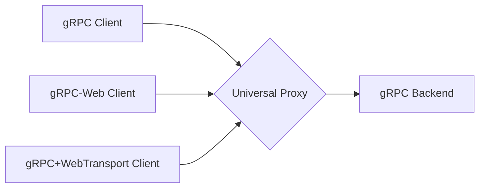

WebSockets have powered real-time web apps for over a decade, but they’re starting to show their age. Let's talk about WebTransport, a shiny new API built on HTTP/3 and QUIC that promises to fix WebSocket’s biggest limitations and finally bring full-duplex gRPC to the browser.

> **TL;DR:** WebTransport is a new web API built on HTTP/3 and QUIC that finally makes full-duplex, low-latency, bidirectional communication possible in the browser. It could be the successor to WebSockets — and maybe even unlock full gRPC streaming — once Safari decides to join the party.

## The Caveats of gRPC-Web

Before diving into WebTransport, let’s talk about why gRPC-Web exists and why it falls short for real-time communication.

Standard **gRPC** is a high-performance framework that leverages modern protocols like HTTP/2 to enable powerful communication patterns, especially between backend services. Its full power lies in its native support for streaming, which comes in four flavors:
1. **Unary:** The classic request/response.
2. **Server streaming:** The client sends a single request and gets a stream of responses back.
3. **Client streaming:** The client sends a stream of requests and gets a single response back.
4. **Bidirectional streaming:** The client and server can send messages to each other in any order.

The problem? Browsers can't speak native gRPC. That’s why gRPC-Web was created: a compatibility layer that translates gRPC calls into browser-friendly requests. However, this translation comes with a major compromise. Because gRPC-Web is fundamentally limited to the request/response nature of older HTTP semantics, **it cannot support client streaming or bidirectional streaming**.

This is a major drawback for applications that require true real-time, two-way communication, like chats, collaborative editors, or live data dashboards. In short, the promise of gRPC-Web falls short in the same places that gRPC excels at.

## What is WebTransport?

Enter WebTransport. It's a new web API that offers low-latency, bidirectional, client-server messaging. Unlike WebSockets, which are built on a single, ordered stream of messages, WebTransport is built on top of HTTP/3 and QUIC. This gives it some powerful capabilities:

* **Multiple streams:** Open several independent streams of data.
* **Unidirectional and bidirectional streams:** Flexible communication patterns.
* **Out-of-order delivery:** Data from one stream doesn't block another.
* **Reliable and Unreliable Data Transfer:**
  * **Reliable (Streams):** WebTransport streams (`createBidirectionalStream()` or `createUnidirectionalStream()`) are reliable and ordered, just like TCP. When you send data over a stream, you can be sure it will arrive in the correct order, without any missing pieces. This is ideal for critical data like chat messages, file transfers, or the initial state of an application.
  * **Unreliable (Datagrams):** WebTransport also provides a `datagrams` API, which works more like UDP. Data sent as a datagram is not guaranteed to arrive, nor is it guaranteed to arrive in any particular order. This might sound problematic, but it's extremely useful for latency-sensitive data where speed is more important than perfect accuracy. For example, in a real-time game, you'd rather drop an old packet with a player's previous position than delay the stream to re-transmit it. The same applies to live video or audio, where a lost frame is preferable to a frozen stream. This "choose your own adventure" for data reliability is a powerful feature that WebSockets lack.

These features make WebTransport a natural candidate to finally bring full-featured gRPC streaming to the web.

## Possible Alternatives

Before diving into an example, it's worth considering the alternatives.

### WebRTC
While WebRTC also provides real-time, peer-to-peer streaming, it operates outside of HTTP semantics, making it harder to monitor, debug, and integrate with existing observability tools. Additionally, WebRTC was created for peers; WebTransport is for clients and servers.

### WebSockets

While WebRTC serves a different purpose (peer-to-peer), the more direct comparison for WebTransport is the technology it's poised to replace: WebSockets. For over a decade, WebSockets have been the standard for client-server real-time communication. However, they are built on a single TCP connection, which introduces limitations like head-of-line blocking. A closer look reveals where WebTransport really shines:

| Feature | WebSockets | WebTransport |
|----------|-------------|--------------|
| Transport | TCP | QUIC (HTTP/3) |
| Multiplexing | ❌ Single stream | ✅ Multiple streams |
| Reliability | Always reliable | Reliable *and* unreliable modes |
| Ordered messages | Always ordered | Optional |
| Built-in backpressure | ❌ | ✅ |

The ability to manage multiple streams without head-of-line blocking, choose between reliable and unreliable delivery, and handle backpressure natively are game-changers. These aren't just incremental improvements; they are the exact features needed to overcome the limitations that have held back protocols like gRPC in the browser.

These features make WebTransport a natural candidate to finally bring **true streaming gRPC** to the web and it feels like the community is rallying around WebTransport as *the* solution. While the ecosystem is still maturing, the best way to understand the technology is to see it in action.

## The Official Plan for gRPC + WebTransport

So, where does the gRPC team stand on this? The official [streaming roadmap for gRPC-Web](https://github.com/grpc/grpc-web/blob/master/doc/streaming-roadmap.md) has long been a source of discussion. However, the outlook is not promising. A key [GitHub issue](https://github.com/grpc/grpc-web/issues/24) tracking the implementation of bidirectional streaming over WebTransport was recently closed with the status "not planned". The gRPC-Web project has decided not to pursue new major features, including this one. The gRPC team has historically focused on server-to-server communication rather than browser-based clients, so gRPC-Web hasn’t been a major priority.

Browser support is catching up: Chrome, Edge, and Firefox are onboard. However, Safari remains stubbornly behind. Until it joins the table, WebTransport won’t be ready for wide adoption. Remember that you can always check on browser status of features like this by using [caniuse.com](https://caniuse.com/webtransport).

## Why Isn't This Done Yet?

It's frustrating that a solution seems so close, yet so far. Why doesn't gRPC-Web have this, even as an experimental feature? The gRPC project, for all its technical brilliance, has historically focused on the needs of large-scale microservice architectures. Browser developers have often felt like second-class citizens in the gRPC world. While gRPC is an excellent protocol for server-to-server communication, its potential for transforming web applications feels untapped. The organization's priorities seem geared towards large enterprise use-cases, leaving web developers waiting.

But that shouldn't stop the community from experimenting. For internal tools, native applications, or contexts where you control the client environment, WebTransport is a viable and exciting option today.

## WebTransport in Go

Speaking of afterthoughts, the most reliable and supported implementation of WebTransport in Go, [quic-go/webtransport-go](https://github.com/quic-go/webtransport-go), is currently maintained as an unfunded hobby project. What does this mean?

> webtransport-go has been unfunded since the beginning of 2024. For the first half of the year, I have been maintaining the project in my spare time. Maintaining high-quality open-source software requires significant time and effort. This situation is becoming unsustainable, and as of June 2024, I will be ceasing maintenance work on the project.
> 
> Specifically, this means:
> 
> - I will no longer respond to issues or review PRs.
> - I will not keep the API in sync with quic-go.
> - Since WebTransport is still an IETF draft, browser compatibility will break as soon as the interoperability target changes.
> 
> If your project relies on WebTransport support, what can you do?
> I’m glad you asked. First, I would like to hear about your use case. Second, please consider sponsoring the maintenance and future development of the project. It’s best to reach out to me via email.

Still, the project continues to see activity, thanks to community interest and Marten’s persistence. This is yet another reminder that much of the modern web still runs on unpaid passion.

## So what?
So where are we now? WebTransport is stable in Chrome, supported in Firefox, and inching toward production-readiness. It’s not quite universal, but it’s mature enough to experiment with for internal apps, native clients, closed ecosystems or if you just don't care about Safari users.

If your users are internal or your browser matrix doesn’t include Safari, you can start experimenting with WebTransport today.

## Let's Try It: A Go Example

Let's demonstrate how WebTransport works with a simple client-server application written in Go, using the excellent `github.com/quic-go/webtransport-go` library. The server implementation will just echo whatever the client sends and the client will send a message with the current timestamp each second until it's manually stopped. If you've ever written a small WebSocket client and server, this will look very familiar.

### The Server

The server sets up an HTTP/3 server and upgrades incoming requests on the `/webtransport` endpoint to a WebTransport session. It then enters a loop, accepting new streams and echoing back any messages it receives.

```go
package main

import (
	"context"
	"errors"
	"log"
	"net/http"

	"github.com/quic-go/quic-go/http3"
	"github.com/quic-go/webtransport-go"
)

func main() {
	server := &webtransport.Server{
		H3: http3.Server{
			Addr: ":4433",
		},
	}

	http.HandleFunc("/webtransport", func(rw http.ResponseWriter, r *http.Request) {
		conn, err := server.Upgrade(rw, r)
		if err != nil {
			log.Printf("upgrading failed: %s", err)
			rw.WriteHeader(500)
			return
		}

		go func() {
			log.Printf("accepted session: %s", conn.RemoteAddr())
			for {
				stream, err := conn.AcceptStream(r.Context())
				if err != nil {
					if !errors.Is(err, context.Canceled) {
						log.Printf("accepting stream failed: %s", err)
					}
					return
				}
				log.Printf("accepted stream: %d", stream.StreamID())

				go func() {
					for {
						buf := make([]byte, 1024)
						n, err := stream.Read(buf)
						if err != nil {
							log.Printf("read finished with error: %s", err)
							return
						}
						log.Printf("read %d bytes: %s", n, buf[:n])

						_, err = stream.Write(buf[:n])
						if err != nil {
							log.Printf("write finished with error: %s", err)
							return
						}
						log.Printf("wrote %d bytes: %s", n, buf[:n])
					}
				}()
			}
		}()
	})

	log.Println("Starting server on :4433")
	if err := server.ListenAndServeTLS("cert.pem", "cert.key"); err != nil {
		log.Fatal(err)
	}
}
```

### The Client

The client dials the server, opens a bidirectional stream, and then starts two goroutines: one to send a message every second, and another to listen for incoming messages from the server.

```go
package main

import (
	"context"
	"crypto/tls"
	"fmt"
	"log"
	"os"
	"os/signal"
	"syscall"
	"time"

	"github.com/quic-go/webtransport-go"
	"golang.org/x/sync/errgroup"
)

func main() {
	if err := run(); err != nil {
		log.Fatal(err)
	}
}

func run() error {
	ctx, stop := signal.NotifyContext(context.Background(), os.Interrupt, syscall.SIGTERM)
	defer stop()

	dialer := &webtransport.Dialer{
		TLSClientConfig: &tls.Config{
			InsecureSkipVerify: true,
		},
	}

	_, conn, err := dialer.Dial(ctx, "https://localhost:4433/webtransport", nil)
	if err != nil {
		return err
	}
	defer conn.CloseWithError(0, "graceful shutdown")

	stream, err := conn.OpenStreamSync(ctx)
	if err != nil {
		return err
	}

	g, gctx := errgroup.WithContext(ctx)

	g.Go(func() error {
		ticker := time.NewTicker(1 * time.Second)
		defer ticker.Stop()

		for {
			select {
			case <-gctx.Done():
				log.Println("shutting down writer")
				return gctx.Err()
			case t := <-ticker.C:
				msg := fmt.Sprintf("Hello! The time is now %v", t.Format(time.DateTime))
				_, err = stream.Write([]byte(msg))
				if err != nil {
					return err
				}
				log.Printf("Wrote: %s", msg)
			}
		}
	})

	g.Go(func() error {
		for {
			buf := make([]byte, 1024)
			n, err := stream.Read(buf)
			if err != nil {
				log.Printf("shutting down reader: %v", err)
				return err
			}
			log.Printf("Read: %s", buf[:n])
		}
	})

	go func() {
		<-gctx.Done()
		stream.CancelRead(0)
		stream.Close()
	}()

	log.Println("Running, press CTRL+C to stop...")
	defer log.Println("shutting down")

	return g.Wait()
}
```

This simple example demonstrates the core concept: native, bidirectional communication between a Go client and server, perfect for building the foundation of a gRPC transport layer. While this example is simplified, I hope it shows how easily you can implement WebTransport with the right libraries and tooling.

## A Universal gRPC Proxy?

While we wait for official support, what can we build today to help? One powerful idea is a proxy that can terminate all three types of gRPC connections:

1.  **Standard gRPC:** From other backend services.
2.  **gRPC-Web:** From current web browsers.
3.  **gRPC + WebTransport:** From modern browsers and native clients.

This proxy would inspect the incoming connection and route the gRPC calls to the appropriate backend service.



Such a proxy would allow you to write your services in standard gRPC and let the proxy handle the complexity of supporting different client types.

It could be built from scratch or it could leverage existing functionality in a project like [Vanguard](https://github.com/connectrpc/vanguard-go), which I've used to enable support for gRPC, gRPC Web, ConnectRPC and REST in [FauxRPC](https://fauxrpc.com) or [Envoy](https://www.envoyproxy.io/docs/envoy/latest/intro/arch_overview/other_protocols/grpc), which can already terminate and translate gRPC and/or gRPC-Web connections.

Building such a proxy could bridge the gap between legacy browsers and future protocols. This would be a practical path while the standards catch up.

## Final Thoughts

WebTransport isn’t just “WebSockets but faster.” It’s a shift toward giving web developers the same transport-level flexibility backend engineers have enjoyed for years. Once it’s universally supported (and if the gRPC ecosystem embraces it), we could finally see browser apps communicating with backend systems using the same rich streaming semantics as microservices.

WebTransport presents a clear and powerful evolution for real-time web communication. Its native support for multiple streams and unreliable data transfer makes it a technically superior successor to WebSockets for many use cases, especially as a transport for full-duplex gRPC.

However, its future is not yet certain. The lack of official adoption by the gRPC-Web team and the absence of support in Safari are significant roadblocks. This lack of forward movement has led some to speculate that gRPC-Web itself may be an abandoned project. For now, WebTransport remains a technology of the near future—viable for controlled environments and internal tools, but not yet ready for the mainstream web. The next critical step will be to pair these powerful backend capabilities with a web-based client to truly demonstrate the end-to-end potential.
