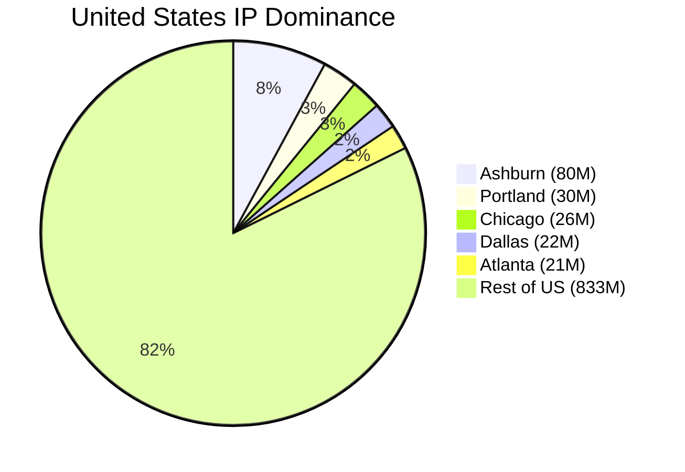

Where is the actual center of the Internet?

If you asked a random person, they might guess San Francisco.  
If you asked a network engineer, they might say New York or London, where major financial markets and submarine cables converge.

They would both be wrong.

If we define “center” as the largest concentration of publicly routed IPv4 address space on Earth, the answer is not a global metropolis.

It is a suburb about 30 miles west of Washington, D.C.



**Ashburn, Virginia.**

When I was compiling the data for the 2026 Internet Map last month, one specific result caught me completely off guard. Looking at the top five list for the United States (shown below), a single suburb in Northern Virginia dwarfed massive hubs like Portland and Chicago combined. I actually had to double check my numbers to make sure I had not made a mistake.

| Rank | City | IP Dominance |
| --- | --- | --- |
| **1** | **Ashburn** | **80,073,721** |
| 2 | Portland | 29,917,135 |
| 3 | Chicago | 26,208,184 |
| 4 | Dallas | 22,397,185 |
| 5 | Atlanta | 21,047,144 |

There was no bug.

That ranking reflects infrastructure density.

---

## What “Center” Means

This article uses two metrics:

- **Peering Bandwidth** The total public interconnection capacity available at Internet Exchange Points in a city.

- **IP Dominance** The number of unique publicly routed IPv4 addresses geolocated to that metro area.

Peering bandwidth measures how much traffic flows through a place.  
IP dominance measures how much infrastructure is physically hosted there.

IP dominance is calculated by aggregating announced IPv4 prefixes observed in global BGP tables and mapping them to metro regions using commercial geolocation datasets and operator disclosures. It is not a perfect proxy for server count, but it is a strong approximation of infrastructure concentration at global scale.

If we measure headquarters or startup density, Ashburn does not win.

If we measure hardware, it does.

---

## The Numbers

On public peering capacity alone, Ashburn is elite but not unique.

| City | Public Peering Capacity |
| :--- | :--- |
| **New York** | 44.60 Tbps |
| **Chicago** | 34.92 Tbps |
| **Ashburn** | 32.68 Tbps |

These numbers place it alongside Frankfurt, Amsterdam, London, and Singapore.

However, when we switch to IP dominance, the ranking changes dramatically.

| Rank | City | IP Dominance |
| :--- | :--- | :--- |
| **1** | **Ashburn, USA** | **80,073,721** |
| 2 | Tokyo, JP | 65,061,284 |
| 3 | Portland, USA | 29,917,135 |
| 4 | Chicago, USA | 26,208,184 |
| 5 | London, GB | 21,440,000 |

Ashburn, population ~50,000, hosts more IPv4 space than a metro area of 37 million.

It hosts nearly three times as many as Portland, home to AWS us-west-2 and Google’s Oregon cloud region.

That gap is structural, not cosmetic.

---

## What Peering Actually Means

To understand Ashburn, you need to understand peering.

The internet is not one network. It is thousands of independent networks called Autonomous Systems. These networks exchange traffic with one another in two primary ways:

1. **Private Peering via Cross-Connects** 2. **Public Peering via Internet Exchange Points**

### Private Peering and Cross-Connects

Inside large data center facilities, networks can establish direct fiber links between their routers. These are called cross-connects. They are often short fiber runs inside the same building or campus.

If Netflix and Comcast both have routers in the same facility, they can run a direct cross-connect between their cabinets. Traffic flows without transiting a third-party carrier.

This reduces:
- Latency  
- Transit cost  
- Packet loss risk  

Private cross-connects are simple, fast, and powerful. But they require both networks to be physically present in the same building.

That is where clustering begins.

### Public Peering at IXPs

An Internet Exchange Point, or IXP, is a shared switching fabric where many networks interconnect over a common Ethernet platform.

Instead of running dozens of individual cross-connects, a network connects once to the exchange switch. From there, it can peer with hundreds of other networks using BGP sessions.

Think of it as a high-speed meet-me room at metropolitan scale.

A 1,000-mile fiber route adds roughly 8–10 ms of round-trip time.

Ashburn hosts several major IXPs. Each one aggregates hundreds of networks. Once a critical mass of networks join an exchange, every new entrant has a strong incentive to join the same location.

If your customers are there, you go there.

If your competitors are there, you go there.

If your upstream providers are there, you definitely go there.

This is how infrastructure gravity forms.

---

## The Town Itself

Ashburn is a census-designated place in Loudoun County with roughly 50,000 residents.

It looks like a typical American suburb.

Drive along the Dulles Greenway, however, and the scenery changes. Instead of office parks, you see endless rows of reinforced concrete data centers. These facilities collectively span tens of millions of square feet of raised floor space.

They host infrastructure for:

- Amazon Web Services us-east-1  
- Major financial clearing networks  
- Federal systems  
- Global content delivery networks  
- Hyperscale AI clusters  

Older claims suggested that 70 percent of global internet traffic passed through Northern Virginia. That number has been widely challenged and likely overstated.

More credible regional operator estimates place the figure closer to 20 to 25 percent of global traffic touching Northern Virginia infrastructure daily.

Even at the lower bound, that concentration is extraordinary.

---

## Why Here?

Ashburn’s dominance emerged from four reinforcing factors.

### 1. Early Interconnection History

In the early 1990s, MAE-East became one of the first major U.S. internet exchange points. Carriers and early internet companies colocated nearby to reduce transit costs and latency.

Once fiber routes were established, additional networks followed. Each new participant increased the value of the location for the next one.

Network effects compounded.

### 2. Latency Economics

Data moves at the speed of light in fiber, but physical distance still matters.

Every millisecond saved in round-trip time matters for:
- Financial trading
- Real-time APIs
- Distributed databases

If AWS is in Ashburn, SaaS companies deploy near AWS.  
If financial clearing networks are in Ashburn, market data providers colocate nearby.  
If content platforms are in Ashburn, access providers peer there.

Latency is not abstract. It is physics.

### 3. Power and Land

Data centers consume enormous amounts of electricity. Loudoun County invested heavily in transmission infrastructure and substations early in the growth cycle.

Reliable high-capacity power is not trivial to replicate.

Add relatively abundant land and favorable zoning, and large-scale builds become feasible.

### 4. Tax Policy

Virginia offers sales and use tax exemptions on qualifying data center equipment such as servers and cooling systems.

Hyperscale operators refresh hardware frequently. Tax treatment at this scale translates into meaningful capital savings.

Infrastructure decisions are driven by cost models. Northern Virginia performs well in those models.

---

## Will It Move?

Other regions are expanding rapidly. Texas is building at scale. Oregon continues to grow. European and Asian hubs remain strong.

Northern Virginia also faces real constraints:
- Grid capacity concerns  
- Rising land prices  
- Community resistance to further development  
- Water usage debates  

However, Ashburn’s advantage is not only square footage. It is interconnection density.

Hundreds of networks are already present. Thousands of cross-connects already exist. IXPs already aggregate large portions of global traffic.

Relocating that density would require coordinated migration by an entire ecosystem.

That rarely happens in infrastructure.

As AI workloads expand and require tightly coupled compute clusters near massive data stores, deployment gravitates toward regions that already host large volumes of data.

Today, that region is still Ashburn.

---

## Methodology

To build this dataset, publicly routed IPv4 prefixes were collected from global BGP routing tables. These prefixes were then aggregated by metropolitan area using a combination of commercial IP geolocation datasets and public facility disclosures. CDN and cloud prefixes were included in these counts provided they successfully geolocated within the specific metro boundaries.

It is worth noting that IPv6 address space was excluded from this analysis. This decision was made to avoid the uneven deployment and aggregation distortions currently present in IPv6 routing. All figures reflect a data snapshot collected on February 1st, 2026.

No model is perfect. The signal, however, is clear.

---

## Conclusion

The internet feels abstract. It feels distributed and weightless.

It is not.

It is built from fiber, routers, substations, and concrete buildings.

More of those physical components are concentrated in Ashburn, Virginia than anywhere else on Earth.

If you measure the internet by where its hardware lives, the center is not a skyscraper in Manhattan or a campus in Silicon Valley.

It is a cluster of data centers in Loudoun County.

Infrastructure has gravity. And for now, the internet bends around Ashburn.

---

**[Explore Ashburn on the Map »](https://map.kmcd.dev/?lat=39.0438&lng=-77.4874&z=7.00&year=2026)**
