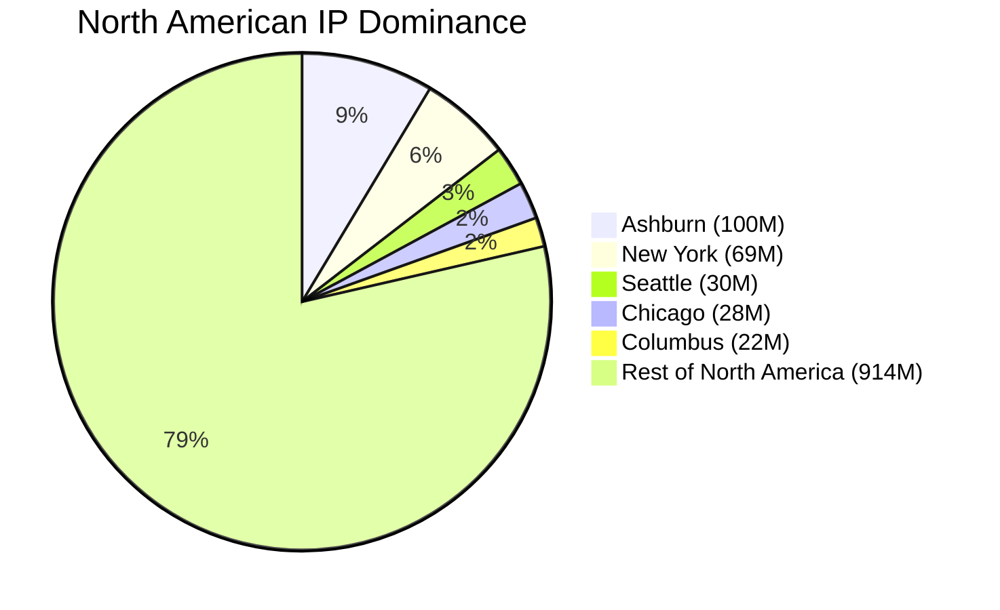

Where is the actual center of the Internet?

If you asked a random person, they might guess San Francisco.
A network engineer might point to New York or London, places where finance and submarine cables intersect.

Both answers sound reasonable, but they are wrong. If you define “center” as the largest concentration of publicly routed IPv4 address space, the answer isn’t a global city at all. It’s a suburb about 30 miles west of Washington, D.C.



**Ashburn, Virginia.**

When I was compiling the data for the 2026 Internet Map last month, one specific result caught me completely off guard. Looking at the top five list for the United States (shown below), a single suburb in Northern Virginia dwarfed massive hubs like Seattle and Chicago combined. I actually had to double check my numbers to make sure I had not made a mistake.

| Rank | City | IP Dominance |
| :--- | :--- | :--- |
| **1** | **Ashburn** | **100,934,452** |
| 2 | New York | 69,322,932 |
| 3 | Seattle | 30,696,072 |
| 4 | Chicago | 28,980,879 |
| 5 | Columbus | 22,291,535 |

There was no bug.

What the ranking actually captured wasn’t population or economic activity. It was how much infrastructure is physically sitting in one place. By that measure, Ashburn isn’t just ahead. It’s in a different category.



## What “Center” Means

This article uses two metrics, and neither is perfect:

- **Peering Bandwidth**: the amount of public interconnection capacity available at Internet Exchange Points in a city
- **IP Dominance**: the number of publicly routed IPv4 addresses geolocated to that metro area

Peering bandwidth tells you how much traffic can flow through a place.

IP dominance is closer to answering a different question: where does the infrastructure actually live?

To estimate it, I aggregated announced IPv4 prefixes from global BGP tables and mapped them to metro regions using commercial geolocation datasets and operator disclosures.

That sounds precise. It isn’t.

For one thing, an IP address does not equal a user or even a single machine. Technologies like carrier-grade NAT allow thousands of users to share a much smaller pool of public IPv4 addresses. A residential ISP might represent an entire city's worth of customers behind a relatively small prefix.

Data centers behave differently. Large blocks of IPv4 space are often allocated directly to infrastructure such as load balancers, virtual machines, and edge nodes. Many of these are globally reachable and persistently assigned. That skews the numbers heavily toward places where hardware is concentrated.

There’s also the IPv6 problem.

IPv6 address space is vast and unevenly deployed. Some networks aggressively advertise large aggregates; others are far more conservative. The result is that IPv6 counts tend to reflect allocation strategy more than physical presence. For now, including it introduces more distortion than clarity, so it’s excluded from this analysis.

Even within IPv4, geolocation is fuzzy. Prefixes don’t always map cleanly to where hardware sits. Any dataset like this involves approximation layered on top of incomplete information.

So IP dominance isn’t a count of users, and it’s not a direct count of servers.

But at global scale, it’s still a useful signal. Big, persistent concentrations of address space tend to follow big, persistent concentrations of infrastructure.

And that’s the signal this article is trying to isolate.

## The Numbers

On public peering capacity alone, Ashburn sits comfortably in the top tier.

| City | Public Peering Capacity |
| :--- | :--- |
| **New York** | 44.60 Tbps |
| **Chicago** | 34.92 Tbps |
| **Ashburn** | 32.68 Tbps |

These numbers place it alongside heavyweights like Frankfurt, Amsterdam, London, and Singapore.

But when we look at IP dominance, the ranking changes dramatically.

| Rank | City | IP Dominance |
| :--- | :--- | :--- |
| **1** | **Ashburn** | **100,934,452** |
| 2 | New York | 69,322,932 |
| 3 | Seattle | 30,696,072 |
| 4 | Chicago | 28,980,879 |
| 5 | Columbus | 22,291,535 |

Ashburn, a town of around 50,000 people, hosts more IPv4 space than a New York metro area of 20 million.

It hosts nearly three times as many addresses as Seattle, the home of AWS us-west-2 and Google’s Oregon cloud region.

That gap isn’t a rounding error or a quirk of the dataset. It reflects a tangible difference in how cloud providers and carriers distribute their hardware.

## What Peering Actually Means

To make sense of why Ashburn pulls so far ahead, you have to look at how networks actually connect to each other.

The internet isn’t a single cohesive entity. It’s a loose federation of thousands of independently operated networks—Autonomous Systems—that agree to pass traffic back and forth.

Everything you experience online depends on how and where those systems interconnect. They do this in two primary ways:

1. **Private Peering via Cross-Connects**
2. **Public Peering via Internet Exchange Points**

### Private Peering and Cross-Connects

Inside large data center facilities, networks can establish direct, physical links between their routers. These are called cross-connects, and they usually consist of short runs of dark fiber connecting cabinets within the same building or campus.

If Netflix and Comcast both maintain routers in the same facility, they can run a direct cross-connect between their respective hardware. This allows their traffic to flow freely without needing to transit through a third-party carrier.

This direct connection significantly reduces latency, slashes transit costs, and minimizes the risk of packet loss. While powerful, private cross-connects require both networks to be physically present in the exact same building. That spatial requirement is the spark that starts an infrastructure cluster.

### Public Peering at IXPs

While private peering connects two networks directly, public peering scales the concept up. An Internet Exchange Point (IXP) acts as a shared switching fabric where many networks can interconnect over a common Ethernet platform.

Instead of running dozens of individual dark fiber cross-connects to every single partner, a network simply connects once to the exchange switch. From that single physical port, it can establish BGP sessions to peer with hundreds of other networks simultaneously.

Think of an IXP as a high-speed meet-me room operating at a metropolitan scale.

Distance adds latency—roughly 8 to 10 milliseconds for every 1,000 miles of fiber. That makes physical proximity to these shared switches incredibly valuable. Ashburn hosts several major IXPs, each aggregating hundreds of distinct networks. Once an exchange reaches critical mass, the math heavily favors joining it. If your upstream providers, major customers, and biggest competitors are already plugged into the same building, deploying somewhere else is an active disadvantage. You go where the network already is. It’s a simple, pragmatic feedback loop that quietly turned a Virginia suburb into a global chokepoint.

## The Town Itself

Ashburn is a census-designated place in Loudoun County. Aside from the occasional hum of cooling towers, it looks like a standard American suburb.

Drive along the Dulles Greenway, however, and the scale of the digital footprint becomes obvious. You pass endless rows of reinforced concrete data centers, collectively spanning tens of millions of square feet of raised floor space.

They host infrastructure for:

- Amazon Web Services us-east-1
- Major financial clearing networks
- Federal systems
- Global content delivery networks
- Hyperscale AI clusters

You might have heard the old statistic that 70 percent of the world's internet traffic flows through Northern Virginia. That’s likely an exaggeration today, but regional operators estimate the actual number is still between 20 and 25 percent.

Even at that lower bound, the sheer volume of global traffic moving through this single county is staggering.

## Why Here?

Ashburn’s dominance wasn't planned by a single entity; it emerged from four reinforcing factors.

### 1. Early Interconnection History

MAE-East put Northern Virginia on the map in the 1990s as one of the first major U.S. exchange points. Early internet companies set up shop nearby to cut transit costs, laying down dense fiber trenches that subsequent networks simply reused, expanded, and built upon.

### 2. Latency Economics

Distance is a physical constraint. If AWS is serving out of Ashburn, the SaaS platforms built on top of it need to be right next door to minimize API latency. Financial traders, content delivery networks, and enterprise databases all stack physically close to each other to shave off single-digit milliseconds.

### 3. Power and Land

Data centers are exceptionally power-hungry. Loudoun County saw the trend early and built out the heavy transmission infrastructure and dedicated substations required to support hyperscale campuses long before other municipalities understood the demand.

### 4. Tax Policy

Virginia offers significant sales and use tax exemptions on qualifying data center equipment, such as servers and cooling systems. When you are a hyperscale cloud provider refreshing hundreds of thousands of servers every few years, those tax breaks translate into massive capital savings.

## Will It Move?

Texas and Oregon are booming, while global hubs in Europe and Asia are growing fast.

Northern Virginia is also hitting real physical limits: severe power grid constraints, rising land prices, pushback from residents over noise and water usage, and a lack of easily developable parcels.

But Ashburn's real moat isn't cheap land anymore; it's the tangled web of thousands of existing cross-connects. Moving away means convincing your entire digital supply chain to pack up and move with you. With AI workloads demanding tight physical coupling between massive compute clusters and deep data stores, new infrastructure continues to gravitate toward existing data gravity wells.

For the foreseeable future, the center holds.

## Methodology

To build this dataset, publicly routed IPv4 prefixes were collected from global BGP routing tables. These prefixes were then aggregated by metropolitan area using a combination of commercial IP geolocation datasets and public facility disclosures. CDN and cloud prefixes were included in these counts provided they successfully geolocated within the specific metro boundaries.

Note that IPv6 address space was excluded from this analysis to avoid the allocation distortions currently present in IPv6 routing. All figures reflect a data snapshot collected on February 1st, 2026.

## The Gravity of Interconnection

We like to think of the internet as an omnipresent cloud—abstract, evenly distributed, and placeless.

In reality, it’s a massively heavy physical machine made of concrete, dark fiber, and cooling towers. When you measure the internet by where that machinery actually sits, the map doesn't point to Silicon Valley, London, or Wall Street.

It points straight to Ashburn.

**[Explore Ashburn on the Map »](https://map.kmcd.dev/?lat=39.0438&lng=-77.4874&z=7.00&year=2026)**
