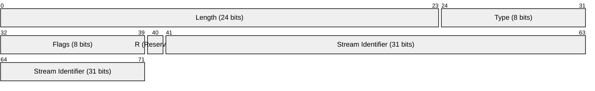
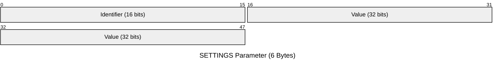

In the previous post, we successfully performed the TLS handshake and sent our 24-byte connection preface. To the server, we now look like a valid HTTP/2 client. But as soon as that preface is sent, the server starts talking back in a language we haven't yet taught our Go code to understand.

While HTTP/1.1 communicated in lines of text separated by newlines, HTTP/2 communicates in **frames**. Every single interaction from here on out (settings, headers, data, and keepalive pings) happens inside of a frame. To progress, we need to build a parser that can slice into these binary packets and make sense of the bits inside.

### The Anatomy of a Frame

According to the specification, every HTTP/2 frame begins with a fixed 9-byte header. This header is the roadmap for the rest of the payload. It tells us exactly how much data follows and how we should interpret it.

The 9-byte header is laid out precisely. Using a packet visualization, we can see how the bits are packed together:



The header fields serve specific purposes:

* **Length:** The size of the frame payload (up to 16,383 bytes by default).
* **Type:** The specific purpose of the frame (e.g., `0x0` for DATA, `0x1` for HEADERS).
* **Flags:** Boolean modifiers that change how the frame is processed.
* **Stream Identifier:** A unique ID that links the frame to a specific request-response lifecycle.

The first bit of the Stream Identifier is reserved (R) and must remain zero. This is a common pattern in binary protocols to ensure alignment or save space for future protocol versions.

### Modeling the Header in Go

To handle this in Go, we need a structure that mirrors the spec. While the length and stream ID are 24 and 31 bits respectively, we use `uint32` to store them and handle the bit-masking manually during the read.

```go
type FrameHeader struct {
    Length   uint32
    Type     uint8
    Flags    uint8
    StreamID uint32
}

```

The challenge here is that Go's `encoding/binary` package doesn't have a direct way to read a 24-bit integer. We have to read three bytes and manually shift them into place. We are no longer working with strings; we are working with bitwise operators.

### Thinking in Bits
Before we write the parser, we need to get comfortable with Bit Shifting. In Go, we use the `<<` (left shift) and `|` (bitwise OR) operators to "stitch" separate bytes into a single number.

Think of it like a conveyor belt. To turn three separate bytes into one 24-bit integer, we take the first byte and slide it 16 places to the left, move the second byte 8 places to the left, and then lay them all on top of each other using the OR operator.

In Go, `uint32(data[0]) << 16` tells the compiler to take an 8-bit byte, treat it as a 32-bit number, and move its value to the "high" end of the bucket. `HTTP/2` always uses network byte order (big-endian). Go’s `binary.BigEndian` makes this explicit when reconstructing integers.

Bitwise operations take some getting used to, so it’s worth spending time with them if this feels unfamiliar. I recommend [Chapter 27: Enum, Iota & Bitmask](https://www.practical-go-lessons.com/chap-27-enum-iota-and-bitmask) from [Practical Go Lessons](https://www.practical-go-lessons.com/).

### Parsing the Bytes

When the server responds, we read the first 9 bytes from our `tls.Conn`. We then use bit-shifting to reconstruct the fields. For the Stream Identifier, we use `binary.BigEndian.Uint32` and then mask out the first bit.

We also need to handle the **Reserved (R)** bit in the Stream Identifier. Even though we read 4 bytes (32 bits), the spec says the first bit must be ignored. We use the bitwise AND operator with `0x7FFFFFFF`, which is a binary 0 followed by thirty-one 1s—to "mask out" that first bit and ensure our ID is always interpreted correctly.

```go
func ReadFrameHeader(data []byte) FrameHeader {
    // Length is 24 bits: first 3 bytes shifted and OR'd
    length := uint32(data[0])<<16 | uint32(data[1])<<8 | uint32(data[2])
    
    // Type and Flags are single bytes
    fType := data[3]
    flags := data[4]
    
    // Stream ID is 31 bits. We read 4 bytes starting at offset 5, 
    // then mask out the reserved bit (0x7FFFFFFF)
    streamID := binary.BigEndian.Uint32(data[5:9]) & 0x7FFFFFFF

    return FrameHeader{
        Length:   length,
        Type:     fType,
        Flags:    flags,
        StreamID: streamID,
    }
}

```

### The SETTINGS Frame

Immediately after receiving our preface, the server will send a `SETTINGS` frame (Type `0x04`). This is the protocol's way of establishing the rules of the road. It defines limits like how many concurrent streams we can open or how large our header table can be.

The payload of a SETTINGS frame consists of a series of 6-byte parameters:



For now, the most important thing is that we simply **acknowledge** these settings. HTTP/2 requires that when you receive a SETTINGS frame, the client must send back a SETTINGS frame with the `ACK` flag set (bit `0x1`). If you don't, the server will eventually assume the client is unresponsive and close the connection.

### Putting it into Practice

We can now update our client to read the header, read the payload based on the length we just parsed, and log what we found. This is where the binary nature of the protocol becomes visible in your terminal.


{}


Running this against `kmcd.dev` will show you exactly what Cloudflare or your server expects. You'll see a `Type: 4` frame with a specific length. This is the first time our code is truly listening to an HTTP/2 server.

### What’s Next?

We can now read the frame header and the raw payload, but the raw payload represents a HEADERS frame and we have no idea how to actually parse that yet. In the next post, we will tackle the most complex part of the HTTP/2 specification: **HPACK**.

We need to learn how to compress and decompress headers using a stateful table, which is the only way we will ever be able to send a real `GET` request and get a real response.

See all of the code mentioned in this article here:

