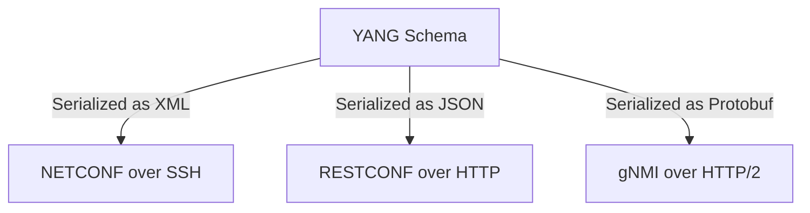

The networking industry has been undergoing a quiet revolution, moving away from archaic, string-heavy command-line interfaces (CLIs) and legacy protocols like [SNMP](https://en.wikipedia.org/wiki/Simple_Network_Management_Protocol). In modern networks, [gNMI](https://github.com/openconfig/reference/blob/master/rpc/gnmi/gnmi-specification.md) (gRPC Network Management Interface) is establishing itself as the standard for telemetry and configuration. But protocol interfaces are only half the battle. Agreeing on the data schemas (representing the thousands of configuration knobs and operational states of a core router) is a far harder challenge.

This is where [YANG](https://datatracker.ietf.org/doc/html/rfc7950) (Yet Another Next Generation) comes in. Published by the IETF, YANG is a data modeling language designed specifically to model the configuration, state, and RPCs of network hardware. 

To most software engineers, YANG looks completely alien. But it contains architectural design choices that solve problems web developers are only beginning to grapple with.

---

## Decoupling the Wire from the Schema

The most striking design choice in YANG is the total separation of the domain model from the serialization format and transport protocol. 

In the web development world, schema systems are almost always tightly bound to their transport layer. An OpenAPI (Swagger) spec defines HTTP verbs, JSON payloads, and REST endpoints simultaneously. A GraphQL schema defines exactly how queries and mutations travel over HTTP. 

YANG, by contrast, models the *domain* (e.g., a physical linecard, an IP interface, or a BGP routing table) as an abstract tree, completely independent of the wire format. The exact same YANG model can be:

*   Serialized to XML and transported over SSH using [NETCONF](https://datatracker.ietf.org/doc/html/rfc6241).
*   Serialized to JSON and transported over HTTP using [RESTCONF](https://datatracker.ietf.org/doc/html/rfc8040).
*   Serialized to Protocol Buffers or JSON and streamed over HTTP/2 using [gNMI](https://github.com/openconfig/reference/blob/master/rpc/gnmi/gnmi-specification.md).



This decoupling allows network hardware to support multiple management protocols simultaneously without changing the underlying business logic or data structures.

---

## Why Not JSON Schema, GraphQL, or Smithy?

When software engineers first encounter YANG, they naturally ask: *Why invent a new DSL? Why not just use JSON Schema, GraphQL, or AWS Smithy?*

Part of the answer is historical: YANG development started in 2008, long before GraphQL or Smithy existed. But even today, standard software engineering tools fail to address the unique constraints of hardware configuration.

1.  **The Config vs. State Split**: A router has a strict boundary between *Intended State* (what you want the device to do, e.g., configure BGP neighbor `192.0.2.1`) and *Operational State* (what the hardware is actually doing right now, e.g., BGP session is `ESTABLISHED`, packet counters are incrementing). YANG tags nodes natively with `config true` (read-write config) and `config false` (read-only state).
2.  **Referential Integrity**: In database systems, foreign keys guarantee that if a row references a user, that user must exist. In a router, there is no SQL database. Instead, the configuration payload itself must maintain referential integrity. If you configure a routing protocol to use interface `GigabitEthernet0/1`, YANG's native `leafref` type validates at the schema layer that the interface is actually defined in the configuration. The router will reject the entire transaction before applying it if the reference is dangling.
3.  **Derived Identity Types**: YANG supports extensible `identity` definitions, allowing vendors to subclass base identities (like routing protocols or interface media types) without rewriting the core schemas.

GraphQL SDL can model config and state via queries and mutations, but it is an API contract detailing client-server transport rather than a domain modeling language. AWS Smithy is conceptually the closest modern equivalent, modeling cloud services independently of transport protocols. However, Smithy's tooling focuses on generating cloud SDKs and API gateways, whereas YANG is optimized for embedded hardware validation, transaction commits, and deep configuration trees.

---

## OpenConfig and the Clean Architecture Pattern

Historically, hardware vendors (Cisco, Juniper, Arista) published their own proprietary YANG models. The path to enable an interface on a Cisco router was completely different from a Juniper switch, forcing operators to write complex translation layers.

To solve this, the [OpenConfig](https://www.openconfig.net/) working group (backed by major operators like Google, Microsoft, and Meta) designed a set of vendor-neutral YANG models. They enforced a strict clean architecture pattern separating `config` and `state` into sibling containers under every list item.

Here is a simplified look at the [OpenConfig interfaces model](https://github.com/openconfig/public/blob/master/release/models/interfaces/openconfig-interfaces.yang):

```yang
container interfaces {
  list interface {
    key "name";
    leaf name {
      type leafref {
        path "../config/name";
      }
    }
    container config {
      leaf enabled {
        type boolean;
      }
    }
    container state {
      config false; // Locks this entire branch as read-only operational state
      leaf enabled {
        type boolean;
      }
      leaf oper-status {
        type enumeration {
          enum UP;
          enum DOWN;
        }
      }
    }
  }
}
```

Using tools like [`pyang`](https://github.com/mbj4668/pyang), this YANG schema translates into a clean, readable operational tree:

```text
module: openconfig-interfaces
  +--rw interfaces
     +--rw interface* [name]
        +--rw name      -> ../config/name
        +--rw config
        |  +--rw enabled?         boolean
        +--ro state
           +--ro enabled?         boolean
           +--ro oper-status?     enumeration
```

A network automation script reading this schema instantly knows it can edit `/interfaces/interface/config/enabled`, but must only read `/interfaces/interface/state/oper-status`.

---

## The Developer Experience and the Custom DSL Tax

While YANG is architecturally brilliant, the developer experience for software engineers is notoriously painful.

Because YANG is a custom DSL, the software ecosystem is narrow. If you write C or C++, you use [`libyang`](https://github.com/CESNET/libyang). Python developers rely on [`pyang`](https://github.com/mbj4668/pyang) and [`pyangbind`](https://github.com/robshakir/pyangbind). In Go, the standard tool is [`ygot`](https://github.com/openconfig/ygot), which generates large Go structs from YANG files, complete with path-mapping helpers. But if you work in Rust, TypeScript, or Swift, you are largely on your own.

Furthermore, compiling and validating these schemas is computationally heavy. A modern router's schema consists of hundreds of imported modules, augmented fields, and cross-tree validation rules. Building the schema AST in memory can consume hundreds of megabytes of RAM and take several seconds of CPU time, long before a single byte of telemetry is processed.

To mitigate this, tooling often compiles YANG models into optimized native code (such as static Go/C structs) or intermediate schemas (like Protocol Buffers) at build time. This allows applications to reap the architectural benefits of YANG's validation and type safety without directly parsing or loading expensive schemas at runtime.

---

## Interesting Observations

Looking at YANG's design highlights several interesting trade-offs rather than hard and fast rules. The technical choices in YANG have distinct pros and cons:

*   **Model the Domain, Not the API**:
    *   *Pros:* Building schemas that describe the core domain (like AWS Smithy or YANG) rather than binding schemas directly to JSON/REST protocols ensures longevity and enables protocol migration (e.g., REST to gRPC) without structural rewrites.
    *   *Cons:* It introduces substantial mapping and translation overhead, requiring serialization layers to map abstract domain structures onto concrete transport envelopes.
*   **First-Class Operational State**:
    *   *Pros:* Separating the "intended configuration" from the "current operational reality" is a powerful pattern that prevents exposing mutable and immutable resource fields in a single flat JSON object.
    *   *Cons:* It doubles the schema complexity, forcing developers to model every attribute twice (once as configuration and once as state) and manage the reconciliation logic between them.
*   **Schema-Level Referential Validation**:
    *   *Pros:* Enforcing relational integrity directly in the schema payload (using constructs like `leafref`) is highly effective for distributed pipelines, catching invalid references before they reach the device.
    *   *Cons:* It makes parsing computationally expensive. Validating a single payload requires loading the entire dependency graph in memory, making schema evaluation resource-heavy and slow.
*   **Self-Documenting Schemas**:
    *   *Pros:* Similar to OpenAPI, YANG is excellent at acting as the authoritative documentation for the system. Native `description` and `reference` statements make YANG modules highly self-documenting, and tooling can easily parse them to generate clean API documentation or interactive tree diagrams.
    *   *Cons:* Without specialized rendering tools (like `pyang`), the raw YANG DSL is extremely verbose and difficult for developers outside the networking domain to read or scan directly.

Ultimately, YANG's architecture is a beast to learn and expensive to run, but it is tailored to handle the complexity of physical infrastructure. It presents a clear trade-off: a heavy runtime and developer tax worth paying to replace fragile CLI regex parsing with type-safe, validated automation contracts.
