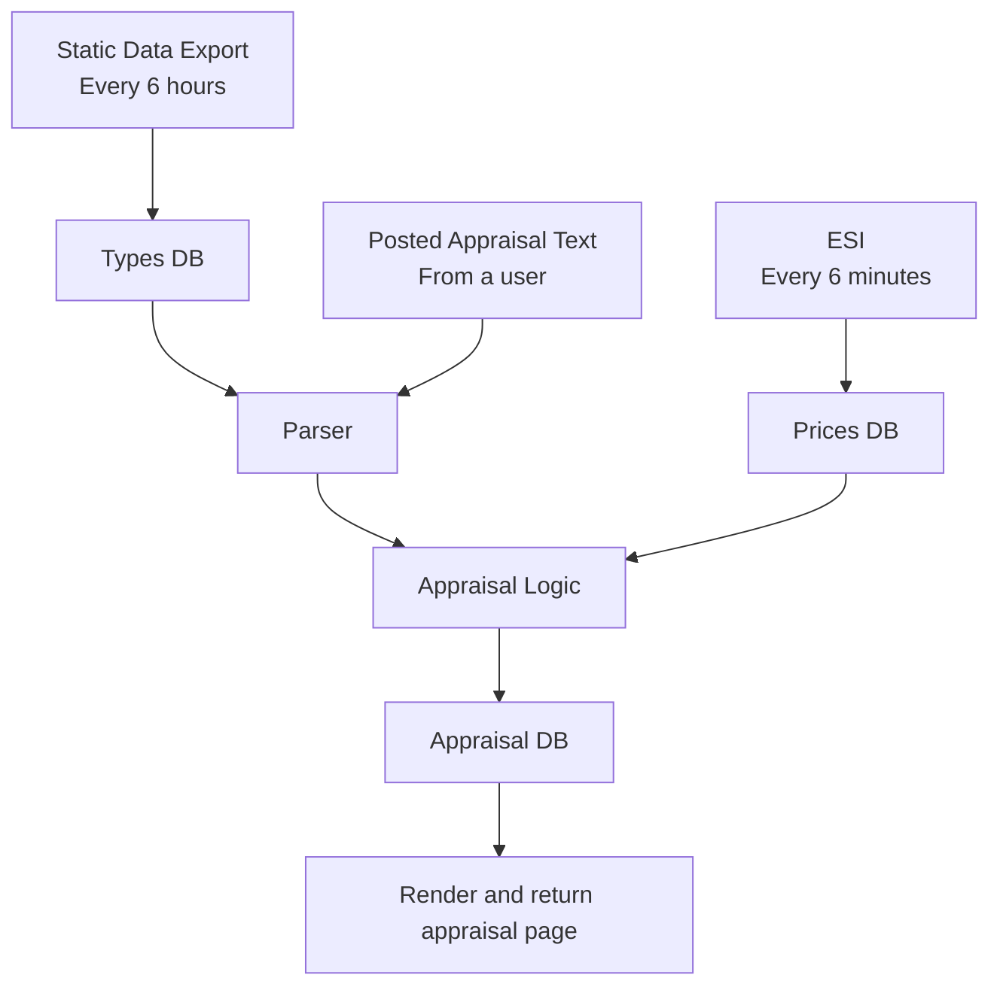

+++
categories = ["project"]
tags = ["eve online", "gaming", "evepraisal", "golang", "python", "postgresql"]
date = "2023-08-17"
description = "Inside Evepraisal's operations: data automation, databases, deployment, and giving advice for similar projects."
featured = "thumbnail.png"
featuredalt = ""
featuredpath = "date"
linktitle = ""
title = "Lessons from a Decades Long Project"
slug = "lessons-from-a-decades-long-project"
type = "posts"

# Unlisted Draft
[_build]
  list = "never"

+++

I wrote [Evepraisal](/posts/evepraisal.com). Here are some lessons that I’ve learned during the 10 years. This article will cover the technical lessons and experiences that I've had while maintaining this extremely useful tool for a decade.



## Getting Started
I have already told the story of how it started in my [Economists with Guns](/posts/economists-with-guns/) article, but I did want to add that the first version of what became Evepraisal was written in Python and used a static database of pricing data. It also only worked for cargo scan results because it was used for the Burn Jita event. I actually only intended it to be used for this event, so the prices of items NEVER updated. They were all frozen in time. It was a few months later when I noticed that the tool was still being used a good amount and I started getting requests for updated prices that I thought I might want to improve this tool a bit more. I bought the evepraisal.com domain and started making my work.

### v1: Getting real with Python
The next version was written in Python and used an API to fetch market data from eve-marketdata.com, which is now sadly no longer running. Also, the mapping of item name to so-called "type ID" was done by harvesting the list of all types and type IDs from data files that comes along with installing the Eve Online client. These files were actually SQLite databases that could be easily opened and queried. I used PostgreSQL for the database and memcache to cache both appraisal pages and requests to eve-marketdata.com.



To get an idea of what the data looks like, here are the tables that this version ended up with.
```
Appraisals

    Id INTEGER
    Kind TEXT
    RawInput TEXT
    Parsed JSON
    ParsedVersion INT
    Prices JSON
    BadLines JSON
    Market INTEGER
    Created INTEGER
    Public BOOL
    UserId INTEGER
```

Oh, and users can also log in with OpenID and create private appraisals that only they can see. Nice. Here's that table:
```
Users

    Id INTEGER
    OpenId STRING(200)
    Options TEXT
```

If you're wondering where the "type" information is, well... it's in a giant JSON file that is loaded into memory on startup. If you want to see the last version of this file, [it exists here](https://github.com/evepraisal/python-evepraisal/tree/master/data).



This first version was great but it wasn't perfect. A lot of memory and disk space was being used for the database. The database needed a good amount of maintenance. A lot of these things made the website run a little slow and I had one too many outages for my liking, so I needed to do something to help the situation...

### v2: Just Rewrite it in Go
To address some of the issues with v1 I decided to rewrite the project in Go. I wanted experience writing something "real" in the language so this was it. This effort involved re-writing all of the parsers, all the API handlers, the frontend, and... everything into Go which took a good deal of effort. But in the end it was actually worth it. The memory usage was WAY down for a number of reasons, the CPU usage (which was starting to be a problem too) was very minimal and the website was extremely fast. Rewriting the website in a different language wasn't the only thing that changed though. I changed the database, caching method, how it sourced data, and probably a lot more. All while maintaining a familiar user experience.

#### PostgreSQL to Bolt
With this rewrite I also switched from PostgreSQL to an embedded key/value store called Bolt. This means that the only ways I have to access data is by the exact primary key or by scanning a range of keys in alphanumeric order. This made some things more difficult but it also taught me a lot about this type of database and it's fast. Really fast. I would post the schema here, but that's not really a thing for Bolt. So instead, I will show you the buckets and the format I used for keys and values for each bucket.

```
bucket=appraisals
key_format="AppraisalID"
value=JSON Encoded Appraisal Data

bucket=appraisals-last-used
key_format="AppraisalID"
value=timestamp encoded as a uint64

bucket=appraisals-by-user
key_format="CharacterOwnerHash:AppraisalID"
value=AppraisalID

bucket=stats
key=total_appraisals
value=uint64
```

Creating an Appraisal would involve adding an entry to `appraisals`, `appraisals-last-used`, `appraisals-by-user` (if the user was logged in) and `stats` buckets. Deleting is pretty much the same. It took a while to get these features worked out but once it was done I haven't needed to adjust this very much at all.

#### Eve-Marketdata to ESI
I moved from from eve-marketdata.com to ESI, which newly supported fetching live(ish) market orders and allowed Evepraisal to have a more reliable pricing. ESI also has a guess at the market price which was a useful value to fall back on but sometimes it was ridiculously out of whack with the market.

#### Other Changes
Around this time I also fixed some usability issues. I tackled pricing for items that had a super low volume or couldn't be sold on the market by summing up the cost of the components that were needed to build that item. I added a percentage upcharge to that to factor in for build time and effort. In the end it made for a decent prices after some tweaking.

In addition to re-implementing the existing parsers in Go, I also added a few more and improved on the "heuristic" parser that would try VERY HARD to find Eve Online types from the input.

The data migration was fairly extensive. I had a process that would re-parse every appraisal again to ensure that it could. I noted differences and eventually decided that it was good enough (or better enough) to do a final migration and flip over to the new site. Luckily, I tested enough for most users not to notice that it's a completely different website. I made some UI adjustments, which people noticed, but the fact that the entire thing was re-written was transparent to most users.

#### Data Flow
So let's put all of this together. Here's the basic dataflow diagram for Evepraisal:



And here's what the new version looked like:




All-in-all, I think this rewrite went really well. It probably took more effort than I expected, but it definitely paid off over the course of the next 6 years from 2017 to a couple weeks ago. My primary goal was to get a functioning knowledge of operating a project using the Go programming language, and that definitely happened.

## Project Recap
So now that I described the evolution of the project and the two major versions, 

### What went wrong
I encountered hurdles such as unreliable game data, naming inconsistencies, missing data, and disk constraints. Overcoming these challenges shaped Evepraisal's resilience.

- Unreliable game data
    - When they standardized the names of modules but they never bothered to update the type database with the new names
    - Missing data: Volumes and packaged volumes are not consistent and not in the game data, so I’ve had to maintain my own mapping, which really sucks.
- Disk Constraints
    - I was slowly running low on disk space, so I changed the default for the API to not store appraisals
    - I also started purging data more aggressively by using the "last seen" time to decide which appraisals are unlikely to be looked at again.

### What didn't go wrong
Certain aspects, like deployment, OS upgrades, and backup/restore, flowed smoothly. Rigorous testing and proactive data management bolstered overall stability.

#### Deployment
You may be surprised to see my deployment script. You can read it in the [deploy.sh](https://github.com/evepraisal/go-evepraisal/blob/master/scripts/deploy.sh) file. It simply copies up a systemd unit file and binary. Then it ensures that the service is enabled. That's basically it.

#### OS Upgrades and Migrations
Image upgrades and migrations definitely happened but I haven’t had any issues with it other than a few minutes of downtime once or twice a year. In the cloud space there were cycles where migrations had to be done to mitigate security vulnerabilities. Since this kept happening it seems like the cloud providers have gotten better with seamlessly migrating VMs to a new hypervisor version. The only migrations that disrupt me are when they want to retire the OS image and I believe they completely retired a datacenter that my VM was hosted at once, so that involved a bit longer downtime as the data was shipped to a new datacenter.

#### Backup/restore
Never had to actually do this... and TBH it’s not the worst thing in the world that the database gets wiped. Sure, it would be annoying to users that have links to their appraisals but a lot of them can be recreated pretty easily.

#### Testing
There’s a lot of table-based testing in this project, which allowed me to add new test cases without needing to write a lot of code. This is especially useful in the parser part of the app. Here's an example of a couple test cases for the "listing" parser, which handles lines that simply have a quantity and an item name delimited by some kind of whitespace:

```go
{
    "with ending whitespace",
    `Compressed Iridescent Gneiss x 109 `,
    &Listing{
        Items: []ListingItem{
            {Name: "Compressed Iridescent Gneiss", Quantity: 109},
        },
        lines: []int{0},
    },
    Input{},
    false,
}, {
    "with beginning whitespace",
    `1865 Compressed Glossy Scordite
 105 Compressed Brilliant Gneiss
  27 Compressed Jet Ochre`,
    &Listing{
        Items: []ListingItem{
            {Name: "Compressed Brilliant Gneiss", Quantity: 105},
            {Name: "Compressed Glossy Scordite", Quantity: 1865},
            {Name: "Compressed Jet Ochre", Quantity: 27},
        },
        lines: []int{0, 1, 2},
    },
    Input{},
    false,
}
```
All of test cases for all parsers were ran by the same code, so adding more tests is just adding a new `Case` object. Whenever I fixed a reported bug I would create a new test case so that same bug couldn't happen again.

### Stats for nerds

| Metric |  | Refs |
|---|---|---|
| Apprisals Performed | 150 Million |  |
| First Commit | Dec 17, 2012 | [3a24930](https://github.com/evepraisal/python-evepraisal/commit/3a24930edc0566e6c9ca22038a3e6870817497bf) |
| First Commit (Go Version) | Apr 25, 2017 | [55f6794](https://github.com/evepraisal/go-evepraisal/commit/55f6794c8c4b0d3b2e2dbdcecb069232700d6654) |
| Lines of code (Python) | 1283+1051=2334 | [python-evepraisal](https://github.com/evepraisal/python-evepraisal) + [eve-paste](https://github.com/evepraisal/evepaste) |
| Lines of code (Go) | 8022 | [go-evepraisal](https://github.com/evepraisal/go-evepraisal) |
| Number of Commits | 450+234+130 | [go-evepraisal](https://github.com/evepraisal/go-evepraisal) + [python-evepraisal](https://github.com/evepraisal/python-evepraisal) + [eve-paste](https://github.com/evepraisal/evepaste) |





## Advice
Now here's some advice for running a similar project. I feel like most of this is applicable.

### Identify data dependencies and find good sources
Evepraisal suffered a lot whenever the source of data wasn't reliable. Eve-marketdata served as the datasource for market data for Evepraisal for a long time. I actually ended up integrating with a similar service as a backup before settling on using CCP's ESI market API to fetch market data from the source.

### Automate the rotation of data dependencies
I initially had a script that would scrape Eve Online's type data from the game client data files. This was super manual and it involved me updating the game (which took a lot of my disk storage for a game I didn't play much), running a script, and checking in the new giant JSON file with all of the types in it. The process was "fine" but it was very reactionary. I had to do this for every major game release and that's actually pretty often. I would normally get messaged about the game data needing an update from a user noticing a new item didn't get recognized. That's kind of embarrassing, so I needed to improve this.

I was so happy when CCP started regularly releasing the [Static Data Export (SDE)](https://developers.eveonline.com/resource/resources) for Eve Online. It had (almost) everything I needed. After this change, Evepraisal would periodically check for a new SDE release and, if there was one, would download the new package, process it, make a new type database and switch to using the new one. It was pretty slick once I got this process working reliably.

You may notice a pattern here: moving from scrappy 3rd party APIs that are maintained by individuals to using first-party data sources like SDE and the ESI API. I think CCP did a lot of good work to make it reasonable to create tools like this without a lot of effort.

### Have a backup/restore plan
I, luckily, never really had an issue with backup and restore, but I do think you need some kind of plan. Users may forgive you if you lose a day's worth of data but they'll be pretty irritated if you lose all of it... So have a backup. And test the restore process every once in a while. My backup strategy changed a good amount for Evepraisal. I initially took SQL dumps and put them into my Google Drive using a script. However, after switching to Bolt for the database I had to come up with a different strategy. I used a combination of image-level backups along with a script that could export recent appraisals to Google Drive. Later on, I relied solely on the VM image backups.

### Cleanup stale data automatically
After you've gotten the project to a stable state the things that will break are the log files that are never truncated or databases tables that grow forever. Come up with a strategy to deal with this. I let systemd manage log files for me. By default systemd will keep 4GB of log files for you, which was enough for me. I had a subprocess in the Evepraisal server that would clean up old appraisals automatically.

### Get alerts
You absolutely need alerts, especially if your interest in the game varies over time. You may have an issue for days before someone tries to tell you so you should be proactive.
- Log based alerting
    - I used [Papertrail's](https://www.papertrail.com/) free plan to handle logging and alerting for me. I filtered a lot of irrelevant things from the log so Papertrail would only receive actionable logs.
- Uptime monitoring alerts
    - There are a lot of free services for this but I used [Uptime Robot](https://uptimerobot.com/).
- Google Alerts
    - Hopefully the name of your service is unique enough that you can make a [Google alert](https://www.google.com/alerts) for the name. It will show reddit threads, blog articles, forum posts, etc. that mention this name. It's great, but it can also be a little slow.
- Subscribe to emails lists that will tell you if major changes are happening with the game.
- Be available on a social platform like mastodon and list your handle on the website. If people are using your website someone will find your user and tell you if something is wrong if it's broken for long enough.

### Monetization
I used AdSense to generate revenue from Evepraisal. Revenue completely covered operational costs but it didn't make too much beyond that. The only ongoing costs for this project were hosting and domain name registration. Monetization ensured that the project lived for as long as it did.

### If I were to change things...

You should absolutely keep a log and make an entry for every time your attention is required, you can use that log to figure out what to focus on the next time you feel like working on the project.

Other than that... I don't know. I think this was a massively successful project. I'm extremely proud to have contributed something so significant to the game.

## The End
In conclusion, Evepraisal's journey underscores the importance of data reliability, automation, strong testing techniques, and monetization. I thank everyone who has used the tool in their everyday space-lives. You kept me going for so long.
