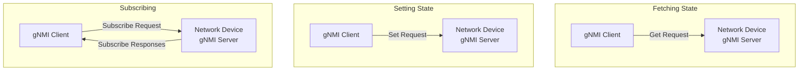

+++
categories = ["project"]
tags = ["golang", "gnmi", "openconfig", "grpc"]
date = "2023-08-29"
description = "Watch as I use an industry-specific protocol to do silly things"
cover = ""
images = []
featured = ""
linktitle = ""
title = "gNMI for fun and no profit"
slug = "gnmi-for-fun-and-no-profit"
type = "posts"
draft = true
+++

This is the first in a series of posts where I dive into the gNMI protocol and use it for things it was never designed to do. Why? Because I can.

First off, I have to give a bit of background before any of this makes sense. gNMI is a networking protocol based on gRPC. It’s used for getting, creating, updating, and streaming state from network devices. It’s currently an industry-standard way to get telemetry and manage configuration for network devices. What are these “network devices” that I’m referring to? Well, it’s big Nokia, Cisco, Juniper, Arista devices that sometimes take up a full-sized rack. They routers, switches, firewalls, WiFi access points, optical gear, etc.



## The Old Ways
Before I talk about how awesome gNMI is, I want to give an overview of the networking world before gNMI. It's important to know where the industry is coming from because terminology and ways of doing things will carry over whether we like it or not.

### State Management
First, let's talk about state management. What's state management? For networking devices, it's mostly configuration. We have things like interface configurations that include the interface description, admin status, MTU, etc. For firewalls, you have all of the filtering rules. For WiFi access points you have the WiFi networks, mesh configuration, radio power settings, etc.

Anyway, the point is, there are a lot of things to configure for these devices and it's important to get it right because a failed configuration can cause you to completely lose access to the device.

Talk about how you can manage the state of network devices.
Examples:
- Configuring an IP for a port
- Setting the hostname
- Configuring BGP

Talk about CLI automation, [scrapligo](https://github.com/scrapli/scrapligo) and [scrapli](https://github.com/carlmontanari/scrapli). Talk about NETCONF, vendor-specific protocols

### Telemetry
SNMP grand-daddy; SNMP Sucks
 - Security: 1 and 2c suck. No one uses v3.
 - Community Strings
 - Limited Data Types
 - Polling-Based
 - Complex MIBs
 - Lack of Native Support for Event Notification

CLI scraping
Also mention Talk about OpenFlow, rib/fib, etc,

## The New Way
gRPC Foundation: gNMI is built upon gRPC, which is a modern, efficient, and language-agnostic remote procedure call framework. This forms the sturdy foundation of gNMI's communication.

Structured Data with YANG: At the heart of gNMI is YANG. It defines the structure of data in a clear, human-readable way. YANG models are like the blueprint that both your management system and network devices follow. So, when you send requests or receive data, everyone knows what's on the table.

Transport Protocol: gNMI relies on HTTP/2 as its transport protocol. It's like the express lane on the data highway, ensuring that data flows smoothly and efficiently between your management system and network devices.

Operations: gNMI supports various operations:

- **Get**: You can fetch data from network devices. It's like asking for the current status of your devices.

- **Set**: This allows you to change configurations on devices. Think of it as tweaking the settings on your gadgets remotely.

- **Subscribe**: One of the cool features of gNMI is subscription-based real-time updates. You can subscribe to specific data paths and receive updates when things change. It's like getting live notifications for important events.

Security: gNMI takes security seriously. It can use TLS for encryption and authentication, ensuring that your data is safe as it travels through the network. It's like having a high-tech vault protecting your precious information.

Data Encoding: gNMI can use different encodings like Protocol Buffers (protobufs) or JSON to serialize data. This makes it flexible to work with different data formats.

Error Handling: Like any superhero, gNMI knows that things don't always go smoothly. It provides error codes and descriptions to help you understand what went wrong if a request doesn't pan out.

Streaming Telemetry: This is a superpower of gNMI. It allows devices to continuously stream data updates to your management system. It's like having a live feed of what's happening in your network.

In a nutshell, gNMI works by creating a structured, efficient, and secure channel of communication between your management system and network devices. It's like having a fluent conversation with your devices, where everyone understands the language and can exchange information seamlessly. So, the next time you want to manage your network with finesse, gNMI is your trusty sidekick! 💼🌐🦸‍♂️

Part 1: Setting up the gNMI server (Part 1)
 - gNMI, containerlab

Making a gNMI Server (Part 2)
 - Review gNMI spec
   - coalesced duplicate updates
 - Sever code
 - ygot
 - stub/fake data
 - Ticker change

Integrating Mastodon (Part 3)

Putting it all together and refinement (Part 4)

Only cache a certain number of posts

References:
- https://docs.joinmastodon.org/client/token/
- https://github.com/mattn/go-mastodon

- https://github.com/openconfig/gnmi
- https://github.com/openconfig/gnmic
- https://github.com/openconfig/ygot

Model it in YANG? Gotta explain YANG... ugh! YGot to convert go to gNMI notifications (and back?)

Description of coalesce queue
https://documents.rtbrick.com/gnmi/gnmi_guide_online.html
